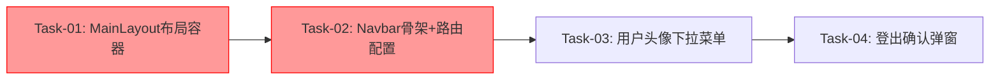

# 导航栏 — 开发任务计划

## 1. 任务概览

**总任务数**：4 个
**预计总工时**：200 分钟（约 3.3 小时）
**开发方法**：TDD — 每个任务按 RED → GREEN → REFACTOR 循环执行

**关键标注**：
- 🔒 阻塞任务：被多个任务依赖，建议优先完成
- ⚠️ 风险任务：技术难度高，可能需要额外时间

### 依赖关系图

### 可并行任务组

| 并行组 | 任务 | 说明 |
|--------|------|------|
| 无 | — | 所有任务有明确的前后依赖关系，需按顺序执行 |

---

## 2. 开发任务

> 按垂直切片组织。每个阶段对应一个可独立运行和验证的用户行为（加可选的基础设施层）。切片内部的任务按技术层自然顺序排列。
>
> 每个任务按 TDD 循环执行：RED（根据验证标准写测试）→ GREEN（写最小实现通过测试）→ REFACTOR（重构）

---

### 阶段一：基础设施 — 布局框架搭建

**阶段完成标准**：页面有了固定顶部导航栏和下方内容区的基本框架，点击Tab可以切换页面

---

#### Task-01: 创建 MainLayout 布局容器 🔒

**通俗解释**：页面有了固定顶部导航栏和下方内容区的基本框架

**做什么**：
1. 新建 `client/src/components/common/MainLayout.tsx`
2. 实现固定顶部导航栏区域（position: fixed）
3. 实现下方内容区（children），并添加顶部 padding 避开 Navbar
4. 导出 MainLayout 组件

**涉及文件**：`client/src/components/common/MainLayout.tsx`

**参考**：技术方案 2. 架构概览 → 6. 现有代码改动

**依赖**：无

**预估工时**：30 分钟

**验证标准**（TDD RED 阶段直接转化为测试用例）：
- [ ] 渲染 MainLayout → 包含一个固定的顶部区域和一个内容区域
- [ ] 顶部区域使用 `position: fixed` 固定在页面顶部
- [ ] 内容区域有顶部 padding，内容不被导航栏遮挡
- [ ] 传入 children → children 在内容区域正确渲染
- [ ] 顶部区域高度为 Navbar 的高度（如 64px）

---

#### Task-02: 创建 Navbar 骨架和配置路由 🔒

**通俗解释**：导航栏显示 Logo 和 4 个 Tab 按钮，点击能跳转到对应页面，当前页面的 Tab 会高亮

**做什么**：
1. 在 `client/src/types.ts` 中新增 `TabConfig` 类型定义
2. 新建 `client/src/components/common/Navbar.tsx`
3. 实现 Logo + 应用名称显示
4. 实现 4 个功能 Tab（窝囊费、蛐蛐蛐、摸鱼鱼、鱼圈管理）
5. 使用 `useLocation()` 获取当前路径，高亮对应 Tab
6. 使用 `useNavigate()` 实现 Tab 点击跳转
7. 点击 Logo 跳转到窝囊费页（`/salary`）
8. 修改 `client/src/App.tsx`，用 MainLayout 包裹路由，添加新路由配置
9. 登录后默认跳转到窝囊费页

**涉及文件**：
- `client/src/components/common/Navbar.tsx`
- `client/src/App.tsx`
- `client/src/types.ts`

**参考**：技术方案 5.1 Tab切换与URL同步 → AC-001, AC-002, AC-102, AC-201, AC-202

**依赖**：Task-01

**预估工时**：60 分钟

**验证标准**（TDD RED 阶段直接转化为测试用例）：
- [ ] Navbar 渲染 Logo 区域，显示应用名称
- [ ] Navbar 渲染 4 个 Tab 按钮：窝囊费、蛐蛐蛐、摸鱼鱼、鱼圈管理
- [ ] 当前路径为 `/salary` → "窝囊费" Tab 高亮，其他 Tab 不高亮
- [ ] 当前路径为 `/chat` → "蛐蛐蛐" Tab 高亮
- [ ] 当前路径为 `/game` → "摸鱼鱼" Tab 高亮
- [ ] 当前路径为 `/circle` → "鱼圈管理" Tab 高亮
- [ ] 点击"蛐蛐蛐" Tab → `useNavigate()` 被调用，跳转到 `/chat`
- [ ] 点击 Logo → 跳转到 `/salary`
- [ ] 浏览器 URL 变化（前进/后退）→ Tab 高亮自动更新
- [ ] App.tsx 中 `/` 路由重定向到 `/salary`
- [ ] App.tsx 中 `/salary`、`/chat`、`/game`、`/circle` 路由都被 MainLayout 包裹
- [ ] 未登录访问 `/salary` → 被重定向到登录页（ProtectedRoute）

---

### 阶段二：Tab切换功能 — 页面切换与动画

**阶段完成标准**：用户点击Tab或Logo可以切换页面，页面切换有200ms淡入淡出动画

---

#### Task-03: 实现页面切换动画

**通俗解释**：切换页面时内容会有淡入淡出的过渡效果，不是生硬的瞬间切换

**做什么**：
1. 在 MainLayout 组件中为内容区添加 CSS transition
2. 使用 `useLocation()` 的 key 触发重新挂载动画
3. 实现 200ms 淡入淡出效果

**涉及文件**：
- `client/src/components/common/MainLayout.tsx`
- `client/src/index.css`（如需要添加动画样式）

**参考**：技术方案 8. 安全与性能 → AC-202

**依赖**：Task-02

**预估工时**：30 分钟

**验证标准**（TDD RED 阶段直接转化为测试用例）：
- [ ] 内容区包裹一个带 transition 的容器
- [ ] transition 时长为 200ms
- [ ] 使用 fade 效果（opacity 从 0 到 1）
- [ ] 路由切换时触发淡入动画

---

### 阶段三：用户菜单功能 — 头像菜单与登出

**阶段完成标准**：用户点击头像可以查看菜单，点击"下班跑路"可以确认并登出

---

#### Task-04: 实现用户头像下拉菜单和登出功能

**通俗解释**：点击右上角头像显示菜单，菜单里有个人信息、头像选择、下班跑路三个选项，点击菜单外区域自动关闭

**做什么**：
1. 新建 `client/src/components/user/UserMenu.tsx`
2. 在 Navbar 右侧集成 UserMenu 组件
3. 使用 `useAuth()` Hook 获取用户信息（头像 emoji）
4. 实现点击头像切换菜单显示/隐藏
5. 实现菜单项：个人信息、头像选择、下班跑路
6. 使用 `useRef` + `useEffect` 监听点击外部事件关闭菜单
7. 点击"下班跑路"显示登出确认弹窗
8. 新建 `client/src/components/common/ConfirmModal.tsx` 实现确认弹窗
9. 弹窗显示文案："你确信要收拾公文包下线，离开今天的带薪阵地吗？"
10. 点击"确认"调用 `useAuth().logout()`，清除 Token，跳转到登录页
11. 点击"取消"或遮罩层关闭弹窗

**涉及文件**：
- `client/src/components/user/UserMenu.tsx`
- `client/src/components/common/ConfirmModal.tsx`
- `client/src/components/common/Navbar.tsx`

**参考**：技术方案 5.2 用户头像下拉菜单 + 5.3 登出确认弹窗 → AC-003, AC-004, AC-103

**依赖**：Task-02

**预估工时**：80 分钟

**验证标准**（TDD RED 阶段直接转化为测试用例）：
- [ ] Navbar 右侧渲染用户头像（emoji）
- [ ] 点击头像 → 下拉菜单显示
- [ ] 下拉菜单包含三个选项：个人信息、头像选择、下班跑路
- [ ] 再次点击头像 → 下拉菜单隐藏
- [ ] 下拉菜单展开时，点击菜单外部区域 → 菜单关闭
- [ ] 点击"下班跑路" → 显示确认弹窗
- [ ] 弹窗标题为"确认操作"
- [ ] 弹窗文案为"你确信要收拾公文包下线，离开今天的带薪阵地吗？"
- [ ] 弹窗有"取消"和"确认"两个按钮
- [ ] 点击"取消" → 弹窗关闭，用户仍处于登录状态
- [ ] 点击遮罩层 → 弹窗关闭，用户仍处于登录状态
- [ ] 点击"确认" → 调用 logout()，清除 Token，跳转到 `/login`
- [ ] 未登录状态 → Navbar 不显示用户头像区域

---

## 3. AC 覆盖总表

> 最终检查：每条 AC 是否都有任务承接。这是全文档唯一的 AC 映射汇总。

| AC 编号 | 验收标准概述 | 承接任务 | 验证方式 |
|---------|-------------|---------|---------|
| AC-001 | 点击Tab切换页面，高亮当前Tab，URL同步更新 | Task-02 | 点击Tab检查页面跳转、Tab高亮、URL变化 |
| AC-002 | 点击Logo跳转到窝囊费页 | Task-02 | 点击Logo检查跳转到 `/salary` |
| AC-003 | 点击头像显示下拉菜单，点击"下班跑路"显示登出确认弹窗 | Task-04 | 点击头像检查菜单显示，点击"下班跑路"检查弹窗 |
| AC-004 | 点击"确认"后登出，跳转到登录页 | Task-04 | 点击"确认"检查Token清除和页面跳转 |
| AC-101 | 切换Tab时保持聊天草稿 | 不在范围内 | 由ChatPage组件内部状态管理保证 |
| AC-102 | 浏览器前进/后退时Tab高亮同步 | Task-02 | 浏览器前进/后退检查Tab高亮 |
| AC-103 | 点击菜单外部区域关闭下拉菜单 | Task-04 | 点击菜单外部检查菜单关闭 |
| AC-201 | 登录后默认显示窝囊费页 | Task-02 | 登录后检查URL为 `/salary` |
| AC-202 | 页面切换动画200ms淡入淡出 | Task-03 | 切换页面检查动画效果 |

---

## 4. 完成定义

> 所有任务完成后，功能整体交付前的最终确认。只列出跟这个功能相关的检查项，不要套用通用清单。

- [ ] 所有任务的验证标准（测试用例）通过
- [ ] AC 覆盖总表中每条 AC 的验证方式已执行并通过
- [ ] 导航栏在所有功能页面（窝囊费、蛐蛐蛐、摸鱼鱼、鱼圈管理）均正常显示
- [ ] Tab切换响应时间 ≤ 200ms
- [ ] 页面切换动画流畅，无明显卡顿
- [ ] 登出后 Token 已清除，无法直接访问受保护页面
- [ ] 未登录状态下导航栏不显示用户头像区域
