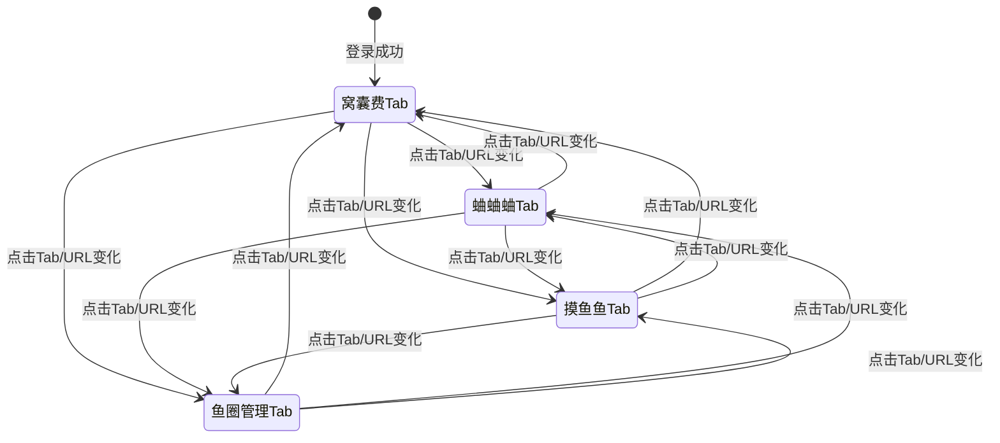

# 导航栏 — 技术设计文档

## 1. 设计概要

**功能描述**：实现摸鱼圈应用的全局导航栏，支持4个功能Tab切换与URL同步、固定顶部布局、用户头像下拉菜单及登出功能。

**影响范围**：前端路由模块、布局组件、认证模块、用户模块

**技术难点**：Tab切换与URL同步、浏览器前进/后退支持、页面状态保持

**外部依赖**：无

---

## 2. 架构概览

导航栏是纯前端功能，不涉及后端API。核心架构如下：

```
┌─────────────────────────────────────────────────────────────┐
│                        App.tsx                               │
│  ┌─────────────────────────────────────────────────────┐    │
│  │                    MainLayout                        │    │
│  │  ┌─────────────────────────────────────────────┐    │    │
│  │  │                  Navbar                      │    │    │
│  │  │  [Logo] [窝囊费] [蛐蛐蛐] [摸鱼鱼] [鱼圈] [头像]│    │    │
│  │  └─────────────────────────────────────────────┘    │    │
│  │                       │                              │    │
│  │                       ▼                              │    │
│  │  ┌─────────────────────────────────────────────┐    │    │
│  │  │              Content Area                    │    │    │
│  │  │  (SalaryPage / ChatPage / GamePage / CirclePage)│  │    │
│  │  └─────────────────────────────────────────────┘    │    │
│  └─────────────────────────────────────────────────────┘    │
└─────────────────────────────────────────────────────────────┘
```

**模块职责**：

| 模块 | 职责 |
|------|------|
| `Navbar` | 渲染导航栏UI，处理Tab点击事件，显示用户头像菜单 |
| `MainLayout` | 包裹导航栏和内容区，提供固定顶部布局 |
| `useAuth` | 提供用户信息和登出方法 |
| `react-router-dom` | 处理路由切换和URL同步 |

---

## 3. 数据库设计

导航栏是纯前端功能，不需要数据库改动。

---

## 4. API 设计

导航栏是纯前端功能，不需要新增API。现有API复用：

| API | 用途 |
|-----|------|
| `POST /api/auth/logout` | 登出操作（已有） |
| `GET /api/user/profile` | 获取用户信息用于头像显示（已有） |

---

## 5. 核心逻辑

### 5.1 Tab切换与URL同步 → AC-001, AC-102, AC-201, AC-202

**触发条件**：用户点击Tab或浏览器前进/后退

**处理流程**：
1. 用户点击Tab → 调用 `react-router-dom` 的 `useNavigate()` 跳转对应路由
2. 路由变化触发组件重新渲染
3. Navbar通过 `useLocation()` 获取当前路径，高亮对应Tab
4. 浏览器前进/后退 → URL变化自动触发Tab高亮更新

**Tab配置数据结构**：
```typescript
interface TabConfig {
  id: string;
  label: string;
  icon: string; // emoji
  path: string;
}

const TABS: TabConfig[] = [
  { id: 'salary', label: '窝囊费', icon: '💰', path: '/salary' },
  { id: 'chat', label: '蛐蛐蛐', icon: '💬', path: '/chat' },
  { id: 'game', label: '摸鱼鱼', icon: '🎮', path: '/game' },
  { id: 'circle', label: '鱼圈管理', icon: '🐟', path: '/circle' },
];
```

**状态流转**：


### 5.2 用户头像下拉菜单 → AC-003, AC-103

**触发条件**：用户点击头像

**处理流程**：
1. 点击头像 → 切换 `isMenuOpen` 状态
2. 渲染下拉菜单（个人信息、头像选择、登出）
3. 监听点击事件，点击菜单外部区域关闭菜单

**实现方式**：使用 `useRef` + `useEffect` 监听点击外部事件

```typescript
// 伪代码
const menuRef = useRef<HTMLDivElement>(null);

useEffect(() => {
  const handleClickOutside = (e: MouseEvent) => {
    if (menuRef.current && !menuRef.current.contains(e.target as Node)) {
      setIsMenuOpen(false);
    }
  };
  document.addEventListener('mousedown', handleClickOutside);
  return () => document.removeEventListener('mousedown', handleClickOutside);
}, []);
```

### 5.3 登出确认弹窗 → AC-004

**触发条件**：用户点击"下班跑路"菜单项

**处理流程**：
1. 点击"下班跑路" → 显示确认弹窗
2. 用户点击"确认" → 调用 `useAuth().logout()`
3. 清除本地Token → 跳转到登录页
4. 用户点击"取消"或遮罩层 → 关闭弹窗

---

## 6. 现有代码改动

| 模块 / 文件 | 改动内容 | 原因 | 对应 AC |
|-------------|---------|------|---------|
| `client/src/App.tsx` | 添加MainLayout包裹，配置新路由 | 支持导航栏布局和Tab路由 | AC-001, AC-201 |
| `client/src/components/common/` | 新增 `Navbar.tsx` | 导航栏主组件 | 全部AC |
| `client/src/components/common/` | 新增 `MainLayout.tsx` | 布局容器组件 | AC-202 |
| `client/src/components/user/` | 新增 `UserMenu.tsx` | 用户头像下拉菜单 | AC-003, AC-103 |
| `client/src/components/common/` | 新增 `ConfirmModal.tsx` | 登出确认弹窗 | AC-004 |
| `client/src/types.ts` | 新增 `TabConfig` 类型 | Tab配置类型定义 | AC-001 |

---

## 7. 技术决策

### 7.1 路由方案选择

**背景**：需要实现Tab切换与URL同步，同时支持浏览器前进/后退

**选项**：
- A: 使用 `react-router-dom` 的嵌套路由 — 成熟方案，自动处理URL同步和历史记录
- B: 自定义状态管理 + History API — 灵活但需要自己处理边界情况

**结论**：选择方案A，项目已使用 `react-router-dom`，复用现有技术栈，减少学习成本和维护负担

### 7.2 导航栏组件位置

**背景**：导航栏应该放在哪个目录

**选项**：
- A: `client/src/components/common/Navbar.tsx` — 作为通用组件
- B: `client/src/components/layout/Navbar.tsx` — 新建layout目录

**结论**：选择方案A，项目结构文档已定义Navbar在common目录，且Navbar属于全局通用组件

---

## 8. 安全与性能

**性能考量**：
- Tab切换使用React状态管理，避免不必要的重渲染
- 使用 `React.memo` 优化Navbar组件，仅在路由变化时更新高亮状态
- 页面切换动画使用CSS transition，避免JavaScript动画性能开销

**敏感数据处理**：
- 登出时清除localStorage中的Token
- 用户头像信息从已有的用户状态获取，不额外请求

---

## 9. AC 覆盖总表

| AC 编号 | 验收标准概述 | 实现位置 |
|---------|-------------|---------|
| AC-001 | 点击Tab切换页面，高亮当前Tab，URL同步更新 | 核心逻辑 5.1 + App.tsx路由配置 |
| AC-002 | 点击Logo跳转到窝囊费页 | Navbar组件Logo点击事件 |
| AC-003 | 点击头像显示下拉菜单 | 核心逻辑 5.2 + UserMenu组件 |
| AC-004 | 点击"下班跑路"显示登出确认弹窗，确认后登出 | 核心逻辑 5.3 + ConfirmModal组件 |
| AC-101 | 切换Tab时保持聊天草稿 | 由ChatPage组件内部状态管理保证 |
| AC-102 | 浏览器前进/后退时Tab高亮同步 | 核心逻辑 5.1 + useLocation |
| AC-103 | 点击菜单外部区域关闭下拉菜单 | 核心逻辑 5.2 + clickOutside监听 |
| AC-201 | 登录后默认显示窝囊费页 | App.tsx路由重定向配置 |
| AC-202 | 页面切换动画200ms淡入淡出 | MainLayout组件CSS transition |

---

## 附录：变更记录

| 日期 | 变更内容 | 原因 |
|------|---------|------|
| 2026-06-12 | 初始版本 | — |
