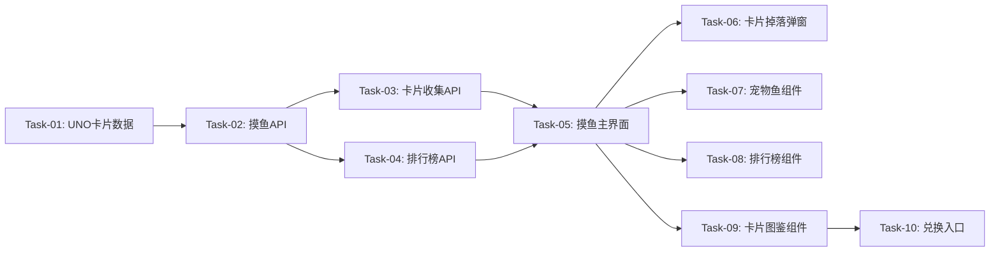

# 摸鱼鱼（游戏系统）— 开发任务计划

## 1. 任务概览

**总任务数**：10 个
**预计总工时**：300 分钟（约 5 小时）
**开发方法**：TDD — 每个任务按 RED → GREEN → REFACTOR 循环执行

**关键标注**：
- 🔒 阻塞任务：被多个任务依赖，建议优先完成
- ⚠️ 风险任务：技术难度高，可能需要额外时间

### 依赖关系图

---

## 2. 开发任务

### 阶段一：后端基础设施

**阶段完成标准**：摸鱼API和卡片数据可用

---

#### Task-01: UNO卡片数据定义 🔒

**通俗解释**：定义54种UNO卡片的数据结构

**做什么**：
- 创建 `server/src/data/unoCards.ts`
- 定义54种卡片数据
- 包含id、name、color、value、rarity、bonusText
- 导出卡片池常量

**涉及文件**：
- `server/src/data/unoCards.ts`

**参考**：摸鱼鱼.md 第5.2节"UNO卡片掉落" - 卡片池设计

**依赖**：无

**预估工时**：30 分钟

**验证标准**（TDD RED 阶段直接转化为测试用例）：
- [ ] UNO_CARDS 数组长度为54
- [ ] 每张卡片包含id, name, color, value, rarity, bonusText
- [ ] 红色卡片13张（0-9 + Skip + Reverse + Draw Two）
- [ ] 蓝色卡片13张
- [ ] 绿色卡片13张
- [ ] 黄色卡片13张
- [ ] 万能卡片2张（Wild + Wild Draw Four）

---

#### Task-02: 摸鱼API 🔒

**通俗解释**：实现摸鱼点击接口，处理卡片掉落和宠物鱼升级

**做什么**：
- 创建 `server/src/routes/moyu.ts`
- 实现 `POST /api/moyu/click` 接口
- 检查每日配额
- 生成随机卡片
- 保存卡片到用户收集库
- 更新宠物鱼经验值
- 更新摸鱼统计
- 错误处理

**涉及文件**：
- `server/src/routes/moyu.ts`
- `server/src/index.ts`（注册路由）

**参考**：技术方案 第4节"API 设计" - POST /api/moyu/click

**依赖**：Task-01

**预估工时**：60 分钟

**验证标准**（TDD RED 阶段直接转化为测试用例）：
- [ ] POST /api/moyu/click → 返回200，body包含cards, petFish, todayCount, maxCount
- [ ] cards数组长度为1或2
- [ ] 每张卡片包含完整字段
- [ ] 数据库中创建了UnoCard记录
- [ ] 重复卡片count累加
- [ ] MoyuStat的todayCount+1，totalCount+1
- [ ] Circle的petFishExp增加
- [ ] 达到上限 → 返回400

---

### 阶段二：查询API

**阶段完成标准**：卡片收集和排行榜查询可用

---

#### Task-03: 卡片收集API

**通俗解释**：实现获取用户卡片收集列表接口

**做什么**：
- 实现 `GET /api/moyu/cards` 接口
- 查询用户所有卡片
- 计算总数量和种类数
- 错误处理

**涉及文件**：
- `server/src/routes/moyu.ts`

**参考**：技术方案 第4节"API 设计" - GET /api/moyu/cards

**依赖**：Task-02

**预估工时**：30 分钟

**验证标准**（TDD RED 阶段直接转化为测试用例）：
- [ ] GET /api/moyu/cards → 返回200，body包含cards, totalCount, uniqueCount
- [ ] cards数组包含用户所有收集的卡片
- [ ] totalCount为所有卡片count之和
- [ ] uniqueCount为不同cardId数量

---

#### Task-04: 排行榜API

**通俗解释**：实现获取鱼圈摸鱼排行榜接口

**做什么**：
- 实现 `GET /api/moyu/leaderboard` 接口
- 查询鱼圈成员摸鱼统计
- 按今日次数降序排序
- 今日次数相同按历史总次数降序
- 限制返回前10名
- 错误处理

**涉及文件**：
- `server/src/routes/moyu.ts`

**参考**：技术方案 第4节"API 设计" - GET /api/moyu/leaderboard

**依赖**：Task-02

**预估工时**：30 分钟

**验证标准**（TDD RED 阶段直接转化为测试用例）：
- [ ] GET /api/moyu/leaderboard → 返回200，body包含leaderboard数组
- [ ] leaderboard按todayCount降序排列
- [ ] todayCount相同时按totalCount降序
- [ ] 最多返回10条记录
- [ ] 每条记录包含userId, userName, todayCount, totalCount

---

### 阶段三：前端页面开发

**阶段完成标准**：用户可以通过前端页面进行摸鱼游戏

---

#### Task-05: 摸鱼主界面

**通俗解释**：创建摸鱼主界面，显示摸鱼按钮、宠物鱼、排行榜

**做什么**：
- 创建 `client/src/components/MoyuGame.tsx`
- 实现摸鱼按钮
- 实现今日配额显示
- 布局宠物鱼、排行榜、卡片图鉴区域
- 调用摸鱼API

**涉及文件**：
- `client/src/components/MoyuGame.tsx`
- `client/src/App.tsx`（路由配置）

**参考**：摸鱼鱼.md 第5.1节"摸鱼点击按钮"

**依赖**：Task-03, Task-04

**预估工时**：60 分钟

**验证标准**（TDD RED 阶段直接转化为测试用例）：
- [ ] 页面显示"带薪疯狂摸鱼 🦥"标题
- [ ] 显示今日配额"{已用次数} / {上限次数}"
- [ ] 显示橙色摸鱼按钮
- [ ] 点击按钮调用摸鱼API
- [ ] 摸鱼成功弹出卡片掉落弹窗
- [ ] 达到上限按钮禁用，显示提示

---

#### Task-06: 卡片掉落弹窗

**通俗解释**：创建卡片掉落弹窗，展示本次获得的卡片

**做什么**：
- 创建 `client/src/components/CardDropModal.tsx`
- 显示1-2张卡片
- 每张卡片显示稀有度、数字、名称、彩蛋
- 显示"继续摸鱼"按钮
- 关闭弹窗返回主界面

**涉及文件**：
- `client/src/components/CardDropModal.tsx`

**参考**：摸鱼鱼.md 第5.2节"卡片掉落弹窗"

**依赖**：Task-05

**预估工时**：30 分钟

**验证标准**（TDD RED 阶段直接转化为测试用例）：
- [ ] 弹窗显示"摸鱼成功！抽得神牌"标题
- [ ] 显示1-2张卡片
- [ ] 每张卡片显示稀有度标签、数字、名称
- [ ] 卡片颜色正确（Red/Blue/Green/Yellow/Wild）
- [ ] 显示"继续摸鱼 / 收下卡牌 🦦"按钮
- [ ] 点击按钮关闭弹窗

---

#### Task-07: 宠物鱼组件

**通俗解释**：创建宠物鱼组件，显示鱼圈共享宠物鱼

**做什么**：
- 创建 `client/src/components/PetFish.tsx`
- 显示宠物鱼emoji和名称
- 显示品类和等级标签
- 显示经验条
- 实现浮动动画

**涉及文件**：
- `client/src/components/PetFish.tsx`

**参考**：摸鱼鱼.md 第5.4节"宠物鱼养成系统"

**依赖**：Task-05

**预估工时**：30 分钟

**验证标准**（TDD RED 阶段直接转化为测试用例）：
- [ ] 显示"治愈金鱼池"标题
- [ ] 显示宠物鱼emoji和名称
- [ ] 显示品类标签
- [ ] 显示等级标签
- [ ] 显示经验条"{当前经验} / {升级所需经验} XP"
- [ ] 宠物鱼有浮动动画

---

#### Task-08: 排行榜组件

**通俗解释**：创建排行榜组件，显示鱼圈成员摸鱼次数排名

**做什么**：
- 创建 `client/src/components/Leaderboard.tsx`
- 显示排行榜列表
- 显示排名奖牌emoji
- 高亮当前用户
- 显示今日次数和历史总次数

**涉及文件**：
- `client/src/components/Leaderboard.tsx`

**参考**：摸鱼鱼.md 第5.5节"带薪战斗排行榜"

**依赖**：Task-05

**预估工时**：30 分钟

**验证标准**（TDD RED 阶段直接转化为测试用例）：
- [ ] 显示"带薪战斗排行榜"标题
- [ ] 显示排行榜列表，最多10人
- [ ] 第1名显示🥇，第2名🥈，第3名🥉，其他🐟
- [ ] 当前用户高亮显示
- [ ] 当前用户显示"我"标签
- [ ] 显示今日次数和历史总次数

---

#### Task-09: 卡片图鉴组件

**通俗解释**：创建卡片图鉴组件，展示用户收集进度

**做什么**：
- 创建 `client/src/components/CardCollection.tsx`
- 显示收集进度百分比
- 显示54种卡片网格
- 已获得卡片彩色显示
- 未获得卡片灰色半透明
- 显示持有数量

**涉及文件**：
- `client/src/components/CardCollection.tsx`

**参考**：摸鱼鱼.md 第5.3节"UNO卡片收集图鉴"

**依赖**：Task-05

**预估工时**：40 分钟

**验证标准**（TDD RED 阶段直接转化为测试用例）：
- [ ] 显示"我的 UNO 摸鱼图鉴"标题
- [ ] 显示"{已解锁百分比}% 解锁"
- [ ] 显示54种卡片网格
- [ ] 已获得卡片彩色显示，右上角"GOT"标签
- [ ] 未获得卡片灰色半透明显示
- [ ] 显示持有数量

---

#### Task-10: 兑换入口

**通俗解释**：创建兑换入口，集满108张卡片可申请兑换

**做什么**：
- 创建 `client/src/components/RedeemModal.tsx`
- 显示兑换规则
- 显示当前收集统计
- 判断是否满足兑换条件
- 满足条件显示"发送邮件申请"按钮

**涉及文件**：
- `client/src/components/RedeemModal.tsx`

**参考**：摸鱼鱼.md 第5.6节"兑换入口"

**依赖**：Task-09

**预估工时**：20 分钟

**验证标准**（TDD RED 阶段直接转化为测试用例）：
- [ ] 显示"实体 UNO 兑换申请入口"标题
- [ ] 显示兑换规则说明
- [ ] 显示累计卡牌数和独特种类数
- [ ] 满足条件显示"满足兑换资格"标签
- [ ] 满足条件显示"发送邮件申请"按钮
- [ ] 不满足条件显示"尚未集齐"标签
- [ ] 点击发送邮件打开邮件客户端

---

## 3. AC 覆盖总表

| AC 编号 | 验收标准概述 | 承接任务 | 验证方式 |
|---------|-------------|---------|---------|
| AC-001 | 点击摸鱼弹出卡片掉落弹窗 | Task-02, Task-05, Task-06 | 测试API + 手动验证UI |
| AC-002 | 卡片保存到用户收集库 | Task-02 | 测试API |
| AC-003 | 宠物鱼经验条实时更新 | Task-02, Task-07 | 测试API + 手动验证UI |
| AC-004 | 宠物鱼升级显示动画 | Task-07 | 手动验证UI |
| AC-005 | 排行榜显示成员摸鱼次数 | Task-04, Task-08 | 测试API + 手动验证UI |
| AC-101 | 达到上限按钮禁用 | Task-02, Task-05 | 测试API异常 + 手动验证UI |
| AC-102 | 重复卡片count累加 | Task-02 | 测试API |
| AC-103 | 经验溢出保留 | Task-02 | 测试API |
| AC-104 | 集满108张显示兑换入口 | Task-09, Task-10 | 手动验证UI |
| AC-201 | 60%概率1张，40%概率2张 | Task-02 | 测试API |
| AC-202 | 基于用户ID哈希确定上限 | Task-02 | 测试API |
| AC-203 | 每张卡片+5点经验 | Task-02 | 测试API |
| AC-204 | 品类随等级变化 | Task-02, Task-07 | 测试API + 手动验证UI |

---

## 4. 完成定义

- [ ] 所有任务的验证标准（测试用例）通过
- [ ] AC 覆盖总表中每条 AC 的验证方式已执行并通过
- [ ] 用户可以点击摸鱼获得卡片
- [ ] 卡片收集图鉴正常显示
- [ ] 宠物鱼养成系统正常工作
- [ ] 排行榜正常显示
- [ ] 集满108张卡片可申请兑换
