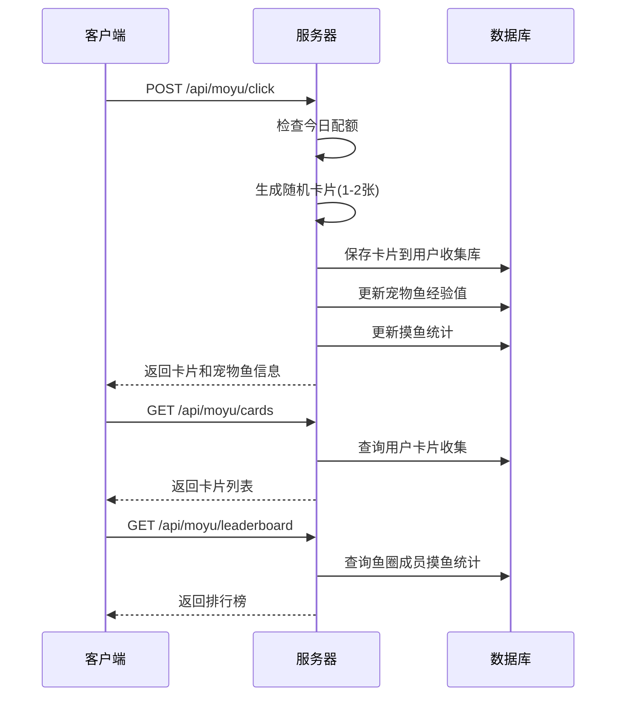

# 摸鱼鱼（游戏系统）— 技术设计文档

## 1. 设计概要

**功能描述**：实现摸鱼游戏系统，包括UNO卡片收集、宠物鱼养成、摸鱼排行榜功能

**影响范围**：游戏模块、鱼圈模块、用户模块

**技术难点**：卡片掉落概率、每日次数限制、宠物鱼升级逻辑、排行榜实时更新

**外部依赖**：用户系统（Phase 1.1）、鱼圈管理（Phase 1.2）

---

## 2. 架构概览

摸鱼游戏系统提供REST API处理摸鱼操作，前端通过API进行游戏交互。

### 模块交互



---

## 3. 数据库设计

### 新增表

#### `UnoCard`

**用途**：存储鱼圈公共UNO卡片收集（按鱼圈共享）

| 字段名 | 类型 | 约束 | 说明 |
|--------|------|------|------|
| id | TEXT | PK | 卡片记录ID (UUID) |
| userId | TEXT | FK(User.id), NOT NULL | 最后获得者用户ID |
| circleId | TEXT | FK(Circle.id), NOT NULL | 鱼圈ID |
| cardId | TEXT | NOT NULL | 卡片定义ID (如 "R_0") |
| cardName | TEXT | NOT NULL | 卡片名称 |
| count | INTEGER | NOT NULL, DEFAULT 1 | 鱼圈累计持有数量 |
| rarity | TEXT | NOT NULL | 稀有度 (N/R/SR) |
| color | TEXT | NOT NULL | 颜色 |
| createdAt | DATETIME | DEFAULT CURRENT_TIMESTAMP | 首次获得时间 |
| updatedAt | DATETIME | DEFAULT CURRENT_TIMESTAMP | 最后更新时间 |

**索引**：
- `(circleId, cardId)` 唯一索引
- `circleId` 索引

```sql
CREATE TABLE "UnoCard" (
    id TEXT PRIMARY KEY,
    userId TEXT NOT NULL,
    circleId TEXT NOT NULL,
    cardId TEXT NOT NULL,
    cardName TEXT NOT NULL,
    count INTEGER NOT NULL DEFAULT 1,
    rarity TEXT NOT NULL,
    color TEXT NOT NULL,
    createdAt DATETIME DEFAULT CURRENT_TIMESTAMP,
    updatedAt DATETIME DEFAULT CURRENT_TIMESTAMP,
    FOREIGN KEY (userId) REFERENCES "User"(id),
    FOREIGN KEY (circleId) REFERENCES "Circle"(id),
    UNIQUE(circleId, cardId)
);
```

#### `CardDropLog`

**用途**：记录鱼圈卡片掉落历史，供所有成员查看

| 字段名 | 类型 | 约束 | 说明 |
|--------|------|------|------|
| id | TEXT | PK | 记录ID (UUID) |
| userId | TEXT | FK(User.id), NOT NULL | 获得者用户ID |
| userName | TEXT | NOT NULL | 获得者昵称 |
| circleId | TEXT | FK(Circle.id), NOT NULL | 鱼圈ID |
| cardId | TEXT | NOT NULL | 卡片定义ID |
| cardName | TEXT | NOT NULL | 卡片名称 |
| color | TEXT | NOT NULL | 颜色 |
| rarity | TEXT | NOT NULL | 稀有度 (N/R/SR) |
| createdAt | DATETIME | DEFAULT CURRENT_TIMESTAMP | 获得时间 |

**索引**：
- `circleId` 索引（按鱼圈查询）
- `(circleId, createdAt)` 复合索引（按时间倒序查询）

```sql
CREATE TABLE "CardDropLog" (
    id TEXT PRIMARY KEY,
    userId TEXT NOT NULL,
    userName TEXT NOT NULL,
    circleId TEXT NOT NULL,
    cardId TEXT NOT NULL,
    cardName TEXT NOT NULL,
    color TEXT NOT NULL,
    rarity TEXT NOT NULL,
    createdAt DATETIME DEFAULT CURRENT_TIMESTAMP,
    FOREIGN KEY (userId) REFERENCES "User"(id),
    FOREIGN KEY (circleId) REFERENCES "Circle"(id)
);
CREATE INDEX idx_cardDropLog_circleId_createdAt ON "CardDropLog"(circleId, createdAt DESC);
```

#### `MoyuStat`

**用途**：存储用户摸鱼统计

| 字段名 | 类型 | 约束 | 说明 |
|--------|------|------|------|
| id | TEXT | PK | 统计记录ID (UUID) |
| userId | TEXT | FK(User.id), NOT NULL | 用户ID |
| circleId | TEXT | FK(Circle.id), NOT NULL | 鱼圈ID |
| userName | TEXT | NOT NULL | 用户昵称 |
| todayCount | INTEGER | NOT NULL, DEFAULT 0 | 今日摸鱼次数 |
| totalCount | INTEGER | NOT NULL, DEFAULT 0 | 历史总次数 |
| lastMoyuTime | DATETIME | 最后摸鱼时间 |
| createdAt | DATETIME | DEFAULT CURRENT_TIMESTAMP | 创建时间 |
| updatedAt | DATETIME | DEFAULT CURRENT_TIMESTAMP | 更新时间 |

**索引**：
- `(userId, circleId)` 唯一索引
- `circleId` 索引（排行榜查询）

```sql
CREATE TABLE "MoyuStat" (
    id TEXT PRIMARY KEY,
    userId TEXT NOT NULL,
    circleId TEXT NOT NULL,
    userName TEXT NOT NULL,
    todayCount INTEGER NOT NULL DEFAULT 0,
    totalCount INTEGER NOT NULL DEFAULT 0,
    lastMoyuTime DATETIME,
    createdAt DATETIME DEFAULT CURRENT_TIMESTAMP,
    updatedAt DATETIME DEFAULT CURRENT_TIMESTAMP,
    FOREIGN KEY (userId) REFERENCES "User"(id),
    FOREIGN KEY (circleId) REFERENCES "Circle"(id),
    UNIQUE(userId, circleId)
);
```

### 现有表修改

#### `Circle`

新增宠物鱼相关字段（Phase 1.1 已创建）

---

## 4. API 设计

### `POST /api/moyu/click`

**描述**：摸鱼点击 → AC-001, AC-002, AC-003, AC-201, AC-202, AC-203

**鉴权**：需要JWT

**Request**：无

**Response（成功）**：
```json
{
    "success": true,
    "data": {
        "cards": [
            {
                "id": "R_0",
                "name": "红色 0",
                "color": "Red",
                "value": "0",
                "rarity": "N",
                "bonusText": "今天又是红色星期一"
            }
        ],
        "petFish": {
            "name": "懵懂胖金鱼",
            "level": 1,
            "exp": 5,
            "type": "肥嘟嘟胖金鱼"
        },
        "todayCount": 1,
        "maxCount": 30
    }
}
```

**异常响应**：

| 场景 | 状态码 | 响应 | 对应 AC |
|------|--------|------|---------|
| 今日已达上限 | 400 | `{"success": false, "message": "你已触及今日防沉迷保护网！"}` | AC-101 |

---

### `GET /api/moyu/cards`

**描述**：获取鱼圈卡片收集（按鱼圈查询）

**鉴权**：需要JWT

**Request Query**：
- `circleId` (string, 必填) — 鱼圈ID

**Response**：
```json
{
    "success": true,
    "data": {
        "cards": [...],
        "totalCount": 108,
        "uniqueCount": 54
    }
}
```

---

### `GET /api/moyu/card-logs`

**描述**：获取鱼圈卡片掉落记录（CR-001 新增）

**鉴权**：需要JWT

**Request Query**：
- `circleId` (string, 必填) — 鱼圈ID
- `limit` (number, 可选, 默认50) — 返回条数

**Response**：
```json
{
    "success": true,
    "data": {
        "logs": [
            {
                "id": "uuid",
                "userId": "uuid",
                "userName": "摸鱼水獭",
                "cardId": "R_0",
                "cardName": "红色 0",
                "color": "Red",
                "rarity": "N",
                "createdAt": "2026-06-22T10:30:00Z"
            }
        ]
    }
}
```

---

### `GET /api/moyu/leaderboard`

**描述**：获取摸鱼排行榜 → AC-005

**鉴权**：需要JWT

**Response**：
```json
{
    "success": true,
    "data": {
        "leaderboard": [
            {
                "userId": "uuid",
                "userName": "摸鱼水獭",
                "todayCount": 10,
                "totalCount": 100
            }
        ]
    }
}
```

---

## 5. 核心逻辑

### 5.1 每日摸鱼次数限制

**触发条件**：用户点击摸鱼

**处理流程**：
1. 计算用户每日摸鱼上限（基于用户ID哈希，15-45次）
2. 查询今日摸鱼次数
3. 判断是否达到上限

**伪代码**：
```
function getMaxCount(userId: string): number {
    // 基于用户ID生成确定性哈希
    let hash = 0
    for (let i = 0; i < userId.length; i++) {
        hash = ((hash << 5) - hash) + userId.charCodeAt(i)
        hash = hash & hash
    }
    // 映射到15-45范围
    return 15 + (Math.abs(hash) % 31)
}
```

---

### 5.2 卡片掉落逻辑

**触发条件**：用户摸鱼

**处理流程**：
1. 决定掉落数量（60%概率1张，40%概率2张）
2. 从54种卡片中随机抽取
3. 保存到用户收集库（重复卡片count累加）

**伪代码**：
```
function generateCards(): UnoCard[] {
    const count = Math.random() < 0.6 ? 1 : 2
    const cards: UnoCard[] = []
    
    for (let i = 0; i < count; i++) {
        const card = UNO_CARDS[Math.floor(Math.random() * UNO_CARDS.length)]
        cards.push(card)
    }
    
    return cards
}
```

---

### 5.3 宠物鱼升级逻辑

**触发条件**：用户摸鱼成功

**处理流程**：
1. 计算经验值增加（每张卡片+5点）
2. 检查是否达到升级条件（当前等级 × 50）
3. 如果升级，更新等级和品类

**伪代码**：
```
function addExp(currentLevel: number, currentExp: number, addedExp: number) {
    let newLevel = currentLevel
    let newExp = currentExp + addedExp
    const expNeeded = currentLevel * 50
    
    while (newExp >= expNeeded) {
        newExp -= expNeeded
        newLevel++
    }
    
    const newType = getFishType(newLevel)
    
    return { level: newLevel, exp: newExp, type: newType }
}

function getFishType(level: number): string {
    if (level >= 15) return "极品七彩锦鲤皇"
    if (level >= 10) return "太极双休太公鱼"
    if (level >= 5) return "带薪发愣神游鳌"
    return "肥嘟嘟胖金鱼"
}
```

---

## 6. 现有代码改动

| 模块 / 文件 | 改动内容 | 原因 | 对应 AC |
|-------------|---------|------|---------|
| server/src/index.ts | 添加 /api/moyu 路由 | 新增游戏API | - |

---

## 7. 技术决策

### 每日次数计算方案

**背景**：需要为每个用户确定每日摸鱼上限

**选项**：
- A: 基于用户ID哈希 — 确定性，每个用户固定
- B: 随机生成 — 每天不同，增加惊喜感
- C: 数据库存储 — 可配置，但增加复杂度

**结论**：选择基于用户ID哈希，简单且确定性

---

## 8. 安全与性能

**输入校验**：
- 无用户输入，服务端生成

**性能考量**：
- 卡片掉落计算在服务端完成
- 排行榜查询使用索引优化

---

## 9. AC 覆盖总表

| AC 编号 | 验收标准概述 | 实现位置 |
|---------|-------------|---------|
| AC-001 | 点击摸鱼弹出卡片掉落弹窗 | API POST /api/moyu/click |
| AC-002 | 卡片保存到用户收集库 | API POST /api/moyu/click |
| AC-003 | 宠物鱼经验条实时更新 | API POST /api/moyu/click |
| AC-004 | 宠物鱼升级显示动画 | 前端实现 |
| AC-005 | 排行榜显示成员摸鱼次数 | API GET /api/moyu/leaderboard |
| AC-101 | 达到上限按钮禁用 | API POST /api/moyu/click 异常 |
| AC-102 | 重复卡片count累加 | API POST /api/moyu/click |
| AC-103 | 经验溢出保留 | 核心逻辑 5.3 |
| AC-104 | 集满108张显示兑换入口 | 前端实现 |
| AC-201 | 60%概率1张，40%概率2张 | 核心逻辑 5.2 |
| AC-202 | 基于用户ID哈希确定上限 | 核心逻辑 5.1 |
| AC-203 | 每张卡片+5点经验 | 核心逻辑 5.3 |
| AC-204 | 品类随等级变化 | 核心逻辑 5.3 |

---

## 附录：变更记录

| 日期 | 变更内容 | 原因 |
|------|---------|------|
| 2026-06-11 | 初始版本 | — |
