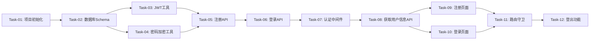

# 用户系统 — 开发任务计划

## 1. 任务概览

**总任务数**：12 个
**预计总工时**：360 分钟（约 6 小时）
**开发方法**：TDD — 每个任务按 RED → GREEN → REFACTOR 循环执行

**关键标注**：
- 🔒 阻塞任务：被多个任务依赖，建议优先完成
- ⚠️ 风险任务：技术难度高，可能需要额外时间

### 依赖关系图

### 可并行任务组

| 并行组 | 任务 | 说明 |
|--------|------|------|
| 组1 | Task-03, Task-04 | JWT工具和密码加密工具互不依赖 |
| 组2 | Task-09, Task-10 | 注册页面和登录页面可并行开发 |

---

## 2. 开发任务

### 阶段一：基础设施搭建

**阶段完成标准**：项目可以启动，数据库连接正常，基础工具函数可用

---

#### Task-01: 项目初始化 🔒

**通俗解释**：搭建前后端项目骨架，安装必要依赖，配置开发环境

**做什么**：
- 创建 `client/` 目录，初始化 React + Vite + TypeScript 项目
- 创建 `server/` 目录，初始化 Express + TypeScript 项目
- 安装前端依赖：react, react-dom, axios, tailwindcss, lucide-react, motion
- 安装后端依赖：express, @prisma/client, jsonwebtoken, bcryptjs, cors, dotenv
- 配置 TypeScript、Vite、Tailwind CSS
- 创建 `.env` 文件

**涉及文件**：
- `client/package.json`
- `client/vite.config.ts`
- `client/tsconfig.json`
- `client/tailwind.config.js`
- `server/package.json`
- `server/tsconfig.json`
- `server/.env`

**参考**：技术栈.md 第四节"核心依赖清单"

**依赖**：无

**预估工时**：60 分钟

**验证标准**（TDD RED 阶段直接转化为测试用例）：
- [ ] `cd client && npm run dev` 启动成功，访问 http://localhost:3000 返回页面
- [ ] `cd server && npm run dev` 启动成功，访问 http://localhost:3001 返回响应
- [ ] 前端 `npm run build` 构建成功
- [ ] 后端 `npm run build` 构建成功

---

#### Task-02: 数据库Schema设计 🔒

**通俗解释**：创建用户表和鱼圈表，让系统可以存储用户和鱼圈数据

**做什么**：
- 初始化 Prisma
- 创建 User 模型
- 创建 Circle 模型
- 运行数据库迁移
- 验证数据库连接

**涉及文件**：
- `server/prisma/schema.prisma`

**参考**：技术方案 第3节"数据库设计"

**依赖**：Task-01

**预估工时**：30 分钟

**验证标准**（TDD RED 阶段直接转化为测试用例）：
- [ ] `npx prisma migrate dev --name init` 执行成功
- [ ] `npx prisma studio` 可以打开，看到 User 和 Circle 表
- [ ] 手动在 Prisma Studio 中创建 User 记录成功
- [ ] 手动在 Prisma Studio 中创建 Circle 记录成功

---

### 阶段二：认证工具开发

**阶段完成标准**：JWT签发/验证和密码加密/验证功能可用

---

#### Task-03: JWT工具函数

**通俗解释**：实现JWT令牌的签发和验证功能，用于用户登录状态管理

**做什么**：
- 创建 `server/src/utils/jwt.ts`
- 实现 `signToken(userId: string)` 函数
- 实现 `verifyToken(token: string)` 函数
- 编写单元测试

**涉及文件**：
- `server/src/utils/jwt.ts`
- `server/src/utils/jwt.test.ts`

**参考**：技术方案 第7节"技术决策" - JWT有效期设置

**依赖**：Task-02

**预估工时**：30 分钟

**验证标准**（TDD RED 阶段直接转化为测试用例）：
- [ ] `signToken('user-123')` 返回非空字符串
- [ ] `verifyToken(validToken)` 返回 `{ userId: 'user-123' }`
- [ ] `verifyToken('invalid-token')` 抛出错误
- [ ] `verifyToken(expiredToken)` 抛出错误

---

#### Task-04: 密码加密工具函数

**通俗解释**：实现密码加密和验证功能，确保存储的密码安全

**做什么**：
- 创建 `server/src/utils/password.ts`
- 实现 `hashPassword(password: string)` 函数
- 实现 `comparePassword(password: string, hashedPassword: string)` 函数
- 编写单元测试

**涉及文件**：
- `server/src/utils/password.ts`
- `server/src/utils/password.test.ts`

**参考**：技术方案 第7节"技术决策" - 密码加密方案选择

**依赖**：Task-02

**预估工时**：20 分钟

**验证标准**（TDD RED 阶段直接转化为测试用例）：
- [ ] `hashPassword('123456')` 返回非空字符串，且不等于原密码
- [ ] `comparePassword('123456', hashedPassword)` 返回 `true`
- [ ] `comparePassword('wrong', hashedPassword)` 返回 `false`
- [ ] 同一密码多次加密结果不同（salt不同）

---

### 阶段三：注册功能

**阶段完成标准**：用户可以通过邮箱注册账号，自动创建私有鱼圈

---

#### Task-05: 注册API 🔒

**通俗解释**：实现用户注册接口，让新用户可以创建账号

**做什么**：
- 创建 `server/src/routes/auth.ts`
- 实现 `POST /api/auth/register` 接口
- 输入验证（邮箱格式、密码长度、昵称非空）
- 检查邮箱唯一性
- 创建用户记录
- 创建私有鱼圈记录
- 更新用户关联
- 签发JWT
- 错误处理

**涉及文件**：
- `server/src/routes/auth.ts`
- `server/src/index.ts`（注册路由）

**参考**：技术方案 第4节"API 设计" - POST /api/auth/register

**依赖**：Task-03, Task-04

**预估工时**：60 分钟

**验证标准**（TDD RED 阶段直接转化为测试用例）：
- [ ] POST /api/auth/register 传入有效数据 → 返回 200，body 包含 token 和 user
- [ ] 返回的 user 包含 id, email, nickname, avatar, salary, workStart, workEnd
- [ ] 数据库中创建了 User 记录
- [ ] 数据库中创建了私有 Circle 记录（name="我的专属安全水箱 🐠", code="000000", isPrivate=true）
- [ ] User 的 privateCircleId 和 joinedCircleId 指向新创建的 Circle
- [ ] 重复邮箱注册 → 返回 400，body.message = "该邮箱已在职场划水中！请尝试直接登录。"
- [ ] 密码少于6位 → 返回 400，body.message = "认证失败：密码过短或网络超时"
- [ ] 昵称为空 → 返回 400，body.message = "注册需要填写一个萌新新昵称哦~"

---

### 阶段四：登录功能

**阶段完成标准**：已注册用户可以通过邮箱密码登录

---

#### Task-06: 登录API

**通俗解释**：实现用户登录接口，让已注册用户可以登录系统

**做什么**：
- 实现 `POST /api/auth/login` 接口
- 根据邮箱查询用户
- 验证密码
- 检查封禁状态
- 签发JWT
- 错误处理

**涉及文件**：
- `server/src/routes/auth.ts`

**参考**：技术方案 第4节"API 设计" - POST /api/auth/login

**依赖**：Task-05

**预估工时**：40 分钟

**验证标准**（TDD RED 阶段直接转化为测试用例）：
- [ ] POST /api/auth/login 传入正确邮箱密码 → 返回 200，body 包含 token 和 user
- [ ] 用户不存在 → 返回 400，body.message = "找不到该雇员信息，请确认邮箱或切换为注册页面！"
- [ ] 密码错误 → 返回 400，body.message = "密码输入有误，请核实后再敲门！"
- [ ] 用户被封禁 → 返回 403，body.message = "你已被管理员关进【冷冻鱼缸】！"

---

### 阶段五：用户信息获取

**阶段完成标准**：前端可以获取当前登录用户的信息

---

#### Task-07: 认证中间件

**通俗解释**：创建JWT验证中间件，保护需要登录才能访问的接口

**做什么**：
- 创建 `server/src/middleware/auth.ts`
- 实现JWT验证中间件
- 从请求头提取token
- 验证token有效性
- 将用户信息附加到请求对象

**涉及文件**：
- `server/src/middleware/auth.ts`

**参考**：技术方案 第4节"API 设计" - GET /api/auth/me

**依赖**：Task-06

**预估工时**：30 分钟

**验证标准**（TDD RED 阶段直接转化为测试用例）：
- [ ] 请求头包含有效token → 中间件调用next()
- [ ] 请求头无token → 返回 401
- [ ] 请求头token无效 → 返回 401
- [ ] 请求头token过期 → 返回 401

---

#### Task-08: 获取用户信息API

**通俗解释**：实现获取当前用户信息接口，让前端可以显示用户资料

**做什么**：
- 实现 `GET /api/auth/me` 接口
- 使用认证中间件
- 查询用户信息
- 查询用户当前鱼圈信息
- 返回用户和鱼圈信息

**涉及文件**：
- `server/src/routes/auth.ts`

**参考**：技术方案 第4节"API 设计" - GET /api/auth/me

**依赖**：Task-07

**预估工时**：30 分钟

**验证标准**（TDD RED 阶段直接转化为测试用例）：
- [ ] GET /api/auth/me 带有效token → 返回 200，body 包含 user 和 circle
- [ ] 返回的 user 包含完整字段
- [ ] 返回的 circle 包含 id, name, code, isPrivate, memberCount
- [ ] GET /api/auth/me 不带token → 返回 401

---

### 阶段六：前端页面开发

**阶段完成标准**：用户可以通过前端页面完成注册、登录、查看用户信息

---

#### Task-09: 注册页面

**通俗解释**：创建注册页面UI，让新用户可以通过网页注册账号

**做什么**：
- 创建 `client/src/components/RegisterForm.tsx`
- 实现邮箱输入框
- 实现密码输入框
- 实现昵称输入框
- 实现头像选择器（12个预设头像）
- 实现注册按钮
- 实现表单验证
- 实现错误提示
- 调用注册API

**涉及文件**：
- `client/src/components/RegisterForm.tsx`
- `client/src/App.tsx`（路由配置）

**参考**：用户系统.md 第5.1节"注册功能"

**依赖**：Task-08

**预估工时**：60 分钟

**验证标准**（TDD RED 阶段直接转化为测试用例）：
- [ ] 页面显示邮箱、密码、昵称输入框和头像选择器
- [ ] 头像选择器显示12个预设头像
- [ ] 点击头像可选中，选中状态高亮
- [ ] 填写有效信息点击注册 → 调用注册API
- [ ] 注册成功 → 跳转到主页
- [ ] 邮箱已存在 → 显示错误提示"该邮箱已在职场划水中！请尝试直接登录。"
- [ ] 密码少于6位 → 显示错误提示"认证失败：密码过短或网络超时"
- [ ] 昵称为空 → 显示错误提示"注册需要填写一个萌新新昵称哦~"

---

#### Task-10: 登录页面

**通俗解释**：创建登录页面UI，让已注册用户可以通过网页登录

**做什么**：
- 创建 `client/src/components/LoginForm.tsx`
- 实现邮箱输入框
- 实现密码输入框
- 实现登录按钮
- 实现表单验证
- 实现错误提示
- 调用登录API
- 实现底部切换链接到注册页

**涉及文件**：
- `client/src/components/LoginForm.tsx`
- `client/src/App.tsx`（路由配置）

**参考**：用户系统.md 第5.2节"登录功能"

**依赖**：Task-08

**预估工时**：40 分钟

**验证标准**（TDD RED 阶段直接转化为测试用例）：
- [ ] 页面显示邮箱和密码输入框
- [ ] 填写有效信息点击登录 → 调用登录API
- [ ] 登录成功 → 跳转到主页
- [ ] 用户不存在 → 显示错误提示"找不到该雇员信息，请确认邮箱或切换为注册页面！"
- [ ] 密码错误 → 显示错误提示"密码输入有误，请核实后再敲门！"
- [ ] 页面底部有"没有注册过工号？注册一个带薪化身账号"链接

---

#### Task-11: 路由守卫

**通俗解释**：实现路由保护，未登录用户自动跳转到登录页

**做什么**：
- 创建 `client/src/components/ProtectedRoute.tsx`
- 检查localStorage中的token
- 验证token有效性（调用 /api/auth/me）
- 未登录时重定向到登录页
- 已登录时正常渲染子组件

**涉及文件**：
- `client/src/components/ProtectedRoute.tsx`
- `client/src/App.tsx`（路由配置）

**参考**：用户系统.md AC-003

**依赖**：Task-09, Task-10

**预估工时**：30 分钟

**验证标准**（TDD RED 阶段直接转化为测试用例）：
- [ ] 未登录访问受保护页面 → 跳转到登录页
- [ ] 已登录访问受保护页面 → 正常显示
- [ ] token过期访问受保护页面 → 跳转到登录页
- [ ] 登录后自动跳转到之前的页面

---

#### Task-12: 登出功能

**通俗解释**：实现登出功能，让用户可以安全退出账号

**做什么**：
- 在主页添加"下班跑路"按钮
- 实现登出确认弹窗
- 清除localStorage中的token
- 跳转到登录页

**涉及文件**：
- `client/src/components/Home.tsx`（或主页组件）
- `client/src/App.tsx`

**参考**：用户系统.md 第5.3节"登出功能"

**依赖**：Task-11

**预估工时**：20 分钟

**验证标准**（TDD RED 阶段直接转化为测试用例）：
- [ ] 主页显示"下班跑路"按钮
- [ ] 点击按钮弹出确认框"你确信要收拾公文包下线，离开今天的带薪阵地吗？"
- [ ] 点击确认 → 清除token，跳转到登录页
- [ ] 点击取消 → 保持当前状态
- [ ] 登出后访问受保护页面 → 跳转到登录页

---

## 3. AC 覆盖总表

| AC 编号 | 验收标准概述 | 承接任务 | 验证方式 |
|---------|-------------|---------|---------|
| AC-001 | 注册成功，自动登录并进入主页，私有鱼圈自动创建 | Task-05, Task-09 | 测试注册API + 手动验证UI |
| AC-002 | 登录成功，进入主页，显示用户资料和当前鱼圈信息 | Task-06, Task-08, Task-10 | 测试登录API + 手动验证UI |
| AC-003 | 登出成功，返回登录页 | Task-12 | 手动验证UI |
| AC-101 | 邮箱已存在时显示错误提示 | Task-05, Task-09 | 测试注册API异常 + 手动验证UI |
| AC-102 | 昵称为空时显示错误提示 | Task-05, Task-09 | 测试注册API异常 + 手动验证UI |
| AC-103 | 密码错误时显示错误提示 | Task-06, Task-10 | 测试登录API异常 + 手动验证UI |
| AC-104 | 用户不存在时显示错误提示 | Task-06, Task-10 | 测试登录API异常 + 手动验证UI |
| AC-105 | 被封禁用户登录后显示封禁提示页 | Task-06, Task-10 | 测试登录API异常 + 手动验证UI |
| AC-106 | 网络异常时显示错误提示 | Task-09, Task-10 | 手动模拟网络异常 |
| AC-201 | 注册时自动创建私有鱼圈 | Task-05 | 测试注册API |
| AC-202 | 注册时设置默认工资和上下班时间 | Task-05 | 测试注册API |
| AC-203 | 密码少于6位时注册失败 | Task-05, Task-09 | 测试注册API异常 + 手动验证UI |
| AC-204 | 昵称超过40字符时输入框限制 | Task-09 | 手动验证UI |

---

## 4. 完成定义

- [ ] 所有任务的验证标准（测试用例）通过
- [ ] AC 覆盖总表中每条 AC 的验证方式已执行并通过
- [ ] 用户可以完成注册 → 登录 → 查看用户信息 → 登出的完整流程
- [ ] 私有鱼圈在注册时自动创建
- [ ] 被封禁用户登录后显示封禁提示页
