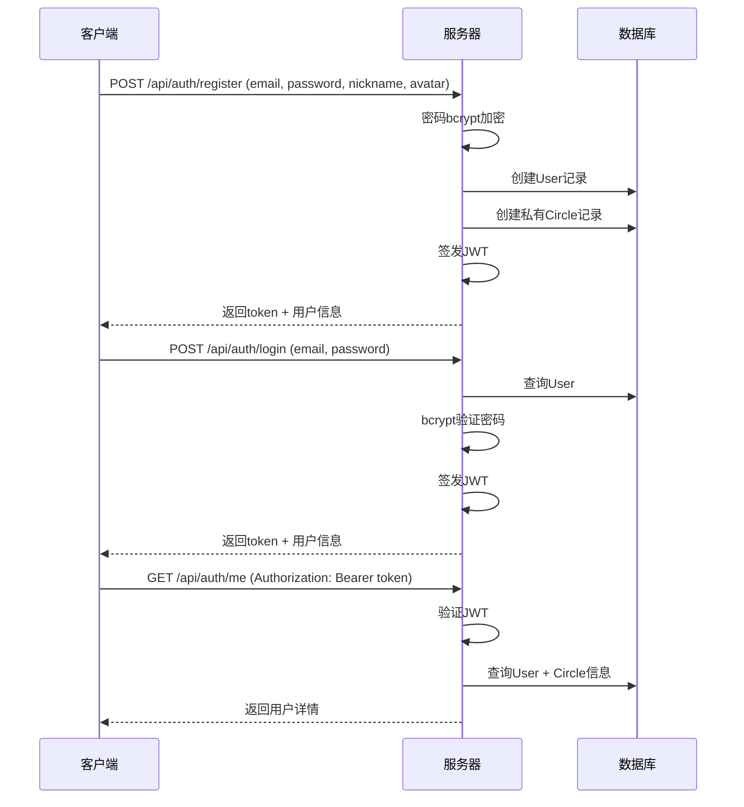

# 用户系统 — 技术设计文档

## 1. 设计概要

**功能描述**：实现用户注册、登录、登出和封禁提示功能，支持邮箱+密码方式，JWT认证，注册时自动创建私有鱼圈。

**影响范围**：用户模块、认证模块、鱼圈模块（自动创建私有鱼圈）

**技术难点**：JWT认证流程设计、密码加密存储、注册时事务性操作（用户创建+私有鱼圈创建）

**外部依赖**：无

---

## 2. 架构概览

用户系统采用前后端分离架构，前端通过REST API与后端交互，后端使用Express处理业务逻辑，SQLite+Prisma存储数据。

### 模块交互

| 模块 | 职责 |
|------|------|
| 前端 (React) | 登录/注册表单、路由守卫、JWT存储 |
| 后端 (Express) | 认证API、JWT签发/验证、密码加密 |
| 数据库 (SQLite) | 存储用户信息、鱼圈信息 |

### 认证流程



---

## 3. 数据库设计

### 新增表

#### `User`

**用途**：存储用户基本信息和认证信息

| 字段名 | 类型 | 约束 | 说明 |
|--------|------|------|------|
| id | TEXT | PK | 用户唯一标识 (UUID) |
| email | TEXT | UNIQUE, NOT NULL | 邮箱地址 |
| password | TEXT | NOT NULL | bcrypt加密后的密码 |
| nickname | TEXT | NOT NULL | 用户昵称 |
| avatar | TEXT | NOT NULL, DEFAULT 'moyu_otter' | 头像ID |
| salary | REAL | NOT NULL, DEFAULT 250 | 日薪（元） |
| workStart | TEXT | NOT NULL, DEFAULT '09:00' | 上班时间 |
| workEnd | TEXT | NOT NULL, DEFAULT '18:00' | 下班时间 |
| isBanned | BOOLEAN | NOT NULL, DEFAULT false | 是否被封禁 |
| joinedCircleId | TEXT | FK(Circle.id) | 当前加入的鱼圈ID |
| privateCircleId | TEXT | FK(Circle.id) | 私有鱼圈ID |
| createdAt | DATETIME | DEFAULT CURRENT_TIMESTAMP | 注册时间 |
| updatedAt | DATETIME | DEFAULT CURRENT_TIMESTAMP | 更新时间 |

**索引**：
- `email` 唯一索引（登录查询）
- `joinedCircleId` 索引（鱼圈成员查询）

```sql
CREATE TABLE "User" (
    id TEXT PRIMARY KEY,
    email TEXT UNIQUE NOT NULL,
    password TEXT NOT NULL,
    nickname TEXT NOT NULL,
    avatar TEXT NOT NULL DEFAULT 'moyu_otter',
    salary REAL NOT NULL DEFAULT 250,
    workStart TEXT NOT NULL DEFAULT '09:00',
    workEnd TEXT NOT NULL DEFAULT '18:00',
    isBanned BOOLEAN NOT NULL DEFAULT false,
    joinedCircleId TEXT,
    privateCircleId TEXT,
    createdAt DATETIME DEFAULT CURRENT_TIMESTAMP,
    updatedAt DATETIME DEFAULT CURRENT_TIMESTAMP,
    FOREIGN KEY (joinedCircleId) REFERENCES "Circle"(id),
    FOREIGN KEY (privateCircleId) REFERENCES "Circle"(id)
);
```

#### `Circle`

**用途**：存储鱼圈基本信息

| 字段名 | 类型 | 约束 | 说明 |
|--------|------|------|------|
| id | TEXT | PK | 鱼圈唯一标识 (UUID) |
| name | TEXT | NOT NULL | 鱼圈名称 |
| code | TEXT | UNIQUE | 6位邀请码 |
| ownerId | TEXT | FK(User.id) | 群主用户ID |
| isPrivate | BOOLEAN | NOT NULL, DEFAULT false | 是否私有鱼圈 |
| memberCount | INTEGER | NOT NULL, DEFAULT 1 | 成员数量 |
| petFishName | TEXT | DEFAULT '懵懂胖金鱼' | 宠物鱼名称 |
| petFishLevel | INTEGER | DEFAULT 1 | 宠物鱼等级 |
| petFishExp | INTEGER | DEFAULT 0 | 宠物鱼经验值 |
| petFishType | TEXT | DEFAULT '肥嘟嘟胖金鱼' | 宠物鱼品类 |
| createdAt | DATETIME | DEFAULT CURRENT_TIMESTAMP | 创建时间 |
| updatedAt | DATETIME | DEFAULT CURRENT_TIMESTAMP | 更新时间 |

**索引**：
- `code` 唯一索引（邀请码查询）
- `ownerId` 索引（群主查询）

```sql
CREATE TABLE "Circle" (
    id TEXT PRIMARY KEY,
    name TEXT NOT NULL,
    code TEXT UNIQUE,
    ownerId TEXT,
    isPrivate BOOLEAN NOT NULL DEFAULT false,
    memberCount INTEGER NOT NULL DEFAULT 1,
    petFishName TEXT DEFAULT '懵懂胖金鱼',
    petFishLevel INTEGER DEFAULT 1,
    petFishExp INTEGER DEFAULT 0,
    petFishType TEXT DEFAULT '肥嘟嘟胖金鱼',
    createdAt DATETIME DEFAULT CURRENT_TIMESTAMP,
    updatedAt DATETIME DEFAULT CURRENT_TIMESTAMP,
    FOREIGN KEY (ownerId) REFERENCES "User"(id)
);
```

---

## 4. API 设计

### `POST /api/auth/register`

**描述**：用户注册 → AC-001, AC-201, AC-202, AC-203

**鉴权**：无需

**Request**：
```json
{
    "email": "user@example.com",
    "password": "123456",
    "nickname": "摸鱼水獭",
    "avatar": "moyu_otter"
}
```

**Response（成功）**：
```json
{
    "success": true,
    "data": {
        "token": "eyJhbGciOiJIUzI1NiIsInR5cCI6IkpXVCJ9...",
        "user": {
            "id": "uuid",
            "email": "user@example.com",
            "nickname": "摸鱼水獭",
            "avatar": "moyu_otter",
            "salary": 250,
            "workStart": "09:00",
            "workEnd": "18:00",
            "isBanned": false,
            "joinedCircleId": "circle-uuid",
            "privateCircleId": "private-circle-uuid"
        }
    }
}
```

**异常响应**：

| 场景 | 状态码 | 响应 | 对应 AC |
|------|--------|------|---------|
| 邮箱已存在 | 400 | `{"success": false, "message": "该邮箱已在职场划水中！请尝试直接登录。"}` | AC-101 |
| 密码少于6位 | 400 | `{"success": false, "message": "认证失败：密码过短或网络超时"}` | AC-203 |
| 昵称为空 | 400 | `{"success": false, "message": "注册需要填写一个萌新新昵称哦~"}` | AC-102 |
| 邮箱格式无效 | 400 | `{"success": false, "message": "请输入有效的邮箱地址"}` | - |

---

### `POST /api/auth/login`

**描述**：用户登录 → AC-002, AC-103, AC-104, AC-105

**鉴权**：无需

**Request**：
```json
{
    "email": "user@example.com",
    "password": "123456"
}
```

**Response（成功）**：
```json
{
    "success": true,
    "data": {
        "token": "eyJhbGciOiJIUzI1NiIsInR5cCI6IkpXVCJ9...",
        "user": {
            "id": "uuid",
            "email": "user@example.com",
            "nickname": "摸鱼水獭",
            "avatar": "moyu_otter",
            "salary": 250,
            "workStart": "09:00",
            "workEnd": "18:00",
            "isBanned": false,
            "joinedCircleId": "circle-uuid",
            "privateCircleId": "private-circle-uuid"
        }
    }
}
```

**异常响应**：

| 场景 | 状态码 | 响应 | 对应 AC |
|------|--------|------|---------|
| 用户不存在 | 400 | `{"success": false, "message": "找不到该雇员信息，请确认邮箱或切换为注册页面！"}` | AC-104 |
| 密码错误 | 400 | `{"success": false, "message": "密码输入有误，请核实后再敲门！"}` | AC-103 |
| 用户被封禁 | 403 | `{"success": false, "message": "你已被管理员关进【冷冻鱼缸】！", "isBanned": true}` | AC-105 |

---

### `GET /api/auth/me`

**描述**：获取当前用户信息 → AC-002

**鉴权**：需要JWT

**Request**：
```
Authorization: Bearer <token>
```

**Response（成功）**：
```json
{
    "success": true,
    "data": {
        "user": {
            "id": "uuid",
            "email": "user@example.com",
            "nickname": "摸鱼水獭",
            "avatar": "moyu_otter",
            "salary": 250,
            "workStart": "09:00",
            "workEnd": "18:00",
            "isBanned": false,
            "joinedCircleId": "circle-uuid",
            "privateCircleId": "private-circle-uuid"
        },
        "circle": {
            "id": "circle-uuid",
            "name": "我的专属安全水箱 🐠",
            "code": "000000",
            "isPrivate": true,
            "memberCount": 1
        }
    }
}
```

**异常响应**：

| 场景 | 状态码 | 响应 | 对应 AC |
|------|--------|------|---------|
| Token无效/过期 | 401 | `{"success": false, "message": "认证失败，请重新登录"}` | - |

---

## 5. 核心逻辑

### 5.1 注册流程 → AC-001, AC-201, AC-202

**触发条件**：用户提交注册表单

**处理流程**：
1. 验证邮箱格式、密码长度、昵称非空
2. 检查邮箱是否已存在
3. 使用bcrypt加密密码（salt rounds: 10）
4. 创建用户记录
5. 创建私有鱼圈记录（名称："我的专属安全水箱 🐠"，邀请码："000000"）
6. 更新用户的 `privateCircleId` 和 `joinedCircleId`
7. 签发JWT（有效期7天）
8. 返回token和用户信息

**伪代码**：
```
async function register(email, password, nickname, avatar):
    // 验证输入
    validateEmail(email)
    validatePassword(password)  // >= 6位
    validateNickname(nickname)  // 非空
    
    // 检查邮箱唯一性
    existingUser = await db.user.findByEmail(email)
    if existingUser:
        throw Error("该邮箱已在职场划水中！请尝试直接登录。")
    
    // 加密密码
    hashedPassword = await bcrypt.hash(password, 10)
    
    // 创建用户
    user = await db.user.create({
        email, password: hashedPassword, nickname, avatar,
        salary: 250, workStart: "09:00", workEnd: "18:00"
    })
    
    // 创建私有鱼圈
    privateCircle = await db.circle.create({
        name: "我的专属安全水箱 🐠",
        code: "000000",
        ownerId: user.id,
        isPrivate: true
    })
    
    // 更新用户关联
    await db.user.update(user.id, {
        privateCircleId: privateCircle.id,
        joinedCircleId: privateCircle.id
    })
    
    // 签发JWT
    token = jwt.sign({ userId: user.id }, JWT_SECRET, { expiresIn: '7d' })
    
    return { token, user }
```

---

### 5.2 登录流程 → AC-002, AC-103, AC-104, AC-105

**触发条件**：用户提交登录表单

**处理流程**：
1. 根据邮箱查询用户
2. 验证密码
3. 检查用户是否被封禁
4. 签发JWT
5. 返回token和用户信息

**伪代码**：
```
async function login(email, password):
    // 查询用户
    user = await db.user.findByEmail(email)
    if !user:
        throw Error("找不到该雇员信息，请确认邮箱或切换为注册页面！")
    
    // 验证密码
    isPasswordValid = await bcrypt.compare(password, user.password)
    if !isPasswordValid:
        throw Error("密码输入有误，请核实后再敲门！")
    
    // 检查封禁状态
    if user.isBanned:
        throw ForbiddenError("你已被管理员关进【冷冻鱼缸】！")
    
    // 签发JWT
    token = jwt.sign({ userId: user.id }, JWT_SECRET, { expiresIn: '7d' })
    
    return { token, user }
```

---

## 6. 现有代码改动

这是项目初始化阶段，无现有代码需要改动。

| 模块 / 文件 | 改动内容 | 原因 | 对应 AC |
|-------------|---------|------|---------|
| 无 | - | - | - |

---

## 7. 技术决策

### 密码加密方案选择

**背景**：需要选择安全的密码加密方案

**选项**：
- A: bcrypt — 成熟稳定，自带salt，抗彩虹表攻击
- B: argon2 — 更新更安全，但依赖较重

**结论**：选择bcrypt，项目需求场景下安全性足够，依赖轻量

### JWT有效期设置

**背景**：需要平衡安全性和用户体验

**选项**：
- A: 1天 — 更安全，但用户需要频繁登录
- B: 7天 — 用户体验好，安全性可接受
- C: 30天 — 用户体验最好，但安全性较低

**结论**：选择7天，平衡安全性和用户体验

---

## 8. 安全与性能

**输入校验**：
- 邮箱格式校验（前端+后端双重校验）
- 密码长度校验（≥6位）
- 昵称长度校验（≤40字符）

**敏感数据处理**：
- 密码使用bcrypt加密存储，