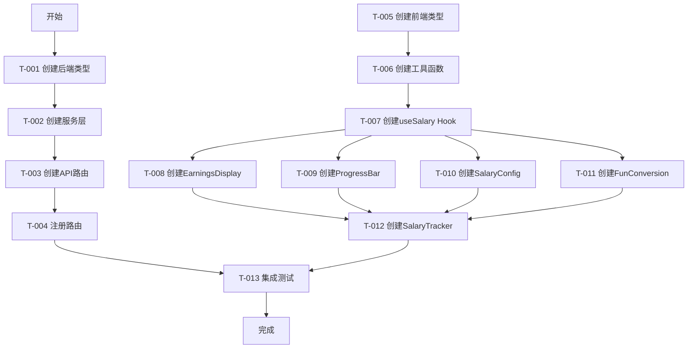
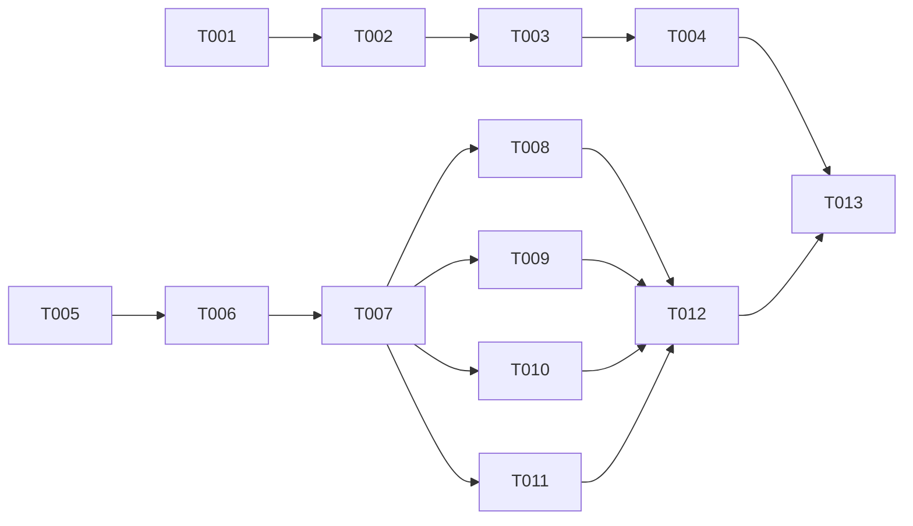

# 窝囊费系统 — 任务规划

## 1. 任务概览

**模块名称**：窝囊费系统（Phase 1.5）

**核心功能**：
- 实时窝囊费计算与展示
- 工作进度条可视化（含动画水獭）
- 工资参数配置（上班时间、下班时间、日薪）
- 防窥模式（一键遮挡金额）
- 趣味换算（奶茶、午餐、UNO卡牌）

**预估总工时**：8小时

**依赖模块**：用户系统（已完成）

---

## 2. 任务拆解

### Phase 1.5.1 — 后端基础设施

| 编号 | 任务 | 预估工时 | 前置依赖 | 验证标准 |
|------|------|---------|---------|---------|
| T-001 | 创建后端类型定义 | 0.5h | 无 | `server/src/types.ts` 包含 `SalaryConfig` 接口 |
| T-002 | 创建窝囊费服务层 | 1h | T-001 | `salary.service.ts` 实现配置查询和更新逻辑 |
| T-003 | 创建窝囊费API路由 | 0.5h | T-002 | `/api/salary/config` GET/PUT 接口可正常访问 |
| T-004 | 注册路由到主入口 | 0.5h | T-003 | 接口测试通过 |

**验证标准**：
- GET `/api/salary/config` 返回用户工资配置
- PUT `/api/salary/config` 成功更新配置并返回更新后的数据
- 参数校验生效（负数工资、无效时间格式）

---

### Phase 1.5.2 — 前端类型定义与工具函数

| 编号 | 任务 | 预估工时 | 前置依赖 | 验证标准 |
|------|------|---------|---------|---------|
| T-005 | 创建前端类型定义 | 0.5h | 无 | `client/src/types.ts` 包含 `SalaryConfig` 接口 |
| T-006 | 创建时间格式化工具 | 0.5h | T-005 | 工具函数可正确解析HH:MM格式并计算时间差 |

**验证标准**：
- `parseTime` 函数正确将HH:MM转换为Date对象
- `formatCountdown` 函数正确格式化倒计时文本

---

### Phase 1.5.3 — 自定义Hook开发

| 编号 | 任务 | 预估工时 | 前置依赖 | 验证标准 |
|------|------|---------|---------|---------|
| T-007 | 创建 `useSalary` Hook | 2h | T-005, T-006 | Hook实现所有核心计算逻辑 |

**验证标准**：
- AC-001: 工资250元/天，09:00-18:00，12:00时显示约¥83.33333，进度约33.33%
- AC-002: 工作时间内金额每200ms更新
- AC-101: 上班前显示¥0.00000，进度0%
- AC-102: 下班后显示日薪全额，进度100%
- AC-201: 金额计算公式正确
- AC-202: 趣味换算结果正确（100元→5.6杯奶茶、3.3顿午餐、2.2套UNO）

---

### Phase 1.5.4 — 前端组件开发

| 编号 | 任务 | 预估工时 | 前置依赖 | 验证标准 |
|------|------|---------|---------|---------|
| T-008 | 创建 `EarningsDisplay` 组件 | 1h | T-007 | 金额显示、状态标签、倒计时正常渲染 |
| T-009 | 创建 `ProgressBar` 组件 | 1h | T-007 | 进度条填充、动画水獭、进度文字正常显示 |
| T-010 | 创建 `SalaryConfig` 组件 | 0.5h | T-007 | 表单可编辑并保存配置 |
| T-011 | 创建 `FunConversion` 组件 | 0.5h | T-007 | 趣味换算卡片正常显示 |
| T-012 | 创建 `SalaryTracker` 主组件 | 0.5h | T-008~T-011 | 整合所有子组件，页面布局正确 |

**验证标准**：
- AC-003: 修改工资为300元，保存成功后立即重新计算
- AC-004: 点击"老板键 (防窥)"，金额显示为"¥ ***.**"，进度条和倒计时正常
- AC-005: 倒计时提示正确显示
- AC-203: 防窥模式切换正常

---

### Phase 1.5.5 — 集成测试

| 编号 | 任务 | 预估工时 | 前置依赖 | 验证标准 |
|------|------|---------|---------|---------|
| T-013 | 端到端集成测试 | 1h | T-004, T-012 | 完整流程测试通过 |

**验证标准**：
- 用户登录后访问窝囊费页面
- 实时计算正常工作
- 修改工资配置后立即生效
- 防窥模式切换正常
- 趣味换算实时更新

---

## 3. 任务流程图

---

## 4. 优先级与依赖关系

### 优先级排序

| 优先级 | 任务编号 | 任务名称 |
|--------|---------|---------|
| P0 | T-001 | 创建后端类型定义 |
| P0 | T-002 | 创建窝囊费服务层 |
| P0 | T-003 | 创建窝囊费API路由 |
| P0 | T-004 | 注册路由到主入口 |
| P0 | T-007 | 创建 `useSalary` Hook |
| P1 | T-005 | 创建前端类型定义 |
| P1 | T-006 | 创建时间格式化工具 |
| P1 | T-008 | 创建 `EarningsDisplay` 组件 |
| P1 | T-009 | 创建 `ProgressBar` 组件 |
| P1 | T-010 | 创建 `SalaryConfig` 组件 |
| P1 | T-011 | 创建 `FunConversion` 组件 |
| P1 | T-012 | 创建 `SalaryTracker` 主组件 |
| P2 | T-013 | 端到端集成测试 |

### 依赖关系

---

## 5. 验收标准对照表

| 验收标准 | 对应任务 | 验证方式 |
|---------|---------|---------|
| AC-001 | T-007, T-008, T-009 | 手动验证：设置工资250元，12:00时检查金额和进度 |
| AC-002 | T-007, T-008 | 手动验证：观察金额每200ms更新 |
| AC-003 | T-002, T-003, T-010 | 手动验证：修改工资后检查计算结果 |
| AC-004 | T-007, T-008 | 手动验证：点击防窥按钮检查显示 |
| AC-005 | T-007, T-008, T-009 | 手动验证：检查倒计时显示 |
| AC-101 | T-007, T-008, T-009 | 手动验证：上班前检查显示 |
| AC-102 | T-007, T-008, T-009 | 手动验证：下班后检查显示 |
| AC-103 | T-002, T-003 | 手动验证：设置上班晚于下班检查错误提示 |
| AC-201 | T-007 | 单元测试：验证计算公式 |
| AC-202 | T-007, T-011 | 手动验证：100元检查换算结果 |
| AC-203 | T-007, T-008 | 手动验证：防窥模式金额显示 |

---

## 6. 风险与应对

| 风险 | 概率 | 影响 | 应对措施 |
|------|------|------|---------|
| 时间计算精度问题 | 中 | 金额计算错误 | 使用Date对象进行精确计算，添加边界条件处理 |
| 定时器性能问题 | 低 | UI卡顿 | 使用requestAnimationFrame优化，添加计算缓存 |
| 防窥模式状态丢失 | 低 | 用户体验差 | 状态存储在localStorage，刷新后恢复 |
| 参数校验遗漏 | 中 | 数据异常 | 前后端双重校验，完善错误提示 |

---

## 7. 完成标志

- [ ] 后端API `/api/salary/config` GET/PUT 接口可用
- [ ] 前端 `useSalary` Hook 实现完整计算逻辑
- [ ] 所有组件（SalaryTracker、EarningsDisplay、ProgressBar、SalaryConfig、FunConversion）创建完成
- [ ] 窝囊费页面可正常访问，实时计算功能正常
- [ ] 防窥模式切换正常
- [ ] 工资参数配置保存成功后立即生效
- [ ] 趣味换算实时更新
- [ ] 所有验收标准通过验证
