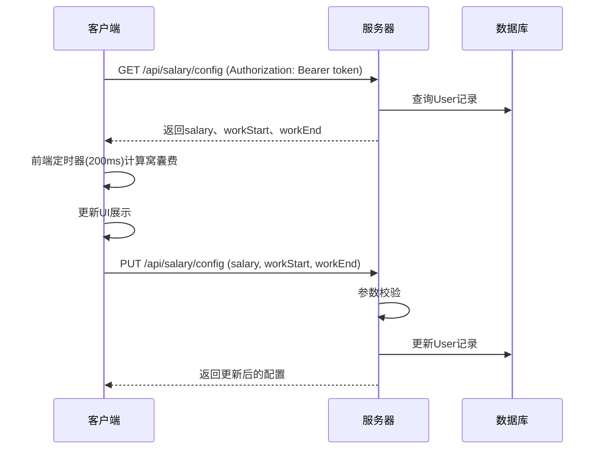

# 窝囊费系统 — 技术设计文档

## 1. 设计概要

**功能描述**：实现实时窝囊费计算、工作进度条可视化、工资参数配置、防窥模式和趣味换算功能。将抽象的工作时间转化为具象的金钱数字，提供即时情绪反馈。

**影响范围**：用户模块（修改工资配置）、窝囊费模块（核心计算逻辑）

**技术难点**：实时计算精度控制（200ms更新）、状态流转逻辑、防窥模式隐私保护

**外部依赖**：无

---

## 2. 架构概览

窝囊费系统采用前后端分离架构，后端负责工资配置的持久化，前端负责实时计算和可视化展示。

### 模块交互

| 模块 | 职责 |
|------|------|
| 前端 (React) | 实时计算窝囊费、进度条渲染、防窥模式切换、趣味换算展示 |
| 后端 (Express) | 工资配置的保存与查询、参数校验 |
| 数据库 (SQLite) | 存储用户工资配置（salary、workStart、workEnd） |

### 数据流转



---

## 3. 数据库设计

### 现有表修改

窝囊费系统使用已有的 `User` 表，无需新增表。

#### `User` 表相关字段

| 字段名 | 类型 | 约束 | 说明 |
|--------|------|------|------|
| salary | REAL | NOT NULL, DEFAULT 250 | 日薪（元） |
| workStart | TEXT | NOT NULL, DEFAULT '09:00' | 上班时间（HH:MM格式） |
| workEnd | TEXT | NOT NULL, DEFAULT '18:00' | 下班时间（HH:MM格式） |

---

## 4. API 设计

### `GET /api/salary/config`

**描述**：获取用户工资配置 → AC-001, AC-003

**鉴权**：需要JWT

**Response（成功）**：
```json
{
    "success": true,
    "data": {
        "salary": 250,
        "workStart": "09:00",
        "workEnd": "18:00"
    }
}
```

**异常响应**：

| 场景 | 状态码 | 响应 |
|------|--------|------|
| Token无效/过期 | 401 | `{"success": false, "message": "认证失败，请重新登录"}` |

---

### `PUT /api/salary/config`

**描述**：更新用户工资配置 → AC-003

**鉴权**：需要JWT

**Request**：
```json
{
    "salary": 300,
    "workStart": "09:00",
    "workEnd": "18:00"
}
```

**字段说明**：

| 字段 | 类型 | 必填 | 默认值 | 规则 | 说明 |
|------|------|------|--------|------|------|
| salary | number | 是 | - | ≥ 0 | 单日工资（元） |
| workStart | string | 是 | - | HH:MM格式 | 上班时间 |
| workEnd | string | 是 | - | HH:MM格式 | 下班时间 |

**Response（成功）**：
```json
{
    "success": true,
    "data": {
        "salary": 300,
        "workStart": "09:00",
        "workEnd": "18:00"
    }
}
```

**异常响应**：

| 场景 | 状态码 | 响应 | 对应 AC |
|------|--------|------|---------|
| Token无效/过期 | 401 | `{"success": false, "message": "认证失败，请重新登录"}` | - |
| 工资为负数 | 400 | `{"success": false, "message": "工资不能为负数哦~"}` | - |
| 时间格式无效 | 400 | `{"success": false, "message": "请输入有效的时间格式（HH:MM）"}` | - |
| 上班时间晚于下班时间 | 400 | `{"success": false, "message": "上班时间不能晚于下班时间！"}` | AC-103 |

---

## 5. 核心逻辑

### 5.1 窝囊费计算 → AC-201

**触发条件**：前端定时器每200ms触发一次

**计算公式**：

| 时间段 | 计算方式 |
|--------|---------|
| 上班前（当前时间 < 上班时间） | 已赚 = 0 |
| 工作中（上班时间 ≤ 当前时间 ≤ 下班时间） | 已赚 = (已工作秒数 / 总工作秒数) × 日薪 |
| 下班后（当前时间 > 下班时间） | 已赚 = 日薪（全额） |

**伪代码**：
```
function calculateEarnings(salary, workStart, workEnd):
    now = 当前时间
    start = parseTime(workStart)  // 转换为当天的Date对象
    end = parseTime(workEnd)      // 转换为当天的Date对象
    
    totalWorkSeconds = (end - start) / 1000
    
    if totalWorkSeconds <= 0:
        return lastEarnings  // 保持上次状态
    
    if now < start:
        return 0
    elif now >= end:
        return salary
    else:
        workedSeconds = (now - start) / 1000
        return (workedSeconds / totalWorkSeconds) * salary
```

---

### 5.2 进度条计算 → AC-001, AC-005

**计算方式**：

| 时间段 | 进度 |
|--------|------|
| 上班前 | 0% |
| 工作中 | (已工作秒数 / 总工作秒数) × 100% |
| 下班后 | 100% |

**业务规则**：
- 进度条最小显示3%（避免完全看不到）
- 进度百分比精确到2位小数
- 水獭位置跟随进度百分比移动

---

### 5.3 倒计时计算 → AC-005

**计算方式**：

| 状态 | 倒计时目标 | 显示格式 |
|------|-----------|---------|
| 上班前 | 上班时间 | "离带薪躺平启动还有: X小时X分钟" |
| 工作中 | 下班时间 | "离准点跑路仅剩: X小时X分钟X秒" |
| 下班后 | - | "工作日圆满结束！今日辛劳犒赏满天飞！" |

---

### 5.4 趣味换算 → AC-202

**换算规则**：

| 物品 | 单价 | emoji | 计算公式 |
|------|------|-------|---------|
| 下午茶（芝芝莓莓） | ¥18 | 🧋 | 金额 / 18 |
| 带薪午餐（豪华大便当） | ¥30 | 🍱 | 金额 / 30 |
| 实体UNO卡牌套装 | ¥45 | 🃏 | 金额 / 45 |

**业务规则**：
- 换算结果保留1位小数
- 换算结果随窝囊费实时更新

---

### 5.5 防窥模式 → AC-203

**触发条件**：用户点击"老板键 (防窥)"按钮

**显示规则**：
- 防窥模式下金额显示为"¥ ***.**"
- 防窥模式下进度条和倒计时仍正常显示
- 点击遮罩区域或"解锁查看"按钮可解除防窥模式

---

## 6. 前端设计

### 6.1 组件结构

```
SalaryTracker (窝囊费主界面)
├── EarningsDisplay (实时收益展示)
│   ├── 大金额显示 (¥ 符号 + 5位小数)
│   ├── 状态标签 (带薪奋斗中 / 静息期)
│   └── 倒计时提示
├── ProgressBar (工作进度条)
│   ├── 进度填充 (渐变: 黄→橙→红)
│   ├── 动画水獭 (随进度移动)
│   └── 进度文字
├── SalaryConfig (工资参数配置)
│   ├── 工资输入框
│   ├── 上班时间选择器
│   ├── 下班时间选择器
│   └── 保存按钮
└── FunConversion (趣味换算)
    ├── 下午茶杯数
    ├── 午餐顿数
    └── UNO卡牌套数
```

### 6.2 自定义 Hook

#### `useSalary`

**用途**：封装窝囊费计算逻辑和状态管理

**返回值**：
```typescript
{
    earnings: number           // 当前窝囊费金额
    progress: number           // 工作进度百分比
    status: 'before' | 'working' | 'after'  // 当前状态
    countdown: string          // 倒计时文本
    config: SalaryConfig       // 工资配置
    isPeekMode: boolean        // 防窥模式状态
    setPeekMode: (mode: boolean) => void  // 设置防窥模式
    updateConfig: (config: Partial<SalaryConfig>) => void  // 更新配置
    conversion: {
        milkTea: number        // 奶茶杯数
        lunch: number          // 午餐顿数
        unoCards: number       // UNO卡牌套数
    }
}
```

---

## 7. 现有代码改动

| 模块 / 文件 | 改动内容 | 原因 | 对应 AC |
|-------------|---------|------|---------|
| `server/src/routes/salary.routes.ts` | 新增路由文件 | 处理窝囊费API请求 | AC-003 |
| `server/src/services/salary.service.ts` | 新增服务文件 | 窝囊费业务逻辑 | AC-003 |
| `server/src/types.ts` | 新增类型定义 | SalaryConfig类型 | - |
| `client/src/components/salary/SalaryTracker.tsx` | 新增组件 | 窝囊费主界面 | AC-001, AC-002, AC-004, AC-005 |
| `client/src/components/salary/SalaryConfig.tsx` | 新增组件 | 工资参数配置表单 | AC-003 |
| `client/src/components/salary/EarningsDisplay.tsx` | 新增组件 | 实时收益展示 | AC-001, AC-002 |
| `client/src/hooks/useSalary.ts` | 新增Hook | 窝囊费计算逻辑 | AC-001, AC-002, AC-201, AC-202 |
| `client/src/types.ts` | 新增类型定义 | SalaryConfig类型 | - |

---

## 8. 技术决策

### 实时计算方案选择

**背景**：需要实现秒级精度的窝囊费计算，更新频率200ms

**选项**：
- A: 前端定时器计算 — 性能好，无网络开销，计算逻辑简单
- B: 后端推送计算 — 实时性好，但增加服务器负载

**结论**：选择前端定时器计算。窝囊费计算逻辑简单，无需服务器参与，前端计算性能更好且节省网络带宽。

### 防窥模式实现方案

**背景**：需要一键遮挡金额信息，保护用户隐私

**选项**：
- A: 纯前端实现 — 简单快速，无服务器依赖
- B: 后端控制 — 更安全，但响应慢

**结论**：选择纯前端实现。防窥模式是UI层的隐私保护，无需服务器参与，前端实现更高效。

### 数据持久化方案

**背景**：用户工资配置需要持久化存储

**选项**：
- A: 存储在User表中 — 已有字段，无需新增表
- B: 新建SalaryConfig表 — 结构清晰，但增加复杂度

**结论**：选择存储在User表中。User表已包含salary、workStart、workEnd字段，直接使用现有字段即可，无需额外建表。

---

## 9. 安全与性能

**输入校验**：
- 工资范围校验（≥ 0）
- 时间格式校验（HH:MM）
- 上班时间早于下班时间校验

**性能优化**：
- 前端定时器使用requestAnimationFrame优化更新频率
- 金额计算结果使用useMemo缓存，避免重复计算
- 防窥模式状态存储在localStorage，刷新后保持状态

**隐私保护**：
- 防窥模式下金额显示为掩码形式
- 工资数据存储在用户私有记录中，其他用户无法访问
