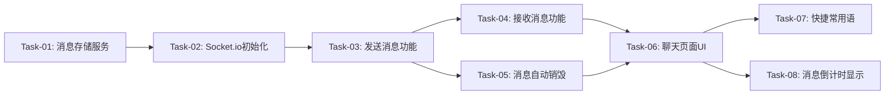

# 蛐蛐蛐（聊天系统）— 开发任务计划

## 1. 任务概览

**总任务数**：8 个
**预计总工时**：240 分钟（约 4 小时）
**开发方法**：TDD — 每个任务按 RED → GREEN → REFACTOR 循环执行

**关键标注**：
- 🔒 阻塞任务：被多个任务依赖，建议优先完成
- ⚠️ 风险任务：技术难度高，可能需要额外时间

### 依赖关系图

---

## 2. 开发任务

### 阶段一：后端基础设施

**阶段完成标准**：消息存储和Socket.io服务可用

---

#### Task-01: 消息存储服务 🔒

**通俗解释**：实现消息的内存存储和自动清理功能

**做什么**：
- 创建 `server/src/services/messageStore.ts`
- 实现MessageStore类
- 实现add方法（存储消息+设置定时删除）
- 实现getByCircle方法（获取鱼圈消息）
- 实现惰性删除逻辑
- 编写单元测试

**涉及文件**：
- `server/src/services/messageStore.ts`
- `server/src/services/messageStore.test.ts`

**参考**：技术方案 第5.1节"消息存储与清理"

**依赖**：无

**预估工时**：40 分钟

**验证标准**（TDD RED 阶段直接转化为测试用例）：
- [ ] `add(message)` 存储消息成功
- [ ] `getByCircle(circleId)` 返回该鱼圈所有未过期消息
- [ ] 消息按createdAt升序排列
- [ ] 超过5分钟的消息不返回（惰性删除）
- [ ] 不同鱼圈的消息互不影响

---

#### Task-02: Socket.io初始化 🔒

**通俗解释**：配置Socket.io服务，处理连接和房间管理

**做什么**：
- 在 `server/src/index.ts` 初始化Socket.io
- 实现连接认证（验证JWT）
- 实现join_circle事件处理
- 实现disconnect事件处理
- 配置CORS

**涉及文件**：
- `server/src/index.ts`
- `server/src/socket.ts`

**参考**：技术方案 第4节"API 设计" - Socket.io 事件

**依赖**：Task-01

**预估工时**：40 分钟

**验证标准**（TDD RED 阶段直接转化为测试用例）：
- [ ] Socket.io服务启动成功
- [ ] 客户端可以连接
- [ ] 连接时验证JWT
- [ ] 无效JWT连接被拒绝
- [ ] join_circle成功加入房间

---

### 阶段二：消息发送接收

**阶段完成标准**：用户可以发送和接收实时消息

---

#### Task-03: 发送消息功能

**通俗解释**：实现用户发送消息到鱼圈聊天室

**做什么**：
- 实现send_message事件处理
- 验证用户在鱼圈内
- 验证消息长度（≤500字符）
- 存储消息到MessageStore
- 广播new_message事件
- 错误处理

**涉及文件**：
- `server/src/socket.ts`

**参考**：技术方案 第4节"API 设计" - send_message

**依赖**：Task-02

**预估工时**：30 分钟

**验证标准**（TDD RED 阶段直接转化为测试用例）：
- [ ] 发送有效消息 → 返回success和message
- [ ] 消息包含id, circleId, authorId, authorName, authorAvatar, text, createdAt
- [ ] 消息存储到MessageStore
- [ ] 同房间其他用户收到new_message事件
- [ ] 消息超过500字符 → 返回错误"内容超长，碎碎念不可超过500字！"
- [ ] 消息为空 → 返回错误

---

#### Task-04: 接收消息功能

**通俗解释**：实现客户端接收和显示新消息

**做什么**：
- 前端监听new_message事件
- 将新消息添加到消息列表
- 自动滚动到底部
- 区分自己和他人的消息样式

**涉及文件**：
- `client/src/hooks/useChat.ts`
- `client/src/components/ChatRoom.tsx`

**参考**：技术方案 第4节"API 设计" - new_message

**依赖**：Task-03

**预估工时**：30 分钟

**验证标准**（TDD RED 阶段直接转化为测试用例）：
- [ ] 收到new_message → 消息添加到列表
- [ ] 新消息显示在列表底部
- [ ] 自动滚动到最新消息
- [ ] 自己的消息靠右对齐，浅橙色背景
- [ ] 他人消息靠左对齐，白色背景

---

#### Task-05: 消息自动销毁

**通俗解释**：实现消息5分钟后自动从列表消失

**做什么**：
- 前端监听message_expired事件
- 从消息列表移除过期消息
- 显示"物理销毁中..."动画
- 定时检查本地消息是否过期

**涉及文件**：
- `client/src/hooks/useChat.ts`
- `client/src/components/ChatRoom.tsx`

**参考**：技术方案 第4节"API 设计" - message_expired

**依赖**：Task-03

**预估工时**：30 分钟

**验证标准**（TDD RED 阶段直接转化为测试用例）：
- [ ] 收到message_expired → 消息从列表移除
- [ ] 消息超过5分钟 → 自动从列表移除
- [ ] 移除时显示"物理销毁中..."动画
- [ ] 过期消息从服务器删除

---

### 阶段三：前端页面开发

**阶段完成标准**：用户可以通过前端页面进行聊天

---

#### Task-06: 聊天页面UI

**通俗解释**：创建聊天室页面，显示消息列表和输入框

**做什么**：
- 创建 `client/src/components/ChatRoom.tsx`
- 实现消息列表显示
- 实现消息气泡组件
- 实现输入框和发送按钮
- 实现字数统计
- 实现空状态提示
- 调用Socket.io连接

**涉及文件**：
- `client/src/components/ChatRoom.tsx`
- `client/src/components/MessageBubble.tsx`
- `client/src/App.tsx`（路由配置）

**参考**：蛐蛐蛐.md 第5.1节"消息列表展示"、第5.2节"消息发送"

**依赖**：Task-04, Task-05

**预估工时**：60 分钟

**验证标准**（TDD RED 阶段直接转化为测试用例）：
- [ ] 页面显示消息列表
- [ ] 每条消息显示头像、昵称、倒计时、内容
- [ ] 输入框显示字数统计"X/500"
- [ ] 字数超过450显示红色
- [ ] 字数达到500无法继续输入
- [ ] 输入框为空时发送按钮禁用
- [ ] 无消息时显示"寂静无声的秘密基地"提示
- [ ] 顶部显示鱼圈名称和"5MIN 瞬时阅后即焚"标签

---

#### Task-07: 快捷常用语

**通俗解释**：实现快捷常用语按钮，一键发送预设消息

**做什么**：
- 创建 `client/src/components/QuickPhrases.tsx`
- 实现6个预设常用语按钮
- 横向滚动显示
- 点击立即发送
- 发送中禁用所有按钮

**涉及文件**：
- `client/src/components/QuickPhrases.tsx`
- `client/src/components/ChatRoom.tsx`

**参考**：蛐蛐蛐.md 第5.3节"快捷常用语"

**依赖**：Task-06

**预估工时**：20 分钟

**验证标准**（TDD RED 阶段直接转化为测试用例）：
- [ ] 显示6个快捷常用语按钮
- [ ] 按钮显示前8个字符+省略号
- [ ] 点击按钮立即发送消息
- [ ] 发送中所有按钮禁用
- [ ] 常用语消息同样遵循5分钟销毁规则

---

#### Task-08: 消息倒计时显示

**通俗解释**：实现消息剩余存活时间的实时显示

**做什么**：
- 创建 `client/src/components/CountdownTimer.tsx`
- 计算消息剩余时间
- 每秒更新显示
- 格式化为"🔥 X分X秒后毁灭"

**涉及文件**：
- `client/src/components/CountdownTimer.tsx`
- `client/src/components/MessageBubble.tsx`

**参考**：技术方案 第5.2节"消息倒计时计算"

**依赖**：Task-06

**预估工时**：20 分钟

**验证标准**（TDD RED 阶段直接转化为测试用例）：
- [ ] 每条消息显示倒计时"🔥 X分X秒后毁灭"
- [ ] 倒计时每秒更新
- [ ] 格式正确（分钟和秒数）
- [ ] 消息过期后倒计时显示"物理销毁中..."

---

## 3. AC 覆盖总表

| AC 编号 | 验收标准概述 | 承接任务 | 验证方式 |
|---------|-------------|---------|---------|
| AC-001 | 发送消息成功，显示在列表底部 | Task-03, Task-06 | 测试Socket + 手动验证UI |
| AC-002 | 接收他人消息，实时显示 | Task-04, Task-06 | 测试Socket + 手动验证UI |
| AC-003 | 点击快捷常用语立即发送 | Task-07 | 手动验证UI |
| AC-004 | 消息5分钟后自动销毁 | Task-05, Task-06 | 测试Socket + 手动验证UI |
| AC-101 | 字数达到500无法继续输入 | Task-06 | 手动验证UI |
| AC-102 | 字数超过450显示红色 | Task-06 | 手动验证UI |
| AC-103 | 输入框为空发送按钮禁用 | Task-06 | 手动验证UI |
| AC-104 | 网络异常恢复输入框内容 | Task-06 | 手动验证UI |
| AC-105 | 无消息时显示空状态 | Task-06 | 手动验证UI |
| AC-201 | 倒计时每秒更新 | Task-08 | 手动验证UI |
| AC-202 | 过期消息从服务器删除 | Task-01, Task-05 | 测试MessageStore |
| AC-203 | 空白消息发送失败 | Task-03 | 测试Socket异常 |
| AC-204 | 自己消息靠右，他人靠左 | Task-06 | 手动验证UI |

---

## 4. 完成定义

- [ ] 所有任务的验证标准（测试用例）通过
- [ ] AC 覆盖总表中每条 AC 的验证方式已执行并通过
- [ ] 用户可以发送消息，其他用户实时接收
- [ ] 消息5分钟后自动从列表消失
- [ ] 快捷常用语可以一键发送
- [ ] 消息倒计时实时更新
