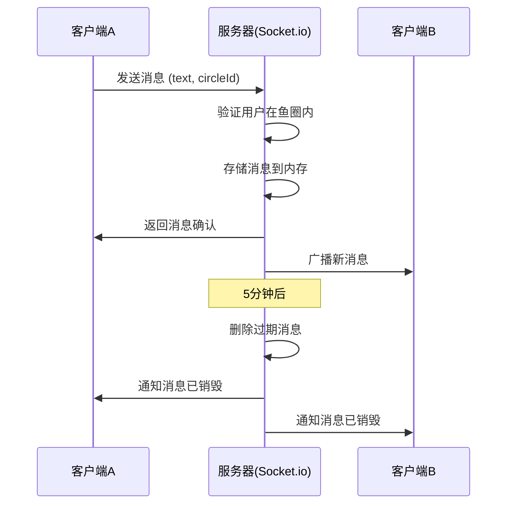

# 蛐蛐蛐（聊天系统）— 技术设计文档

## 1. 设计概要

**功能描述**：实现鱼圈内的即时文字聊天功能，消息5分钟自动销毁，支持快捷常用语

**影响范围**：聊天模块、鱼圈模块

**技术难点**：实时通信（WebSocket）、消息自动销毁机制、消息倒计时显示

**外部依赖**：用户系统（Phase 1.1）、鱼圈管理（Phase 1.2）

---

## 2. 架构概览

聊天系统使用Socket.io实现实时通信，消息存储在内存中，5分钟后自动删除。

### 模块交互



---

## 3. 数据库设计

### 新增表

#### `ChatMessage`

**用途**：存储聊天消息（内存存储，5分钟后删除）

由于消息需要5分钟后自动销毁，且不需要持久化，我们使用内存存储而非SQLite。

**内存数据结构**：
```typescript
interface ChatMessage {
    id: string;           // UUID
    circleId: string;     // 鱼圈ID
    authorId: string;     // 发送者ID
    authorName: string;   // 发送者昵称
    authorAvatar: string; // 发送者头像
    text: string;         // 消息内容（最大500字符）
    createdAt: number;    // 创建时间戳
}
```

**存储方案**：
- 使用Map存储，key为消息ID
- 定时清理过期消息（每分钟检查一次）
- 或者在消息被访问时惰性删除

---

## 4. API 设计

### Socket.io 事件

#### `join_circle`

**描述**：加入鱼圈的聊天房间

**Request**：
```json
{
    "circleId": "circle-uuid"
}
```

**Response**：
```json
{
    "success": true,
    "messages": [...]
}
```

---

#### `send_message`

**描述**：发送消息 → AC-001, AC-203

**Request**：
```json
{
    "circleId": "circle-uuid",
    "text": "老板刚才朝这边看了一眼，全员静默！👀"
}
```

**Response**：
```json
{
    "success": true,
    "message": {
        "id": "uuid",
        "circleId": "circle-uuid",
        "authorId": "user-uuid",
        "authorName": "摸鱼水獭",
        "authorAvatar": "moyu_otter",
        "text": "老板刚才朝这边看了一眼，全员静默！👀",
        "createdAt": 1711785600000
    }
}
```

**异常响应**：

| 场景 | 响应 | 对应 AC |
|------|------|---------|
| 消息超过500字符 | `{"success": false, "message": "内容超长，碎碎念不可超过500字！"}` | AC-203 |
| 消息为空 | `{"success": false, "message": "消息内容不能为空"}` | AC-103 |

---

#### `new_message`

**描述**：接收新消息 → AC-002

**Response**：
```json
{
    "id": "uuid",
    "circleId": "circle-uuid",
    "authorId": "user-uuid",
    "authorName": "摸鱼水獭",
    "authorAvatar": "moyu_otter",
    "text": "老板刚才朝这边看了一眼，全员静默！👀",
    "createdAt": 1711785600000
}
```

---

#### `message_expired`

**描述**：消息过期通知 → AC-004

**Response**：
```json
{
    "messageId": "uuid"
}
```

---

### REST API（备用）

#### `GET /api/chat/:circleId/messages`

**描述**：获取鱼圈最近消息

**鉴权**：需要JWT

**Response**：
```json
{
    "success": true,
    "data": {
        "messages": [...]
    }
}
```

---

## 5. 核心逻辑

### 5.1 消息存储与清理

**触发条件**：新消息发送、定时任务

**处理流程**：
1. 消息发送时，存储到内存Map
2. 设置定时器，5分钟后删除
3. 或者使用惰性删除，在获取消息时检查是否过期

**伪代码**：
```
class MessageStore {
    private messages: Map<string, ChatMessage> = new Map()
    private timers: Map<string, NodeJS.Timeout> = new Map()
    
    add(message: ChatMessage): void {
        this.messages.set(message.id, message)
        
        // 5分钟后自动删除
        const timer = setTimeout(() => {
            this.messages.delete(message.id)
            this.timers.delete(message.id)
            this.broadcastExpiration(message.id)
        }, 5 * 60 * 1000)
        
        this.timers.set(message.id, timer)
    }
    
    getByCircle(circleId: string): ChatMessage[] {
        const now = Date.now()
        const result: ChatMessage[] = []
        
        for (const [id, msg] of this.messages) {
            if (msg.circleId === circleId) {
                // 检查是否过期
                if (now - msg.createdAt < 5 * 60 * 1000) {
                    result.push(msg)
                } else {
                    // 惰性删除
                    this.messages.delete(id)
                    const timer = this.timers.get(id)
                    if (timer) {
                        clearTimeout(timer)
                        this.timers.delete(id)
                    }
                }
            }
        }
        
        return result.sort((a, b) => a.createdAt - b.createdAt)
    }
}
```

---

### 5.2 消息倒计时计算

**触发条件**：客户端显示消息时

**处理流程**：
1. 获取消息创建时间
2. 计算剩余时间 = 5分钟 - (当前时间 - 创建时间)
3. 格式化为"X分X秒后毁灭"

**伪代码**：
```
function getCountdown(createdAt: number): string {
    const elapsed = Date.now() - createdAt
    const remaining = Math.max(0, 5 * 60 * 1000 - elapsed)
    
    const minutes = Math.floor(remaining / 60000)
    const seconds = Math.floor((remaining % 60000) / 1000)
    
    return `${minutes}分${seconds}秒后毁灭`
}
```

---

## 6. 现有代码改动

| 模块 / 文件 | 改动内容 | 原因 | 对应 AC |
|-------------|---------|------|---------|
| server/src/index.ts | 添加Socket.io初始化 | 实时通信 | - |

---

## 7. 技术决策

### 消息存储方案选择

**背景**：消息需要5分钟后自动销毁，且不需要持久化

**选项**：
- A: 内存存储 — 速度快，但服务器重启会丢失
- B: SQLite存储 — 持久化，但需要定时清理
- C: Redis存储 — 支持TTL，但增加依赖

**结论**：选择内存存储，消息本身就是临时的，服务器重启可以接受

### 实时通信方案选择

**背景**：需要实现实时消息推送

**选项**：
- A: Socket.io — 成熟稳定，支持自动重连
- B: WebSocket原生 — 更轻量，但需要自己处理重连
- C: Server-Sent Events — 单向推送，不适合聊天

**结论**：选择Socket.io，项目技术栈已包含，功能完善

---

## 8. 安全与性能

**输入校验**：
- 消息长度限制（≤500字符）
- 消息内容不能为空

**性能考量**：
- 内存存储读写速度快
- 定时清理避免内存泄漏
- 消息列表限制返回数量（最近50条）

---

## 9. AC 覆盖总表

| AC 编号 | 验收标准概述 | 实现位置 |
|---------|-------------|---------|
| AC-001 | 发送消息成功，显示在列表底部 | Socket send_message + 前端 |
| AC-002 | 接收他人消息，实时显示 | Socket new_message + 前端 |
| AC-003 | 点击快捷常用语立即发送 | 前端实现 |
| AC-004 | 消息5分钟后自动销毁 | 消息存储 + Socket message_expired |
| AC-101 | 字数达到500无法继续输入 | 前端实现 |
| AC-102 | 字数超过450显示红色 | 前端实现 |
| AC-103 | 输入框为空发送按钮禁用 | 前端实现 |
| AC-104 | 网络异常恢复输入框内容 | 前端实现 |
| AC-105 | 无消息时显示空状态 | 前端实现 |
| AC-201 | 倒计时每秒更新 | 前端定时器 |
| AC-202 | 过期消息从服务器删除 | 消息存储定时清理 |
| AC-203 | 空白消息发送失败 | Socket send_message 异常 |
| AC-204 | 自己消息靠右，他人靠左 | 前端实现 |

---

## 附录：变更记录

| 日期 | 变更内容 | 原因 |
|------|---------|------|
| 2026-06-11 | 初始版本 | — |
