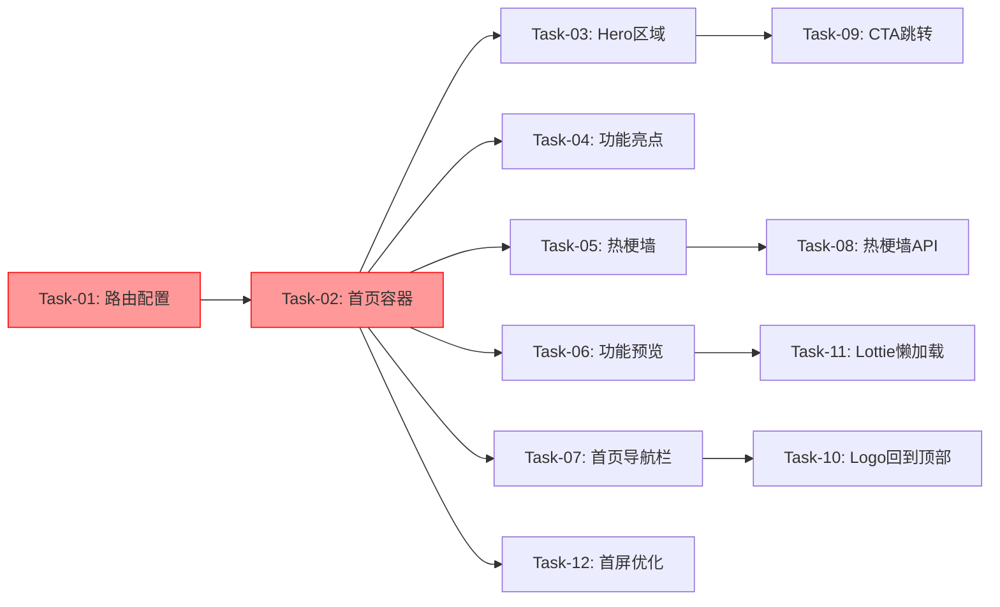

# 首页 — 开发任务计划

## 1. 任务概览

**总任务数**：12 个
**预计总工时**：480 分钟（约 8 小时）
**开发方法**：TDD — 每个任务按 RED → GREEN → REFACTOR 循环执行

**关键标注**：
- 🔒 阻塞任务：被多个任务依赖，建议优先完成
- ⚠️ 风险任务：技术难度高，可能需要额外时间

### 依赖关系图

### 可并行任务组

| 并行组 | 任务 | 说明 |
|--------|------|------|
| 组1 | Task-03, Task-04, Task-05, Task-06 | 四个板块组件互相独立，可并行开发 |
| 组2 | Task-09, Task-10 | CTA跳转和Logo回到顶部无依赖关系 |

---

## 2. 开发任务

> 按垂直切片组织。每个阶段对应一个可独立运行和验证的用户行为。

---

### 阶段一：基础设施 — 首页框架搭建

**阶段完成标准**：用户访问 `/` 可以看到空白首页框架，全屏滚动容器正常工作

---

#### Task-01: 配置首页路由 🔒

**通俗解释**：用户访问网站根路径 `/` 时，可以看到首页而不是被强制跳转到登录页

**做什么**：
1. 修改 `client/src/App.tsx`，添加首页路由 `/`
2. 首页路由不需要登录保护（公开访问）
3. 保留 `/login`、`/register`、`/salary` 等现有路由

**涉及文件**：`client/src/App.tsx`

**参考**：技术方案 6. 现有代码改动 → AC-001

**依赖**：无

**预估工时**：30 分钟

**验证标准**（TDD RED 阶段直接转化为测试用例）：
- [ ] 访问 `/` → 显示首页组件，不跳转到 `/login`
- [ ] 未登录状态访问 `/` → 页面正常加载
- [ ] 已登录状态访问 `/` → 页面正常加载
- [ ] 访问 `/login` → 仍然正常显示登录页
- [ ] 访问 `/salary` → 仍然需要登录保护

---

#### Task-02: 创建首页容器和全屏滚动 🔒 ⚠️

**通俗解释**：用户打开首页后，可以用鼠标滚轮平滑地在四个板块之间切换

**做什么**：
1. 新建 `client/src/components/home/HomePage.tsx` 主容器
2. 实现全屏滚动容器（CSS scroll-snap）
3. 新建 `client/src/hooks/useFullscreenScroll.ts` Hook
4. 添加滚动指示器（右侧小圆点）

**涉及文件**：
- `client/src/components/home/HomePage.tsx`
- `client/src/hooks/useFullscreenScroll.ts`
- `client/src/components/home/home.css`

**参考**：技术方案 5.1 全屏滚动实现 → AC-001, AC-002, AC-003, AC-004

**依赖**：Task-01

**预估工时**：60 分钟

**验证标准**（TDD RED 阶段直接转化为测试用例）：
- [ ] 首页渲染4个section，每个section高度为100vh
- [ ] 鼠标滚轮向下 → 平滑滚动到下一屏
- [ ] 鼠标滚轮向上 → 平滑滚动到上一屏
- [ ] 点击右侧指示器圆点 → 跳转到对应板块
- [ ] 当前板块对应的指示器高亮显示
- [ ] 滚动动画流畅，无卡顿（帧率 ≥ 30fps）

---

### 阶段二：Hero区域 — 首屏核心内容展示

**阶段完成标准**：用户访问首页第一屏，可以看到主标语、副标语、CTA按钮和插画

---

#### Task-03: 实现Hero区域组件

**通俗解释**：用户打开首页，第一眼就能看到吸引人的标语和明显的行动按钮

**做什么**：
1. 新建 `client/src/components/home/HeroSection.tsx`
2. 实现主标语、副标语文案展示
3. 实现CTA按钮（样式使用项目设计系统的按钮组件）
4. 添加像素风格插画/动画占位

**涉及文件**：
- `client/src/components/home/HeroSection.tsx`
- `client/src/components/home/home.css`

**参考**：技术方案 2. 架构概览 → AC-001

**依赖**：Task-02

**预估工时**：45 分钟

**验证标准**（TDD RED 阶段直接转化为测试用例）：
- [ ] Hero区域渲染主标语文案
- [ ] Hero区域渲染副标语文案
- [ ] Hero区域渲染CTA按钮，按钮文字可见
- [ ] Hero区域渲染插画/动画占位
- [ ] 各元素垂直居中排列

---

### 阶段三：功能亮点 — 展示核心功能

**阶段完成标准**：用户滚动到第二屏，可以看到4个核心功能的卡片展示

---

#### Task-04: 实现功能亮点区域

**通俗解释**：用户滚动到第二屏，可以看到四个核心功能的卡片介绍

**做什么**：
1. 新建 `client/src/components/home/FeatureHighlights.tsx`
2. 实现4个功能卡片（情绪排解、摸鱼放松、窝囊费可视化、鱼圈社交）
3. 卡片悬停时有轻微上浮动画
4. 使用项目设计系统的卡片组件和图标

**涉及文件**：
- `client/src/components/home/FeatureHighlights.tsx`
- `client/src/components/home/home.css`

**参考**：技术方案 2. 架构概览 → AC-002

**依赖**：Task-02

**预估工时**：45 分钟

**验证标准**（TDD RED 阶段直接转化为测试用例）：
- [ ] 渲染4个功能卡片
- [ ] 每个卡片显示图标、标题和描述
- [ ] 鼠标悬停卡片 → 卡片轻微上浮（translateY变化）
- [ ] 4个卡片水平排列（响应式）
- [ ] 卡片内容与PRD定义的4个功能一致

---

### 阶段四：热梗墙 — 弹幕式语录展示

**阶段完成标准**：用户滚动到第三屏，可以看到20-30条语录以弹幕形式自动滚动

---

#### Task-05: 实现热梗墙弹幕组件 ⚠️

**通俗解释**：用户滚动到第三屏，可以看到有趣的语录像弹幕一样从右向左滚动

**做什么**：
1. 新建 `client/src/components/home/MemeWall.tsx`
2. 实现弹幕容器（固定高度，溢出隐藏）
3. 将语录分配到5个垂直轨道
4. 使用CSS animation实现从右向左滚动
5. 每条语录速度略有差异（8-15秒）

**涉及文件**：
- `client/src/components/home/MemeWall.tsx`
- `client/src/components/home/home.css`
- `client/src/hooks/useMemeQuotes.ts`

**参考**：技术方案 5.2 弹幕式热梗墙 → AC-003

**依赖**：Task-02

**预估工时**：60 分钟

**验证标准**（TDD RED 阶段直接转化为测试用例）：
- [ ] 渲染弹幕容器，高度固定
- [ ] 使用默认预设语录（8条）作为初始数据
- [ ] 语录从右向左滚动
- [ ] 语录分布在5个不同垂直位置（轨道）
- [ ] 每条语录滚动速度不同（8-15秒）
- [ ] 语录滚动完毕后重新开始（循环播放）
- [ ] 滚动动画流畅，不卡顿

---

#### Task-06: 实现热梗墙语录API

**通俗解释**：热梗墙的语录可以从服务器获取最新内容，运营人员可以随时更新

**做什么**：
1. 新建 `server/src/routes/home.routes.ts`
2. 新建 `server/src/services/home.service.ts`
3. 实现 `GET /api/home/meme-quotes` 接口
4. 返回语录数组

**涉及文件**：
- `server/src/routes/home.routes.ts`
- `server/src/services/home.service.ts`
- `server/src/index.ts`（挂载路由）

**参考**：技术方案 4. API 设计 → AC-203

**依赖**：无

**预估工时**：30 分钟

**验证标准**（TDD RED 阶段直接转化为测试用例）：
- [ ] GET `/api/home/meme-quotes` → 返回200
- [ ] 响应体包含 `quotes` 数组
- [ ] 数组包含至少1条语录
- [ ] 接口无需鉴权即可访问
- [ ] 响应格式符合项目统一格式 `{ success: true, data: { quotes: [...] } }`

---

### 阶段五：功能预览 — Tab切换展示动画

**阶段完成标准**：用户滚动到第四屏，可以点击Tab切换查看不同功能的动画演示

---

#### Task-07: 实现功能预览区域

**通俗解释**：用户滚动到第四屏，可以通过点击Tab查看四个功能的动画演示效果

**做什么**：
1. 新建 `client/src/components/home/FeaturePreview.tsx`
2. 实现Tab切换栏（4个功能Tab）
3. 实现动画展示区（默认显示"蛐蛐蛐"）
4. Tab切换时使用淡入淡出过渡动画

**涉及文件**：
- `client/src/components/home/FeaturePreview.tsx`
- `client/src/components/home/home.css`

**参考**：技术方案 5.3 功能预览Tab切换 → AC-004, AC-005

**依赖**：Task-02

**预估工时**：45 分钟

**验证标准**（TDD RED 阶段直接转化为测试用例）：
- [ ] 渲染4个Tab按钮（蛐蛐蛐、摸鱼鱼、窝囊费、宠物鱼）
- [ ] 默认选中"蛐蛐蛐"Tab
- [ ] 点击"摸鱼鱼"Tab → 切换到摸鱼鱼动画展示
- [ ] Tab切换时有淡入淡出过渡动画
- [ ] 当前选中Tab有高亮样式
- [ ] 动画区域显示对应功能的Lottie动画或静态图

---

#### Task-08: 实现Lottie动画懒加载

**通俗解释**：功能预览的动画文件只在用户滚动到该区域时才加载，不影响首页加载速度

**做什么**：
1. 新建 `client/src/utils/lottieLoader.ts`
2. 使用动态import懒加载Lottie动画文件
3. 动画加载失败时显示静态图片
4. 在FeaturePreview组件中集成懒加载逻辑

**涉及文件**：
- `client/src/utils/lottieLoader.ts`
- `client/src/components/home/FeaturePreview.tsx`

**参考**：技术方案 5.3 功能预览Tab切换 → AC-102

**依赖**：Task-07

**预估工时**：40 分钟

**验证标准**（TDD RED 阶段直接转化为测试用例）：
- [ ] 动画文件不在首页初始加载时请求
- [ ] 滚动到功能预览区域时才加载动画文件
- [ ] 动画加载成功 → 显示Lottie动画
- [ ] 动画加载失败 → 显示静态图片占位符
- [ ] 切换Tab时只加载当前Tab的动画文件

---

### 阶段六：导航栏与交互完善

**阶段完成标准**：首页导航栏根据登录状态正确显示，CTA按钮和Logo交互正常

---

#### Task-09: 实现首页导航栏

**通俗解释**：未登录用户看到登录/注册按钮，已登录用户看到用户头像和进入应用按钮

**做什么**：
1. 新建 `client/src/components/home/HomeNavbar.tsx`
2. 根据登录状态切换导航栏内容
3. 未登录：Logo + 登录按钮 + 注册按钮
4. 已登录：Logo + 用户头像 + 进入应用按钮
5. 导航栏固定在顶部

**涉及文件**：
- `client/src/components/home/HomeNavbar.tsx`
- `client/src/components/home/home.css`

**参考**：技术方案 2. 架构概览 → AC-201, AC-202

**依赖**：Task-02

**预估工时**：40 分钟

**验证标准**（TDD RED 阶段直接转化为测试用例）：
- [ ] 未登录状态 → 导航栏显示登录按钮和注册按钮
- [ ] 未登录状态 → 导航栏不显示用户头像
- [ ] 已登录状态 → 导航栏显示用户头像和进入应用按钮
- [ ] 已登录状态 → 导航栏不显示登录/注册按钮
- [ ] 导航栏固定在页面顶部（position: fixed）
- [ ] 点击登录按钮 → 跳转到 `/login`
- [ ] 点击注册按钮 → 跳转到 `/login`
- [ ] 点击进入应用按钮 → 跳转到 `/salary`

---

#### Task-10: 实现CTA按钮跳转逻辑

**通俗解释**：用户点击首页的大按钮，未登录会跳转到登录页，已登录会跳转到应用内

**做什么**：
1. 在HeroSection组件中实现CTA点击处理
2. 使用useAuth Hook获取登录状态
3. 根据登录状态跳转到不同页面

**涉及文件**：
- `client/src/components/home/HeroSection.tsx`

**参考**：技术方案 5.4 CTA按钮跳转逻辑 → AC-006, AC-007

**依赖**：Task-03, Task-09

**预估工时**：20 分钟

**验证标准**（TDD RED 阶段直接转化为测试用例）：
- [ ] 未登录状态点击CTA → 跳转到 `/login`
- [ ] 已登录状态点击CTA → 跳转到 `/salary`
- [ ] 点击CTA时有按钮点击反馈（active状态）

---

#### Task-11: 实现Logo点击回到顶部

**通俗解释**：用户点击导航栏的Logo，页面会平滑滚动回到第一屏

**做什么**：
1. 在HomeNavbar组件中添加Logo点击事件
2. 点击Logo时触发全屏滚动组件回到第一屏
3. 添加平滑滚动动画

**涉及文件**：
- `client/src/components/home/HomeNavbar.tsx`
- `client/src/hooks/useFullscreenScroll.ts`

**参考**：技术方案 5.5 Logo点击回到顶部 → AC-008

**依赖**：Task-09

**预估工时**：15 分钟

**验证标准**（TDD RED 阶段直接转化为测试用例）：
- [ ] 点击Logo → 页面平滑滚动到顶部（第一屏）
- [ ] 在任意板块点击Logo → 都能回到第一屏
- [ ] 滚动动画流畅

---

### 阶段七：性能优化与收尾

**阶段完成标准**：首页加载时间 < 3秒，首屏加载 < 1.5秒，所有AC覆盖完成

---

#### Task-12: 首屏加载优化

**通俗解释**：首页打开速度更快，用户3秒内可以看到完整内容

**做什么**：
1. Hero区域优先加载
2. 其他板块使用 `loading="lazy"` 懒加载图片
3. 添加加载状态（骨架屏或Loading）
4. 图片资源使用WebP格式
5. 弹幕动画使用CSS transform触发GPU加速

**涉及文件**：
- `client/src/components/home/HomePage.tsx`
- `client/src/components/home/home.css`
- `client/src/components/home/FeatureHighlights.tsx`

**参考**：技术方案 8. 安全与性能 → AC-101

**依赖**：Task-02

**预估工时**：30 分钟

**验证标准**（TDD RED 阶段直接转化为测试用例）：
- [x] 首屏（Hero区域）加载 < 1.5秒
- [x] 首页整体加载 < 3秒
- [x] 图片使用 `loading="lazy"` 属性
- [x] 弹幕动画使用 `transform` 属性（触发GPU加速）
- [x] 页面加载时显示Loading状态

---

## 3. AC 覆盖总表

> 最终检查：每条 AC 是否都有任务承接。

| AC 编号 | 验收标准概述 | 承接任务 | 验证方式 |
|---------|-------------|---------|---------|
| AC-001 | 用户访问首页，显示Hero区域 | Task-02, Task-03 | 访问 `/` 检查Hero区域渲染 |
| AC-002 | 滚动到第二屏，显示功能亮点 | Task-02, Task-04 | 滚动到第二屏检查功能卡片 |
| AC-003 | 滚动到第三屏，显示热梗墙弹幕 | Task-02, Task-05 | 滚动到第三屏检查弹幕滚动 |
| AC-004 | 滚动到第四屏，显示功能预览 | Task-02, Task-07 | 滚动到第四屏检查Tab和动画 |
| AC-005 | 点击Tab切换动画演示 | Task-07 | 点击不同Tab检查动画切换 |
| AC-006 | 未登录用户点击CTA跳转登录页 | Task-10 | 未登录点击CTA检查跳转 |
| AC-007 | 已登录用户点击CTA跳转窝囊费页 | Task-10 | 已登录点击CTA检查跳转 |
| AC-008 | 点击Logo回到顶部 | Task-11 | 点击Logo检查滚动到顶部 |
| AC-101 | 加载超过3秒显示加载状态 | Task-12 | 模拟慢速网络检查Loading |
| AC-102 | 动画加载失败显示静态图 | Task-08 | 模拟动画加载失败检查降级 |
| AC-103 | 热梗墙接口失败显示默认语录 | Task-05 | 模拟接口失败检查兜底数据 |
| AC-201 | 未登录显示简化版导航栏 | Task-09 | 未登录检查导航栏显示 |
| AC-202 | 已登录显示完整版导航栏 | Task-09 | 已登录检查导航栏显示 |
| AC-203 | 热梗墙语录从后端获取 | Task-06 | 调用API检查返回语录 |

---

## 4. 完成定义

> 所有任务完成后，功能整体交付前的最终确认。

- [x] 所有任务的验证标准（测试用例）通过
- [x] AC 覆盖总表中每条 AC 的验证方式已执行并通过
- [x] 首页加载时间 < 3秒（性能测试）
- [x] 首屏加载时间 < 1.5秒（性能测试）
- [x] 全屏滚动流畅，帧率 ≥ 30fps
- [x] 弹幕滚动流畅，不卡顿
- [ ] 主流浏览器测试通过（Chrome、Firefox、Edge、Safari）
- [ ] 最小宽度1024px显示正常
- [ ] 最大宽度1920px显示正常
