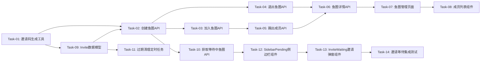

# 鱼圈管理 — 开发任务计划

## 1. 任务概览

**总任务数**：14 个
**预计总工时**：420 分钟（约 7 小时）
**开发方法**：TDD — 每个任务按 RED → GREEN → REFACTOR 循环执行

**关键标注**：
- 🔒 阻塞任务：被多个任务依赖，建议优先完成
- ⚠️ 风险任务：技术难度高，可能需要额外时间

### 依赖关系图

### 可并行任务组

| 并行组 | 任务 | 说明 |
|--------|------|------|
| 组1 | Task-03, Task-04 | 加入鱼圈和退出鱼圈可并行开发 |
| 组2 | Task-09, Task-11 | 数据模型和清理任务可并行开发 |
| 组3 | Task-12, Task-13 | 侧边栏组件和邀请弹窗可并行开发 |

---

## 2. 开发任务

### 阶段一：基础工具

**阶段完成标准**：邀请码生成功能可用

---

#### Task-01: 邀请码生成工具 🔒

**通俗解释**：实现生成唯一6位数字邀请码的功能（基于 Invite 表）

**做什么**：
- 创建 `server/src/utils/inviteCode.ts`
- 实现 `generateUniqueCode()` 函数
- 生成6位随机数字
- 在 Invite 表中检查唯一性
- 编写单元测试

**涉及文件**：
- `server/src/utils/inviteCode.ts`
- `server/src/utils/inviteCode.test.ts`

**参考**：技术方案 第5.1节"生成唯一邀请码"

**依赖**：无

**预估工时**：30 分钟

**验证标准**（TDD RED 阶段直接转化为测试用例）：
- [ ] `generateUniqueCode()` 返回6位数字字符串
- [ ] 连续生成100个邀请码，无重复
- [ ] 邀请码范围在100000-999999之间

---

### 阶段二：鱼圈API开发

**阶段完成标准**：鱼圈的创建、加入、退出、踢出成员API可用

---

#### Task-02: 创建鱼圈API 🔒

**通俗解释**：实现创建鱼圈接口（含邀请码生成和等待激活机制），让用户可以创建新的鱼圈

**做什么**：
- 创建 `server/src/routes/circles.ts`
- 实现 `POST /api/circles` 接口
- 输入验证（名称长度≤50字符）
- 校验用户"等待中"鱼圈数量 < 3
- 创建 Circle 记录，`isActive = false`
- 生成唯一邀请码，写入 Invite 表，`expiresAt = now + 1h`
- 创建者通过 UserCircle 加入
- 返回 circle + invite 信息
- 错误处理

**涉及文件**：
- `server/src/routes/circles.ts`
- `server/src/index.ts`（注册路由）

**参考**：技术方案 第4节"API 设计" - POST /api/circles、第5.2节"创建鱼圈→等待激活流程"

**依赖**：Task-01, Task-09

**预估工时**：50 分钟

**验证标准**（TDD RED 阶段直接转化为测试用例）：
- [ ] POST /api/circles 传入有效名称 → 返回 200，body 包含 circle 和 invite
- [ ] circle 包含 id, name, isActive=false, ownerId, isPrivate, memberCount
- [ ] invite 包含 code（6位数字）, expiresAt
- [ ] ownerId 为当前用户ID
- [ ] 数据库中创建了 Circle 记录（isActive=false）
- [ ] 数据库中创建了 Invite 记录（status=active, expiresAt=now+1h）
- [ ] 用户的 joinedCircleId 更新为新鱼圈ID
- [ ] 名称超过50字符 → 返回 400，body.message = "名称超长，鱼圈名限50字以内哦~"
- [ ] 已有3个"等待中"鱼圈 → 返回 400，body.message 包含"3个"

---

#### Task-03: 加入鱼圈API

**通俗解释**：实现通过邀请码加入鱼圈接口（校验 Invite 表有效性）

**做什么**：
- 实现 `POST /api/circles/join` 接口
- 根据邀请码查询 Invite 表（status=active 且未过期）
- 检查鱼圈是否存在
- 检查是否为私有鱼圈
- 检查成员数量
- 检查用户是否已在该圈
- 更新鱼圈成员数
- 更新用户joinedCircleId
- **检查 memberCount>=2 时自动激活鱼圈（isActive=true）**
- 错误处理

**涉及文件**：
- `server/src/routes/circles.ts`

**参考**：技术方案 第4节"API 设计" - POST /api/circles/join

**依赖**：Task-02

**预估工时**：50 分钟

**验证标准**（TDD RED 阶段直接转化为测试用例）：
- [ ] POST /api/circles/join 传入有效邀请码 → 返回 200，body 包含 circle
- [ ] 鱼圈成员数+1
- [ ] 用户的 joinedCircleId 更新为该鱼圈ID
- [ ] **第2人加入后，circle.isActive 自动变为 true**
- [ ] 邀请码不存在 → 返回 400，body.message = "找不到匹配的鱼圈！"
- [ ] **邀请码已过期 → 返回 400，body.message 包含"已过期"**
- [ ] 鱼圈已满10人 → 返回 400，body.message = "这个划水小分队已经达到10人满负荷啦！"
- [ ] 已在该圈 → 返回 400，body.message = "你已经在这只划水队伍中啦！"
- [ ] 私有鱼圈 → 返回 400，body.message = "私有鱼圈不可加入"

---

#### Task-04: 退出鱼圈API

**通俗解释**：实现退出鱼圈接口

**做什么**：
- 实现 `POST /api/circles/:id/leave` 接口
- 检查是否为私有鱼圈
- 检查用户是否为成员
- 更新鱼圈成员数
- 更新用户joinedCircleId为私有鱼圈
- 错误处理

**涉及文件**：
- `server/src/routes/circles.ts`

**参考**：技术方案 第4节"API 设计" - POST /api/circles/:id/leave

**依赖**：Task-02

**预估工时**：30 分钟

**验证标准**（TDD RED 阶段直接转化为测试用例）：
- [ ] POST /api/circles/:id/leave → 返回 200
- [ ] 鱼圈成员数-1
- [ ] 用户的 joinedCircleId 更新为私有鱼圈ID
- [ ] 私有鱼圈 → 返回 400，body.message = "私有鱼圈不可退出"
- [ ] 不是成员 → 返回 400，body.message = "你不是该鱼圈成员"

---

#### Task-05: 踢出成员API

**通俗解释**：实现群主踢出成员接口

**做什么**：
- 实现 `DELETE /api/circles/:id/members/:userId` 接口
- 检查操作者是否为群主
- 检查不能踢出自己
- 检查目标用户是否为成员
- 更新鱼圈成员数
- 更新目标用户joinedCircleId
- 错误处理

**涉及文件**：
- `server/src/routes/circles.ts`

**参考**：技术方案 第4节"API 设计" - DELETE /api/circles/:id/members/:userId

**依赖**：Task-03

**预估工时**：30 分钟

**验证标准**（TDD RED 阶段直接转化为测试用例）：
- [ ] 群主踢出成员 → 返回 200
- [ ] 鱼圈成员数-1
- [ ] 被踢用户的 joinedCircleId 更新为私有鱼圈ID
- [ ] 非群主操作 → 返回 403，body.message = "只有群主可以踢出成员"
- [ ] 踢出自己 → 返回 400，body.message = "群主不能踢出自己"
- [ ] 用户不在圈内 → 返回 400，body.message = "该用户不是鱼圈成员"

---

#### Task-06: 鱼圈详情API

**通俗解释**：实现获取鱼圈详情和成员列表接口

**做什么**：
- 实现 `GET /api/circles/:id` 接口
- 查询鱼圈信息
- 查询成员列表
- 标记群主和当前用户
- 错误处理

**涉及文件**：
- `server/src/routes/circles.ts`

**参考**：技术方案 第4节"API 设计" - GET /api/circles/:id

**依赖**：Task-04, Task-05

**预估工时**：30 分钟

**验证标准**（TDD RED 阶段直接转化为测试用例）：
- [ ] GET /api/circles/:id → 返回 200，body 包含 circle 和 members
- [ ] circle 包含完整字段
- [ ] members 数组包含所有成员信息
- [ ] 每个成员包含 id, nickname, avatar, isOwner

---

### 阶段三：前端页面开发

**阶段完成标准**：用户可以通过前端页面管理鱼圈

---

#### Task-07: 鱼圈管理页面

**通俗解释**：创建鱼圈管理页面UI，让用户可以创建、加入、退出鱼圈

**做什么**：
- 创建 `client/src/components/CircleManager.tsx`
- 实现当前鱼圈信息展示
- 实现创建鱼圈表单
- 实现加入鱼圈表单
- 实现退出鱼圈按钮
- 实现邀请码复制功能
- 调用鱼圈API

**涉及文件**：
- `client/src/components/CircleManager.tsx`
- `client/src/App.tsx`（路由配置）

**参考**：鱼圈管理.md 第5节"功能详细设计"

**依赖**：Task-06

**预估工时**：60 分钟

**验证标准**（TDD RED 阶段直接转化为测试用例）：
- [ ] 页面显示当前鱼圈信息（名称、邀请码）
- [ ] 私有鱼圈显示"个人专属静室"标签，无退出按钮
- [ ] 公共鱼圈显示邀请码和退出按钮
- [ ] 点击复制图标 → 邀请码复制到剪贴板
- [ ] 填写名称点击创建 → 调用创建API
- [ ] 填写邀请码点击加入 → 调用加入API
- [ ] 点击退出并确认 → 调用退出API

---

#### Task-08: 成员列表组件

**通俗解释**：创建成员列表组件，显示鱼圈成员和踢出功能

**做什么**：
- 创建 `client/src/components/MemberList.tsx`
- 显示成员列表（头像、昵称、群主标签、"我"标签）
- 群主显示踢出按钮
- 实现踢出确认弹窗
- 调用踢出API

**涉及文件**：
- `client/src/components/MemberList.tsx`

**参考**：鱼圈管理.md 第5.2节"成员列表"

**依赖**：Task-07

**预估工时**：40 分钟

**验证标准**（TDD RED 阶段直接转化为测试用例）：
- [ ] 显示成员列表，最多10人
- [ ] 每个成员显示头像、昵称
- [ ] 群主显示橙色"群主"标签
- [ ] 当前用户显示绿色"我"标签
- [ ] 群主视角显示踢出按钮
- [ ] 点击踢出弹出确认框
- [ ] 确认踢出 → 调用踢出API

---

### 阶段三：邀请等待状态后端

**阶段完成标准**：邀请等待状态的API和清理任务可用

---

#### Task-09: Invite 数据模型 🔒

**通俗解释**：创建邀请码数据表，存储邀请码、过期时间、状态等信息

**做什么**：
- 在 Prisma schema 中添加 Invite 模型
- 定义字段：id, circleId, code, createdBy, status, expiresAt, createdAt
- 添加唯一索引（code）、查询索引（circleId, status, createdBy）
- Circle 表新增 isActive 字段
- 运行数据库迁移

**涉及文件**：
- `server/prisma/schema.prisma`

**参考**：技术方案 第3节"数据库设计" - Invite 表

**依赖**：无

**预估工时**：20 分钟

**验证标准**：
- [ ] Invite 表创建成功，包含所有字段
- [ ] Circle 表新增 isActive 字段（默认 false）
- [ ] code 字段唯一索引生效
- [ ] 可通过 circleId 和 createdBy 查询邀请码

---

#### Task-10: 获取等待中鱼圈API

**通俗解释**：实现获取当前用户"等待中"鱼圈列表的接口，供侧边栏展示

**做什么**：
- 实现 `GET /api/circles/pending` 接口
- 查询当前用户创建的 isActive=false 的鱼圈
- 关联查询 Invite 表获取邀请码和过期时间
- 按创建时间倒序排列
- 实现 `GET /api/circles/:id/invite` 接口
- 获取指定鱼圈的邀请信息（用于邀请弹窗）

**涉及文件**：
- `server/src/routes/circles.ts`

**参考**：技术方案 第4节"API 设计" - GET /api/circles/pending、GET /api/circles/:id/invite

**依赖**：Task-09

**预估工时**：30 分钟

**验证标准**：
- [ ] GET /api/circles/pending → 返回当前用户的"等待中"鱼圈列表
- [ ] 列表包含 circleId, circleName, inviteCode, expiresAt, memberCount, createdAt
- [ ] 按创建时间倒序排列
- [ ] 无"等待中"鱼圈时返回空数组
- [ ] GET /api/circles/:id/invite → 返回邀请信息（code, expiresAt, status, memberCount）
- [ ] 非群主调用 GET /api/circles/:id/invite → 返回 403

---

#### Task-11: 过期清理定时任务 ⚠️

**通俗解释**：实现定时清理过期邀请码和未激活鱼圈的任务

**做什么**：
- 创建 `server/src/jobs/cleanup.ts`
- 实现标记过期邀请码逻辑（status=active → expired）
- 实现物理删除过期超过1小时的邀请记录
- 实现删除未激活且无有效邀请的鱼圈
- 配置定时任务（每分钟执行）
- 编写单元测试

**涉及文件**：
- `server/src/jobs/cleanup.ts`
- `server/src/jobs/cleanup.test.ts`

**参考**：技术方案 第5.3节"邀请码过期清理"

**依赖**：Task-09

**预估工时**：30 分钟

**验证标准**：
- [ ] 过期邀请码被标记为 status=expired
- [ ] 未过期的邀请码不受影响
- [ ] 过期超过1小时的邀请记录被物理删除
- [ ] 未激活且无有效邀请的鱼圈被删除
- [ ] 定时任务每分钟执行一次

---

### 阶段四：邀请等待状态前端

**阶段完成标准**：侧边栏展示"等待中"的鱼圈，点击可打开邀请弹窗

---

#### Task-12: SidebarPending 侧边栏待激活鱼圈组件

**通俗解释**：在左侧鱼圈栏中展示"等待中"的鱼圈，带倒计时和状态标签

**做什么**：
1. 创建 `client/src/components/circle/SidebarPending.tsx`
2. 实现：
   - 调用 `GET /api/circles/pending` 加载"等待中"鱼圈列表
   - 特殊样式展示（半透明背景、灰色图标）
   - 显示状态标签"⏳ 等待加入"
   - 显示过期倒计时（每秒更新，等宽数字字体）
   - 剩余时间 < 10分钟时倒计时变红色
   - 剩余时间 ≤ 0 时从列表移除
   - 显示已邀请人数"X/1 人加入"
   - 点击打开 InviteWaiting 弹窗
   - 每30秒轮询检查是否有新成员加入（激活状态）
3. 在侧边栏中位于已激活鱼圈列表下方、个人功能区上方

**涉及文件**：
- `client/src/components/circle/SidebarPending.tsx`（新增）

**参考**：鱼圈管理.md 第5.7节"邀请等待状态展示"、技术方案 第5.4节"侧边栏加载"

**依赖**：Task-10

**预估工时**：50 分钟

**验证标准**：
- [ ] 创建鱼圈后侧边栏显示"等待中"的鱼圈
- [ ] 显示"⏳ 等待加入"状态标签
- [ ] 倒计时每秒更新，显示格式"剩余 XX:XX"
- [ ] 倒计时<10分钟时文字变红色
- [ ] 显示"X/1 人加入"
- [ ] 点击打开 InviteWaiting 弹窗
- [ ] 倒计时归零后鱼圈从侧边栏消失
- [ ] 第2人加入后鱼圈自动激活，样式变为正常鱼圈

---

#### Task-13: InviteWaiting 邀请弹窗组件

**通俗解释**：点击"等待中"鱼圈后打开的弹窗，显示邀请码和倒计时

**做什么**：
1. 创建 `client/src/components/circle/InviteWaiting.tsx`
2. 实现：
   - 调用 `GET /api/circles/:id/invite` 获取邀请信息
   - 大号显示6位邀请码（可点击复制）
   - 过期倒计时（实时更新）
   - 已邀请人数"X/1 人加入"
   - 复制邀请码按钮
   - 关闭按钮
   - 倒计时结束 → 显示"邀请已过期"
3. 遵循 UI 规范

**涉及文件**：
- `client/src/components/circle/InviteWaiting.tsx`（新增）

**参考**：鱼圈管理.md 第5.7节"邀请弹窗内容"、技术方案 第5.4节

**依赖**：Task-12

**预估工时**：40 分钟

**验证标准**：
- [ ] 弹窗显示鱼圈名称
- [ ] 邀请码大号显示且可复制
- [ ] 倒计时每秒更新
- [ ] 显示"X/1 人加入"
- [ ] 点击复制按钮 → 邀请码复制到剪贴板
- [ ] 倒计时结束显示"邀请已过期"
- [ ] 关闭弹窗后"等待中"鱼圈仍显示在侧边栏

---

#### Task-14: 邀请等待集成测试

**通俗解释**：测试完整的邀请等待→激活流程

**做什么**：
- 测试创建鱼圈 → 显示"等待中" → 邀请码复制 → 第2人加入 → 自动激活
- 测试邀请码过期 → 鱼圈自动删除
- 测试达到3个上限时阻止创建
- 测试倒计时红色警示

**涉及文件**：
- `server/src/routes/circles.test.ts`（补充测试用例）

**参考**：鱼圈管理.md 第6节"验收标准" AC-006~AC-011

**依赖**：Task-12, Task-13

**预估工时**：30 分钟

**验证标准**：
- [ ] 完整流程：创建 → 等待 → 加入 → 激活 通过
- [ ] 过期清理流程通过
- [ ] 数量上限校验通过
- [ ] 倒计时红色警示通过

---

## 3. AC 覆盖总表

| AC 编号 | 验收标准概述 | 承接任务 | 验证方式 |
|---------|-------------|---------|---------|
| AC-001 | 创建鱼圈成功，用户成为群主 | Task-02, Task-07 | 测试API + 手动验证UI |
| AC-002 | 通过邀请码加入鱼圈成功 | Task-03, Task-07 | 测试API + 手动验证UI |
| AC-003 | 退出鱼圈成功，回到私有鱼圈 | Task-04, Task-07 | 测试API + 手动验证UI |
| AC-004 | 群主踢出成员成功 | Task-05, Task-08 | 测试API + 手动验证UI |
| AC-005 | 复制邀请码到剪贴板 | Task-07 | 手动验证UI |
| **AC-006** | **侧边栏展示"等待中"鱼圈** | **Task-10, Task-12** | **测试API + 手动验证UI** |
| **AC-007** | **点击"等待中"鱼圈打开邀请弹窗** | **Task-10, Task-13** | **测试API + 手动验证UI** |
| **AC-008** | **邀请码过期后鱼圈从侧边栏消失** | **Task-11, Task-12** | **测试定时任务 + 手动验证UI** |
| **AC-009** | **第2人加入后自动激活鱼圈** | **Task-03, Task-12** | **测试API + 手动验证UI** |
| **AC-010** | **达到3个等待中上限时阻止创建** | **Task-02** | **测试API** |
| **AC-011** | **倒计时<10分钟时红色警示** | **Task-12** | **手动验证UI** |
| AC-101 | 邀请码不存在时显示错误提示 | Task-03, Task-07 | 测试API异常 + 手动验证UI |
| AC-102 | 鱼圈已满时显示错误提示 | Task-03, Task-07 | 测试API异常 + 手动验证UI |
| AC-103 | 已在该圈时显示错误提示 | Task-03, Task-07 | 测试API异常 + 手动验证UI |
| AC-104 | 名称超长时显示错误提示 | Task-02, Task-07 | 测试API异常 + 手动验证UI |
| AC-105 | 私有鱼圈无退出按钮 | Task-07 | 手动验证UI |
| AC-201 | 私有鱼圈名称和邀请码固定 | 用户系统已实现 | - |
| AC-202 | 创建鱼圈自动生成6位邀请码 | Task-01, Task-02 | 测试API |
| AC-203 | 加入鱼圈后更新joinedCircleId | Task-03 | 测试API |
| AC-204 | 踢出成员后更新数据 | Task-05 | 测试API |
| **AC-205** | **邀请码有效期1小时，需至少1人加入才激活** | **Task-09, Task-02, Task-03** | **测试API** |
| **AC-206** | **达到3个等待中上限时返回错误** | **Task-02** | **测试API** |

---

## 4. 完成定义

- [ ] 所有任务的验证标准（测试用例）通过
- [ ] AC 覆盖总表中每条 AC 的验证方式已执行并通过
- [ ] 用户可以完成创建鱼圈 → 加入鱼圈 → 退出鱼圈的完整流程
- [ ] 群主可以踢出成员
- [ ] 邀请码可以复制到剪贴板
- [ ] **创建鱼圈后侧边栏显示"等待中"的鱼圈，包含倒计时和已邀请人数**
- [ ] **点击"等待中"鱼圈可打开邀请弹窗**
- [ ] **邀请码过期后鱼圈从侧边栏自动消失**
- [ ] **第2人加入后鱼圈自动激活**

---

## 附录：变更记录

| 日期 | 变更内容 | 原因 |
|------|---------|------|
| 2026-06-11 | 初始版本（8个任务） | — |
| 2026-06-22 | **邀请等待状态展示任务补充** 1. 总任务数从8增至14 2. 更新 Task-01（邀请码生成基于 Invite 表） 3. 更新 Task-02（创建鱼圈含 Invite 写入和数量校验） 4. 更新 Task-03（加入鱼圈校验 Invite 有效性 + 自动激活） 5. 新增 Task-09: Invite 数据模型 6. 新增 Task-10: 获取等待中鱼圈API 7. 新增 Task-11: 过期清理定时任务 8. 新增 Task-12: SidebarPending 侧边栏组件 9. 新增 Task-13: InviteWaiting 邀请弹窗组件 10. 新增 Task-14: 邀请等待集成测试 11. 更新 AC 覆盖总表（AC-006~AC-011, AC-205~AC-206） 12. 更新依赖关系图和并行组 | 需求：解决创建鱼圈后关闭弹窗找不到"等待中的群"的问题 |
