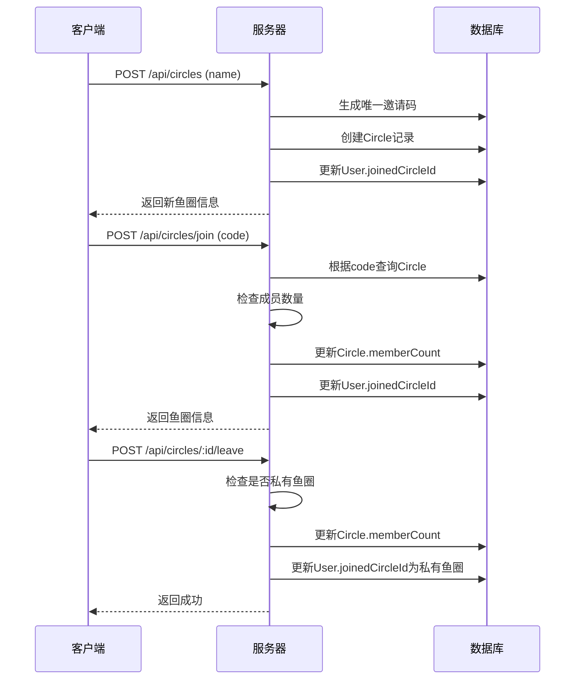

# 鱼圈管理 — 技术设计文档

## 1. 设计概要

**功能描述**：实现鱼圈的创建、加入、退出、成员管理功能，支持6位邀请码加入，私有鱼圈不可退出

**影响范围**：鱼圈模块、用户模块（更新joinedCircleId）

**技术难点**：邀请码唯一性保证、成员数量限制、加入/退出时的状态同步

**外部依赖**：用户系统（Phase 1.1）

---

## 2. 架构概览

鱼圈管理模块提供REST API，前端通过API进行鱼圈的增删改查操作。

### 模块交互



---

## 3. 数据库设计

### 现有表修改

#### `Circle`

新增字段：

| 字段名 | 类型 | 约束 | 说明 |
|--------|------|------|------|
| isActive | Boolean | DEFAULT false | 鱼圈是否已激活（邀请机制） |

```prisma
// Circle 表新增字段
isActive Boolean @default(false)
```

**业务规则**：
- 创建鱼圈后 `isActive = false`，需要等待成员加入才激活
- 至少2人（创建者+1人）加入后自动激活 `isActive = true`
- 未激活的鱼圈在侧边栏以"等待中"样式展示

#### `User`

无需修改

### 新增表

#### `Invite`

**用途**：管理创建鱼圈后的邀请码，支持1小时过期，过期后保留1小时自动删除

| 字段名 | 类型 | 约束 | 说明 |
|--------|------|------|------|
| id | String | PK, uuid | 主键 |
| circleId | String | FK → Circle.id | 鱼圈ID |
| code | String | UNIQUE, 6位数字 | 邀请码 |
| createdBy | String | FK → User.id | 创建者 |
| status | String | DEFAULT 'active' | 状态: active / expired |
| expiresAt | DateTime | NOT NULL | 过期时间（创建后1小时） |
| createdAt | DateTime | DEFAULT now() | 创建时间 |

**索引**：
- `@@unique([code])` — 邀请码唯一
- `@@index([circleId])` — 按鱼圈查邀请码
- `@@index([status])` — 按状态查询用于清理
- `@@index([createdBy])` — 按创建者查询用于限制数量

```prisma
model Invite {
  id        String   @id @default(uuid())
  circleId  String
  code      String   @unique
  createdBy String
  status    String   @default("active")
  expiresAt DateTime
  createdAt DateTime @default(now())

  circle    Circle   @relation(fields: [circleId], references: [id])

  @@unique([code])
  @@index([circleId])
  @@index([status])
  @@index([createdBy])
}
```

---

## 4. API 设计

### `POST /api/circles`

**描述**：创建鱼圈（含邀请码生成和等待激活机制）→ AC-001, AC-202, AC-205

**鉴权**：需要JWT

**Request**：
```json
{
    "name": "第五工位躺平分会"
}
```

**Response（成功）**：
```json
{
    "success": true,
    "data": {
        "circle": {
            "id": "uuid",
            "name": "第五工位躺平分会",
            "isActive": false,
            "ownerId": "user-uuid",
            "isPrivate": false,
            "memberCount": 1
        },
        "invite": {
            "code": "123456",
            "expiresAt": "2026-06-22T12:00:00.000Z"
        }
    }
}
```

**异常响应**：

| 场景 | 状态码 | 响应 | 对应 AC |
|------|--------|------|---------|
| 名称超过50字符 | 400 | `{"success": false, "message": "名称超长，鱼圈名限50字以内哦~"}` | AC-104 |
| 名称为空 | 400 | `{"success": false, "message": "请输入鱼圈名称"}` | - |
| 达到3个等待中上限 | 400 | `{"success": false, "message": "你已经有3个等待中的鱼圈了，等它们过期或有人加入后再创建吧！"}` | AC-206 |

---

### `POST /api/circles/join`

**描述**：通过邀请码加入鱼圈（校验 Invite 表中的邀请码有效性）→ AC-002, AC-101, AC-102, AC-103, AC-203, AC-205

**鉴权**：需要JWT

**Request**：
```json
{
    "code": "123456"
}
```

**Response（成功）**：
```json
{
    "success": true,
    "data": {
        "circle": {
            "id": "uuid",
            "name": "第五工位躺平分会",
            "code": "123456",
            "isActive": true,
            "isPrivate": false,
            "memberCount": 2
        }
    }
}
```

**异常响应**：

| 场景 | 状态码 | 响应 | 对应 AC |
|------|--------|------|---------|
| 邀请码不存在 | 400 | `{"success": false, "message": "找不到匹配的鱼圈！请核对同事给的6位分享秘钥是否正确。"}` | AC-101 |
| 邀请码已过期 | 400 | `{"success": false, "message": "邀请码已过期，请联系群主重新生成"}` | - |
| 鱼圈已满 | 400 | `{"success": false, "message": "这个划水小分队已经达到10人满负荷啦！"}` | AC-102 |
| 已在该圈 | 400 | `{"success": false, "message": "你已经在这只划水队伍中啦！"}` | AC-103 |
| 私有鱼圈 | 400 | `{"success": false, "message": "私有鱼圈不可加入"}` | - |

---

### `POST /api/circles/:id/leave`

**描述**：退出鱼圈 → AC-003, AC-204

**鉴权**：需要JWT

**Request**：无

**Response（成功）**：
```json
{
    "success": true,
    "message": "已成功退出鱼圈"
}
```

**异常响应**：

| 场景 | 状态码 | 响应 | 对应 AC |
|------|--------|------|---------|
| 私有鱼圈 | 400 | `{"success": false, "message": "私有鱼圈不可退出"}` | AC-105 |
| 不是成员 | 400 | `{"success": false, "message": "你不是该鱼圈成员"}` | - |

---

### `DELETE /api/circles/:id/members/:userId`

**描述**：踢出成员 → AC-004, AC-204

**鉴权**：需要JWT（仅群主可操作）

**Request**：无

**Response（成功）**：
```json
{
    "success": true,
    "message": "已成功请离战友！"
}
```

**异常响应**：

| 场景 | 状态码 | 响应 | 对应 AC |
|------|--------|------|---------|
| 非群主操作 | 403 | `{"success": false, "message": "只有群主可以踢出成员"}` | - |
| 踢出自己 | 400 | `{"success": false, "message": "群主不能踢出自己"}` | - |
| 用户不在圈内 | 400 | `{"success": false, "message": "该用户不是鱼圈成员"}` | - |

---

### `GET /api/circles/:id`

**描述**：获取鱼圈详情

**鉴权**：需要JWT

**Request**：无

**Response（成功）**：
```json
{
    "success": true,
    "data": {
        "circle": {
            "id": "uuid",
            "name": "第五工位躺平分会",
            "code": "123456",
            "ownerId": "user-uuid",
            "isPrivate": false,
            "memberCount": 5,
            "petFishName": "懵懂胖金鱼",
            "petFishLevel": 1,
            "petFishExp": 0
        },
        "members": [
            {
                "id": "user-uuid",
                "nickname": "摸鱼水獭",
                "avatar": "moyu_otter",
                "isOwner": true
            }
        ]
    }
}
```

---

### `GET /api/circles/pending`

**描述**：获取当前用户的"等待中"鱼圈列表（用于侧边栏展示）→ AC-006

**鉴权**：需要JWT

**Response（成功）**：
```json
{
    "success": true,
    "data": {
        "pendingCircles": [
            {
                "circleId": "uuid",
                "circleName": "第五工位躺平分会",
                "inviteCode": "123456",
                "expiresAt": "2026-06-22T12:00:00.000Z",
                "memberCount": 1,
                "createdAt": "2026-06-22T11:00:00.000Z"
            }
        ]
    }
}
```

---

### `GET /api/circles/:id/invite`

**描述**：获取指定鱼圈的邀请信息（用于邀请弹窗）→ AC-007

**鉴权**：需要JWT

**Response（成功）**：
```json
{
    "success": true,
    "data": {
        "invite": {
            "code": "123456",
            "expiresAt": "2026-06-22T12:00:00.000Z",
            "status": "active",
            "memberCount": 1
        }
    }
}
```

**异常响应**：

| 场景 | 状态码 | 响应 | 对应 AC |
|------|--------|------|---------|
| 鱼圈已激活 | 400 | `{"success": false, "message": "鱼圈已激活，无需邀请码"}` | - |
| 非群主操作 | 403 | `{"success": false, "message": "只有群主可以查看邀请码"}` | - |

---

### `DELETE /api/circles/expired-invites`

**描述**：清理过期邀请码（定时任务调用）→ AC-008

**鉴权**：内部调用（无需JWT）

**处理逻辑**：
1. 将 `expiresAt < now()` 且 `status = 'active'` 的邀请标记为 `status = 'expired'`
2. 将 `status = 'expired'` 且 `createdAt < now() - 2h` 的邀请物理删除
3. 删除对应的未激活鱼圈（`isActive = false` 且无有效邀请的鱼圈）

**Response**：
```json
{
    "success": true,
    "data": {
        "expiredCount": 3,
        "deletedCount": 2
    }
}
```

---

## 5. 核心逻辑

### 5.1 生成唯一邀请码

**触发条件**：创建鱼圈时

**处理流程**：
1. 生成6位随机数字
2. 在 Invite 表中检查是否已存在
3. 如已存在，重新生成
4. 返回唯一邀请码

**伪代码**：
```
async function generateUniqueCode():
    while true:
        code = String(Math.floor(100000 + Math.random() * 900000))
        existing = await db.invite.findByCode(code)
        if !existing:
            return code
```

---

### 5.2 创建鱼圈 → 等待激活流程

**触发条件**：用户点击"建立安全通道"

**处理流程**：
1. 校验用户"等待中"鱼圈数量 < 3
2. 创建 Circle 记录，`isActive = false`
3. 生成邀请码，写入 Invite 表，`expiresAt = now + 1h`
4. 创建者通过 UserCircle 加入
5. 返回 circle + invite 信息

**状态流转**：
```
创建鱼圈 → isActive=false, Invite status=active
    ↓
1人加入 → memberCount>=2 → 自动激活 isActive=true
    ↓
或1小时过期 → Invite status=expired → 鱼圈自动删除
```

---

### 5.3 邀请码过期清理

**触发条件**：定时任务（每分钟执行）

**处理流程**：
1. 标记过期：将 `expiresAt < now()` 且 `status = 'active'` 的邀请标记为 `status = 'expired'`
2. 删除过期记录：将 `status = 'expired'` 且 `createdAt < now() - 2h` 的邀请物理删除
3. 删除未激活鱼圈：`isActive = false` 且无有效邀请的鱼圈

**伪代码**：
```
// 标记过期
UPDATE Invite SET status = 'expired' 
WHERE status = 'active' AND expiresAt < now()

// 删除已过期超过1小时的记录
DELETE FROM Invite 
WHERE status = 'expired' AND createdAt < now() - 2h

// 删除未激活且无有效邀请的鱼圈
DELETE FROM Circle 
WHERE isActive = false 
AND id NOT IN (SELECT circleId FROM Invite WHERE status = 'active')
AND createdAt < now() - 2h
```

---

### 5.4 侧边栏"等待中"鱼圈加载

**触发条件**：用户打开应用 / 侧边栏刷新

**处理流程**：
1. 调用 `GET /api/circles/pending` 获取"等待中"鱼圈列表
2. 前端计算每个鱼圈的剩余时间：`remaining = expiresAt - now`
3. 每秒更新倒计时显示
4. 剩余时间 < 10分钟时，倒计时文字变为红色
5. 剩余时间 ≤ 0 时，从侧边栏移除该鱼圈
6. 轮询或 WebSocket 监听：是否有新成员加入（每30秒轮询一次 `GET /api/circles/:id/invite`）
7. 成员加入达到2人 → 自动激活，"等待中"样式消失

**前端伪代码**：
```
// 侧边栏加载
const pendingCircles = await fetch('/api/circles/pending')

// 倒计时更新
setInterval(() => {
    pendingCircles.forEach(circle => {
        const remaining = new Date(circle.expiresAt) - Date.now()
        if (remaining <= 0) {
            removeFromSidebar(circle.circleId)
            return
        }
        const isUrgent = remaining < 10 * 60 * 1000 // 10分钟
        updateCountdown(circle.circleId, remaining, isUrgent)
    })
}, 1000)

// 轮询检查激活状态
setInterval(async () => {
    for (const circle of pendingCircles) {
        const invite = await fetch(`/api/circles/${circle.circleId}/invite`)
        if (invite.status === 'active' || invite.memberCount >= 2) {
            activateCircle(circle.circleId)
        }
    }
}, 30000)
```

---

### 5.5 加入鱼圈流程

**触发条件**：用户提交邀请码

**处理流程**：
1. 根据邀请码查询鱼圈
2. 检查鱼圈是否存在
3. 检查是否为私有鱼圈
4. 检查成员数量是否已满（≤10）
5. 检查用户是否已在该圈
6. 更新鱼圈成员数
7. 更新用户joinedCircleId

---

### 5.6 退出鱼圈流程

**触发条件**：用户点击退出

**处理流程**：
1. 检查是否为私有鱼圈（私有不可退出）
2. 检查用户是否为该圈成员
3. 更新鱼圈成员数
4. 将用户joinedCircleId重置为私有鱼圈ID

---

## 6. 现有代码改动

| 模块 / 文件 | 改动内容 | 原因 | 对应 AC |
|-------------|---------|------|---------|
| server/src/index.ts | 添加 /api/circles 路由 | 新增鱼圈管理API | - |
| **server/src/routes/circles.ts** | **新增 Invite 相关接口** | **支持邀请等待状态展示** | **AC-006~AC-009** |
| **server/src/utils/inviteCode.ts** | **新增邀请码生成工具** | **生成唯一6位邀请码** | **AC-202** |
| **server/src/jobs/cleanup.ts** | **新增定时清理任务** | **清理过期邀请码和未激活鱼圈** | **AC-008** |
| **client/src/components/circle/InviteWaiting.tsx** | **新增邀请等待组件** | **显示邀请码、倒计时、已邀请人数** | **AC-006~AC-007** |
| **client/src/components/circle/SidebarPending.tsx** | **新增侧边栏待激活鱼圈组件** | **侧边栏展示"等待中"的鱼圈** | **AC-006, AC-011** |

---

## 7. 技术决策

无特殊技术决策，遵循项目已有技术栈

---

## 8. 安全与性能

**输入校验**：
- 邀请码格式校验（6位纯数字）
- 鱼圈名称长度校验（≤50字符）

**性能考量**：
- 邀请码查询使用唯一索引
- 成员列表查询使用索引优化

---

## 9. AC 覆盖总表

| AC 编号 | 验收标准概述 | 实现位置 |
|---------|-------------|---------|
| AC-001 | 创建鱼圈成功，用户成为群主 | API POST /api/circles |
| AC-002 | 通过邀请码加入鱼圈成功 | API POST /api/circles/join |
| AC-003 | 退出鱼圈成功，回到私有鱼圈 | API POST /api/circles/:id/leave |
| AC-004 | 群主踢出成员成功 | API DELETE /api/circles/:id/members/:userId |
| AC-005 | 复制邀请码到剪贴板 | 前端实现 |
| **AC-006** | **侧边栏展示"等待中"鱼圈（状态标签、倒计时、已邀请人数）** | **API GET /api/circles/pending + SidebarPending** |
| **AC-007** | **点击"等待中"鱼圈打开邀请弹窗** | **API GET /api/circles/:id/invite + InviteWaiting** |
| **AC-008** | **邀请码过期后鱼圈从侧边栏消失** | **API DELETE /api/circles/expired-invites + 定时任务** |
| **AC-009** | **第2人加入后自动激活鱼圈** | **API POST /api/circles/join + 自动激活逻辑** |
| **AC-010** | **达到3个等待中上限时阻止创建** | **API POST /api/circles 校验** |
| **AC-011** | **倒计时<10分钟时红色警示** | **前端 SidebarPending 组件** |
| AC-101 | 邀请码不存在时显示错误提示 | API POST /api/circles/join 异常响应 |
| AC-102 | 鱼圈已满时显示错误提示 | API POST /api/circles/join 异常响应 |
| AC-103 | 已在该圈时显示错误提示 | API POST /api/circles/join 异常响应 |
| AC-104 | 名称超长时显示错误提示 | API POST /api/circles 异常响应 |
| AC-105 | 私有鱼圈无退出按钮 | 前端实现 |
| AC-201 | 私有鱼圈名称和邀请码固定 | 用户系统已实现 |
| AC-202 | 创建鱼圈自动生成6位邀请码 | API POST /api/circles |
| AC-203 | 加入鱼圈后更新joinedCircleId | API POST /api/circles/join |
| AC-204 | 踢出成员后更新数据 | API DELETE /api/circles/:id/members/:userId |
| **AC-205** | **邀请码有效期1小时，需至少1人加入才激活** | **Invite 表 + 创建鱼圈逻辑** |
| **AC-206** | **达到3个等待中上限时返回错误** | **API POST /api/circles 校验** |

---

## 附录：变更记录

| 日期 | 变更内容 | 原因 |
|------|---------|------|
| 2026-06-11 | 初始版本 | — |
| 2026-06-22 | **邀请等待状态展示技术方案**<br>1. Circle 表新增 isActive 字段<br>2. 新增 Invite 表（邀请码、过期时间、状态）<br>3. 更新 POST /api/circles 返回 invite 信息（code + expiresAt）<br>4. 更新 POST /api/circles/join 校验 Invite 表有效性<br>5. 新增 GET /api/circles/pending（获取"等待中"鱼圈列表）<br>6. 新增 GET /api/circles/:id/invite（获取邀请信息）<br>7. 新增 DELETE /api/circles/expired-invites（清理过期邀请）<br>8. 新增 5.2 创建鱼圈→等待激活流程<br>9. 新增 5.3 邀请码过期清理逻辑<br>10. 新增 5.4 侧边栏"等待中"鱼圈加载逻辑<br>11. 新增 InviteWaiting.tsx、SidebarPending.tsx、cleanup.ts 组件<br>12. 更新 AC 覆盖表（AC-006~AC-011, AC-205~AC-206） | 需求：解决创建鱼圈后关闭弹窗找不到"等待中的群"的问题 |
