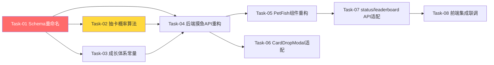

# 摸鱼鱼交互优化 — 开发任务计划

## 1. 任务概览

**总任务数**：8 个
**预计总工时**：240 分钟（约 4 小时）
**开发方法**：TDD — 每个任务按 RED → GREEN → REFACTOR 循环执行

**关键标注**：
- 🔒 阻塞任务：被多个任务依赖，建议优先完成
- ⚠️ 风险任务：技术难度高，可能需要额外时间

### 依赖关系图

### 可并行任务组

| 并行组 | 任务 | 说明 |
|--------|------|------|
| A | Task-02, Task-03 | 抽卡概率算法和成长体系常量互不依赖，可在 Schema 变更后并行开发 |
| B | Task-05, Task-06 | PetFish 组件和 CardDropModal 适配互不依赖，可在后端 API 完成后并行开发 |

---

## 2. 开发任务

### 阶段一：基础设施（Schema + 核心算法）

**阶段完成标准**：数据库字段重命名完成，抽卡概率算法和成长体系常量可独立单元测试通过。

---

#### Task-01: 数据库 Schema 重命名 🔒

**通俗解释**：把宠物鱼的"经验值"字段改名为"成长值"，为后续所有功能打好数据基础。

**做什么**：
1. 修改 `server/prisma/schema.prisma`：`petFishExp` → `petFishGrowth`
2. 执行 `npx prisma migrate dev --name rename-petfishexp-to-growth`
3. 验证迁移后数据完整

**涉及文件**：`server/prisma/schema.prisma`

**参考**：技术方案 第3节 → AC-202

**依赖**：无

**预估工时**：15 分钟

**验证标准**（TDD RED 阶段直接转化为测试用例）：
- [ ] Prisma schema 中 Circle 模型包含 `petFishGrowth Int @default(0)` 字段
- [ ] Prisma schema 中 Circle 模型不再包含 `petFishExp` 字段
- [ ] `npx prisma migrate dev` 执行成功，无数据丢失
- [ ] `npx prisma generate` 生成的类型包含 `petFishGrowth`

---

#### Task-02: 抽卡概率算法 ⚠️

**通俗解释**：重写抽卡逻辑，让每次摸鱼有30%不掉卡、30%掉重复卡、20%掉新普通卡、15%掉新稀有卡、5%掉新超稀有卡。

**做什么**：
1. 在 `server/src/data/unoCards.ts` 中新增 `drawCard(userId, prisma)` 异步函数
2. 实现5档概率分布逻辑
3. 处理边界情况：某稀有度全部收集完时合并到重复卡概率
4. 删除旧的 `drawRandomCards()` 函数和 `calculateDailyLimit()` 函数

**涉及文件**：`server/src/data/unoCards.ts`

**参考**：技术方案 第5.1节 → AC-003, AC-201

**依赖**：Task-01

**预估工时**：45 分钟

**验证标准**（TDD RED 阶段直接转化为测试用例）：
- [ ] `drawCard()` 返回 `{card: UnoCardInfo, isNew: boolean} | null`
- [ ] 当用户无已收集卡片时，重复卡区间返回已收集卡（但无已收集卡时应返回null或从全池随机）
- [ ] 当所有N卡收集完时，20%概率区间合并到重复卡
- [ ] 当所有R卡收集完时，15%概率区间合并到重复卡
- [ ] 当所有SR卡收集完时，5%概率区间合并到重复卡
- [ ] 不掉卡概率约为30%（统计测试：1000次中200-400次）
- [ ] 重复卡返回的卡片确实在用户已收集列表中
- [ ] 新卡返回的卡片确实在用户未收集列表中
- [ ] 已删除 `calculateDailyLimit()` 函数

---

#### Task-03: 成长体系常量定义

**通俗解释**：定义宠物鱼的4个等级和升级所需成长值，让后续代码引用统一常量。

**做什么**：
1. 在 `server/src/data/unoCards.ts` 中新增以下常量：
   - `DAILY_MOYU_LIMIT = 30`
   - `GROWTH_THRESHOLDS = [10, 20, 30]`（等级1→2、2→3、3→4所需成长值）
   - `FISH_TYPE_MAP`（等级→品类名称+emoji映射）

**涉及文件**：`server/src/data/unoCards.ts`

**参考**：技术方案 第5.2节, 第5.3节 → AC-202, AC-203, AC-204

**依赖**：Task-01

**预估工时**：15 分钟

**验证标准**（TDD RED 阶段直接转化为测试用例）：
- [ ] `DAILY_MOYU_LIMIT === 30`
- [ ] `GROWTH_THRESHOLDS[0] === 10`（等级1→2）
- [ ] `GROWTH_THRESHOLDS[1] === 20`（等级2→3）
- [ ] `GROWTH_THRESHOLDS[2] === 30`（等级3→4）
- [ ] `FISH_TYPE_MAP[1]` 返回 `{name: '肥嘟嘟胖金鱼', emoji: '🐠'}`
- [ ] `FISH_TYPE_MAP[2]` 返回 `{name: '带薪发愣神游鳌', emoji: '🐙'}`
- [ ] `FISH_TYPE_MAP[3]` 返回 `{name: '太极双休太公鱼', emoji: '🐙'}`
- [ ] `FISH_TYPE_MAP[4]` 返回 `{name: '极品七彩锦鲤皇', emoji: '🎏'}`

---

### 阶段二：后端 API 重构

**阶段完成标准**：POST /api/moyu/click 接口使用新的抽卡概率、固定30次上限、成长值+1逻辑，所有后端测试通过。

---

#### Task-04: 后端摸鱼 API 重构 🔒 ⚠️

**通俗解释**：重写摸鱼接口，让它用新的抽卡概率、固定30次上限、每次摸鱼成长值+1。

**做什么**：
1. 重构 `POST /api/moyu/click`：
   - 请求体新增 `circleId` 字段
   - 固定上限 = `DAILY_MOYU_LIMIT`（30）
   - 调用新的 `drawCard()` 替代旧的 `drawRandomCards()`
   - 成长值逻辑：`petFishGrowth += 1`（替代 `petFishExp += cards.length * 5`）
   - 升级逻辑：使用 `GROWTH_THRESHOLDS` 和 `FISH_TYPE_MAP`
   - 响应字段：`exp` → `growth`，`requiredExp` → `requiredGrowth`，新增 `leveledUp`
2. 更新 `server/src/routes/moyu.ts` 中的导入

**涉及文件**：`server/src/routes/moyu.ts`

**参考**：技术方案 第4节, 第5.1-5.3节 → AC-001, AC-002, AC-003, AC-004

**依赖**：Task-01, Task-02, Task-03

**预估工时**：60 分钟

**验证标准**（TDD RED 阶段直接转化为测试用例）：
- [ ] 请求缺少 `circleId` 时返回 400
- [ ] 用户未加入鱼圈时返回 400 "请先加入鱼圈"
- [ ] `todayCount < 30` 时可正常摸鱼
- [ ] `todayCount >= 30` 时返回 400 "你已触及今日防沉迷保护网！"
- [ ] 摸鱼后 `todayCount` +1，`totalCount` +1
- [ ] 摸鱼后 `petFishGrowth` +1（不是 `petFishExp`）
- [ ] 不掉卡时 `cards` 数组为空
- [ ] 掉卡时 `cards` 数组包含1张卡片，且包含 `isNew` 字段
- [ ] 宠物鱼达到升级阈值时 `level` +1，`type` 更新，`leveledUp` = true
- [ ] 宠物鱼未达到升级阈值时 `leveledUp` = false
- [ ] 成长值溢出时保留到下一级
- [ ] `lastMoyuDate` 不同时重置 `todayCount` 为 0
- [ ] 响应中 `maxCount` 固定为 30

---

### 阶段三：前端组件重构

**阶段完成标准**：PetFish 组件可点击触发摸鱼动画，CardDropModal 适配新数据结构，前端测试通过。

---

#### Task-05: PetFish 组件重构

**通俗解释**：让宠物鱼变成可点击的，点击后播放1秒摸鱼动画，显示"成长值"替代"经验值"，等级体系改为4级。

**做什么**：
1. 修改 `PetFish` 组件：
   - 新增 `onClick` prop，支持点击触发摸鱼
   - "经验值"文案改为"成长值"
   - `exp` → `growth`，`requiredExp` → `requiredGrowth`
   - 等级→emoji映射：1→🐠, 2→🐙, 3→🐙, 4→🎏
   - 已达上限时显示灰色不可点击状态
2. 新增摸鱼动画：使用 Motion（Framer Motion）实现小手左→右→左1秒动画
3. 新增状态管理：idle / animating / cooldown / maxed

**涉及文件**：`client/src/components/game/PetFish.tsx`

**参考**：技术方案 第6节 → AC-001, AC-002, AC-005

**依赖**：Task-04

**预估工时**：45 分钟

**验证标准**（TDD RED 阶段直接转化为测试用例）：
- [ ] 组件接收 `onClick` prop，点击时触发回调
- [ ] 显示"成长值"而非"经验值"
- [ ] 成长值显示格式为 `{growth} / {requiredGrowth}`
- [ ] 等级1显示🐠，等级2显示🐙，等级3显示🐙，等级4显示🎏
- [ ] 状态为 maxed 时宠物鱼不可点击，显示"你已触及今日防沉迷保护网！"
- [ ] 状态为 animating 时宠物鱼不可点击
- [ ] 摸鱼动画时长约1秒

---

#### Task-06: CardDropModal 适配

**通俗解释**：修改卡片掉落弹窗，让它能处理"没掉卡"和"只掉1张卡"两种情况。

**做什么**：
1. 修改 `CardDropModal` 组件：
   - 支持 `cards` 为空数组（不掉卡时不弹窗，或显示"今日运气不佳"提示）
   - 支持 `cards` 只有1张卡片的展示
   - 卡片信息新增 `isNew` 字段展示

**涉及文件**：`client/src/components/game/CardDropModal.tsx`

**参考**：技术方案 第6节 → AC-003

**依赖**：Task-04

**预估工时**：20 分钟

**验证标准**（TDD RED 阶段直接转化为测试用例）：
- [ ] `cards` 为空数组时不弹窗（或显示"运气不佳"提示）
- [ ] `cards` 有1张卡片时正确展示单张卡片
- [ ] `isNew` 为 true 时显示"新卡"标签
- [ ] `isNew` 为 false 时显示"重复"标签
- [ ] 点击"继续摸鱼"关闭弹窗并触发 `onContinue` 回调

---

### 阶段四：API 适配与集成

**阶段完成标准**：status 和 leaderboard 接口适配新字段，前端完整联调通过。

---

#### Task-07: status/leaderboard API 适配

**通俗解释**：让获取摸鱼状态和排行榜的接口也用新的字段名和 circleId 参数。

**做什么**：
1. 重构 `GET /api/moyu/status`：
   - 从 query 参数获取 `circleId`
   - 返回 `growth` 替代 `exp`，`requiredGrowth` 替代 `requiredExp`
   - `maxCount` 固定返回 30
2. 重构 `GET /api/moyu/leaderboard`：
   - 从 query 参数获取 `circleId`

**涉及文件**：`server/src/routes/moyu.ts`

**参考**：技术方案 第4节 → AC-005

**依赖**：Task-05

**预估工时**：20 分钟

**验证标准**（TDD RED 阶段直接转化为测试用例）：
- [ ] `GET /api/moyu/status?circleId=xxx` 返回 `petFish.growth` 字段
- [ ] `GET /api/moyu/status?circleId=xxx` 返回 `petFish.requiredGrowth` 字段
- [ ] `GET /api/moyu/status` 返回 `maxCount: 30`
- [ ] `GET /api/moyu/leaderboard?circleId=xxx` 正常返回排行榜数据
- [ ] 缺少 `circleId` 参数时返回 400

---

#### Task-08: 前端集成联调

**通俗解释**：把所有前端组件串起来，完整走一遍"点击小鱼→动画→抽卡→弹窗→成长值更新"的流程。

**做什么**：
1. 在摸鱼鱼页面中集成 PetFish + CardDropModal 组件
2. 调用 `POST /api/moyu/click` 并处理响应
3. 调用 `GET /api/moyu/status` 获取初始状态
4. 处理动画结束后的卡片弹窗展示
5. 处理"不掉卡"场景的用户反馈

**涉及文件**：`client/src/components/game/` 相关页面组件

**参考**：技术方案 第2节, 第6节 → AC-001~AC-005

**依赖**：Task-05, Task-06, Task-07

**预估工时**：20 分钟

**验证标准**（TDD RED 阶段直接转化为测试用例）：
- [ ] 页面加载时调用 `/api/moyu/status` 获取今日次数和宠物鱼信息
- [ ] 点击宠物鱼后播放1秒动画
- [ ] 动画结束后调用 `/api/moyu/click`
- [ ] 掉卡时弹出 CardDropModal 展示卡片
- [ ] 不掉卡时显示"运气不佳"提示（不弹窗或轻提示）
- [ ] 今日次数达到30后宠物鱼变为不可点击状态
- [ ] 成长值进度条实时更新

---

## 3. AC 覆盖总表

| AC 编号 | 验收标准概述 | 承接任务 | 验证方式 |
|---------|-------------|---------|---------|
| AC-001 | 点击宠物鱼播放1秒摸鱼动画 | Task-05, Task-08 | PetFish 组件点击事件 + Motion 动画测试 |
| AC-002 | 动画结束后宠物鱼成长值+1 | Task-04 | POST /api/moyu/click 测试：petFishGrowth 增加 |
| AC-003 | 抽卡概率符合新设计 | Task-02, Task-06 | drawCard() 单元测试（统计验证）+ CardDropModal 展示 |
| AC-004 | 每日上限固定30次 | Task-04 | POST /api/moyu/click 测试：第31次返回400 |
| AC-005 | 显示"{已用次数} / 30" | Task-07, Task-08 | GET /api/moyu/status 测试 + 前端展示验证 |
| AC-101 | 已达上限不可点击 | Task-04, Task-05 | 后端400响应 + 前端禁用状态测试 |
| AC-102 | 重复卡片count累加 | Task-04 | POST /api/moyu/click 测试：重复卡时 UnoCard.count +1 |
| AC-103 | 成长值溢出保留 | Task-04 | POST /api/moyu/click 测试：溢出值保留到下一级 |
| AC-104 | 未登录/未加入鱼圈不可点击 | Task-04 | authMiddleware 测试 + circleId 校验测试 |
| AC-201 | 5档概率分布 | Task-02 | drawCard() 统计测试（1000次采样验证分布） |
| AC-202 | 每次固定+1成长值 | Task-01, Task-04 | Schema 字段测试 + API 测试 |
| AC-203 | 4个等级品类映射 | Task-03, Task-04 | FISH_TYPE_MAP 常量测试 + 升级逻辑测试 |
| AC-204 | 固定30次凌晨重置 | Task-04 | API 测试：lastMoyuDate 不同时重置 todayCount |

---

## 4. 完成定义

- [ ] 所有任务的验证标准（测试用例）通过
- [ ] AC 覆盖总表中每条 AC 的验证方式已执行并通过
- [ ] Prisma migration 在测试环境执行成功，数据无丢失
- [ ] 抽卡概率分布通过1000次采样统计测试，各档偏差在合理范围内
- [ ] 前端完整流程联调通过：点击小鱼 → 动画 → 掉卡/不掉卡 → 弹窗 → 成长值更新
- [ ] 已达上限状态正确显示，宠物鱼不可点击
