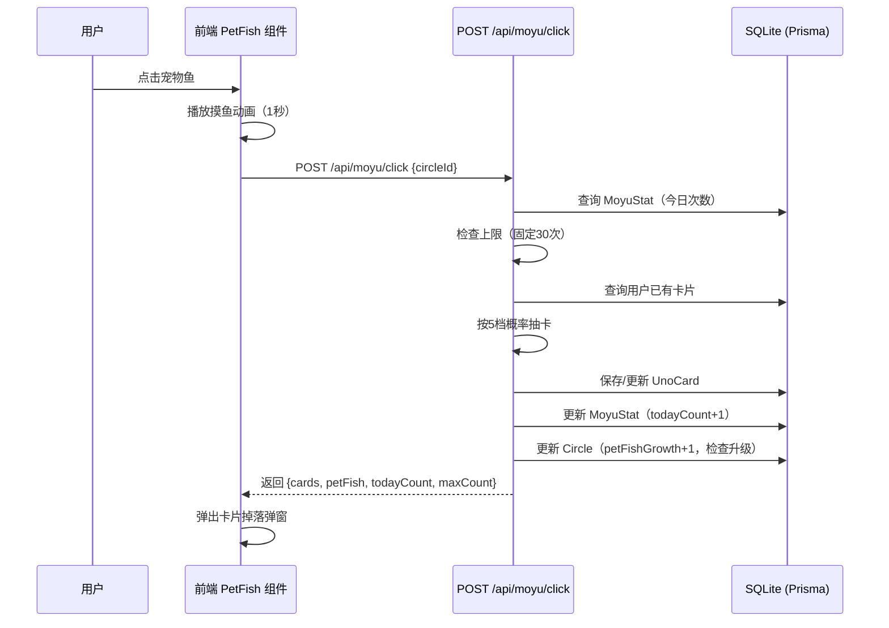

# 摸鱼鱼交互优化 — 技术设计文档

## 1. 设计概要

**功能描述**：重构摸鱼鱼交互方式（点击小鱼触发动画）、抽卡概率（5档新概率）、每日上限（固定30次）、宠物鱼成长体系（成长值+1/次，4个等级，升级10→20→30）。

**影响范围**：Game 模块（前端组件 + 后端路由 + 数据模型）、UNO 卡片数据模块

**技术难点**：抽卡概率需要精确匹配5档分布，且需处理"稀有卡不重复"和"某稀有度全部收集完后概率转为重复卡"的边界逻辑。

**外部依赖**：依赖 V1.1.0 数据库 Schema 升级（Phase 1.1：Circle 模型 `petFishExp` → `petFishGrowth` 字段重命名）。

---

## 2. 架构概览

本次改动集中在 Game 模块内部，不涉及跨模块交互。核心数据流如下：



**模块职责**：

| 模块 | 职责 |
|------|------|
| `unoCards.ts` | 卡片定义不变；重写 `drawCards()` 实现5档概率；删除 `calculateDailyLimit()` |
| `moyu.ts` (routes) | 重构摸鱼点击逻辑：固定30次上限、成长值+1、新升级规则 |
| `PetFish.tsx` | 改为可点击触发摸鱼、显示"成长值"替代"经验值"、新等级映射 |
| `CardDropModal.tsx` | 适配新数据结构（单张卡片而非1-2张随机） |

---

## 3. 数据库设计

### 修改现有表

#### `Circle` 模型

**变更内容**：`petFishExp` 字段重命名为 `petFishGrowth`（语义更清晰）

```prisma
// Before
petFishExp  Int      @default(0)

// After
petFishGrowth  Int   @default(0)
```

**数据迁移**：Prisma 自动生成迁移脚本，保留现有数据。

**升级规则变更**：无需新增字段，逻辑变更在 Service 层。

| 字段 | V1.0.0 | V1.1.0 |
|------|--------|--------|
| `petFishLevel` 升级条件 | `petFishExp >= level * 50` | `petFishGrowth >= [10, 20, 30][level-1]` |
| `petFishType` 映射 | level≥15锦鲤/≥10太公/≥5神游 | level≥4锦鲤/≥3太公/≥2神游 |
| `petFishExp` → `petFishGrowth` | 每次 +5×卡片数 | 每次固定 +1 |

#### `MoyuStat` 模型

**变更内容**：无需新增字段。`lastMoyuDate` 已支持凌晨重置逻辑（通过比对日期字符串）。

---

## 4. API 设计

### `POST /api/moyu/click`

**描述**：摸鱼点击（重构） → AC-001, AC-002, AC-003, AC-004

**鉴权**：需要登录（`authMiddleware`）

**Request**：
```json
{
  "circleId": "string" // 用户当前所在的鱼圈ID
}
```

**Response（成功）**：
```json
{
  "success": true,
  "data": {
    "cards": [
      {
        "id": "R_0",
        "name": "红色 0",
        "color": "Red",
        "value": "0",
        "rarity": "N",
        "bonusText": "红运当头，一切归零！",
        "isNew": true
      }
    ],
    "petFish": {
      "name": "懵懂胖金鱼",
      "level": 2,
      "growth": 5,
      "type": "带薪发愣神游鳌",
      "requiredGrowth": 20,
      "leveledUp": true
    },
    "todayCount": 5,
    "maxCount": 30,
    "totalCount": 42
  }
}
```

**响应字段变更**：

| 字段 | V1.0.0 | V1.1.0 |
|------|--------|--------|
| `data.cards` | 1-2张随机卡片 | 0或1张卡片（由概率决定） |
| `data.cards[].isNew` | 不存在 | 新增字段，标识是否为新卡 |
| `data.petFish.exp` | 经验值 | 改为 `growth`（成长值） |
| `data.petFish.requiredExp` | 升级所需经验 | 改为 `requiredGrowth` |
| `data.petFish.leveledUp` | 不存在 | 新增字段，标识是否升级 |
| `data.maxCount` | 15-45（随机） | 固定 30 |

**异常响应**：

| 场景 | 状态码 | 响应 | 对应 AC |
|------|--------|------|---------|
| 用户不存在 | 404 | `{success: false, message: '用户不存在'}` | - |
| 未加入鱼圈 | 400 | `{success: false, message: '请先加入鱼圈'}` | AC-104 |
| 已达今日上限 | 400 | `{success: false, message: '你已触及今日防沉迷保护网！'}` | AC-101 |
| `circleId` 缺失 | 400 | `{success: false, message: '缺少鱼圈ID'}` | - |

---

### `GET /api/moyu/status`

**描述**：获取今日摸鱼状态 + 宠物鱼信息（微调） → AC-005

**鉴权**：需要登录

**Request**：Query 参数 `?circleId=xxx`

**Response（成功）**：
```json
{
  "success": true,
  "data": {
    "todayCount": 5,
    "maxCount": 30,
    "petFish": {
      "name": "懵懂胖金鱼",
      "level": 2,
      "growth": 5,
      "type": "带薪发愣神游鳌",
      "requiredGrowth": 20
    }
  }
}
```

**变更**：`maxCount` 固定返回 30；`petFish` 中 `exp` → `growth`，`requiredExp` → `requiredGrowth`。

---

### `GET /api/moyu/leaderboard`

**描述**：获取摸鱼排行榜（不变）

**鉴权**：需要登录

**Request**：Query 参数 `?circleId=xxx`

**Response**：不变。

**变更**：需要从 query 参数获取 `circleId`，替代原从 `user.joinedCircleId` 获取。

---

## 5. 核心逻辑

### 5.1 抽卡概率算法 → AC-003, AC-201

**触发条件**：用户成功摸鱼后

**处理流程**：
1. 生成 0-100 的随机数
2. 根据概率区间判断结果类型
3. 根据结果类型从卡片池中抽取

**概率分布**：

| 区间 | 结果 | 处理 |
|------|------|------|
| 0-30 | 不掉卡 | 返回空数组 |
| 30-60 | 重复卡 | 从用户已收集的卡中随机选1张 |
| 60-80 | 不重复普通卡(N) | 从用户未收集的N卡中随机选1张 |
| 80-95 | 不重复稀有卡(R) | 从用户未收集的R卡中随机选1张 |
| 95-100 | 不重复超稀有卡(SR) | 从用户未收集的SR卡中随机选1张 |

**边界处理**：
- 如果某稀有度的卡全部收集完，该概率区间合并到"重复卡"区间
- 如果所有卡都收集完，100%掉重复卡

**伪代码**：
```typescript
async function drawCards(userId: string): Promise<{card: UnoCardInfo, isNew: boolean} | null> {
  // 1. 获取用户已收集的卡片
  const userCards = await prisma.unoCard.findMany({ where: { userId } });
  const ownedCardIds = new Set(userCards.map(c => c.cardId));

  // 2. 按稀有度分组可用卡片
  const availableN = UNO_CARDS.filter(c => c.rarity === 'N' && !ownedCardIds.has(c.id));
  const availableR = UNO_CARDS.filter(c => c.rarity === 'R' && !ownedCardIds.has(c.id));
  const availableSR = UNO_CARDS.filter(c => c.rarity === 'SR' && !ownedCardIds.has(c.id));

  // 3. 计算有效概率区间（收集完的稀有度合并到重复卡）
  const noDrop = 30;
  let repeatEnd = 60;
  let nEnd = 80;
  let rEnd = 95;

  if (availableN.length === 0) { nEnd = 60; repeatEnd = 80; }
  if (availableR.length === 0) { rEnd = nEnd; repeatEnd += (95 - 80); }
  if (availableSR.length === 0) { /* 5%合并到repeatEnd */ }

  // 4. 随机抽取
  const rand = Math.random() * 100;
  if (rand < noDrop) return null; // 不掉卡
  if (rand < repeatEnd) { /* 从已收集卡中随机 */ }
  if (rand < nEnd) { /* 从availableN中随机 */ }
  if (rand < rEnd) { /* 从availableR中随机 */ }
  /* 从availableSR中随机 */
}
```

### 5.2 宠物鱼成长与升级 → AC-002, AC-004, AC-202, AC-203

**触发条件**：每次摸鱼成功后

**处理流程**：
1. `petFishGrowth += 1`（无论是否掉卡）
2. 查询当前等级对应的升级阈值
3. 如果 `petFishGrowth >= threshold`，执行升级
4. 升级后 `petFishGrowth` 溢出部分保留

**升级阈值表**：

| 等级 | 升级所需成长值 | 累计成长值 |
|------|--------------|-----------|
| 1→2 | 10 | 10 |
| 2→3 | 20 | 30 |
| 3→4 | 30 | 60 |
| 4（满级） | 不再升级 | - |

**等级→品类映射**：

| 等级 | 品类名称 | emoji |
|------|---------|-------|
| 1 | 肥嘟嘟胖金鱼 | 🐠 |
| 2 | 带薪发愣神游鳌 | 🐙 |
| 3 | 太极双休太公鱼 | 🐙 |
| 4 | 极品七彩锦鲤皇 | 🎏 |

### 5.3 每日上限与凌晨重置 → AC-004, AC-204

**触发条件**：每次摸鱼请求

**处理流程**：
1. 固定上限 = 30（不再调用 `calculateDailyLimit`）
2. 比对 `lastMoyuDate` 与今日日期字符串（YYYY-MM-DD）
3. 如果不同，重置 `todayCount = 0`

---

## 6. 现有代码改动

| 模块 / 文件 | 改动内容 | 原因 | 对应 AC |
|-------------|---------|------|---------|
| `server/prisma/schema.prisma` | `petFishExp` → `petFishGrowth` | 字段语义更名 | AC-202 |
| `server/src/data/unoCards.ts` | 重写 `drawCards()` 为5档概率；删除 `calculateDailyLimit()`；新增 `GROWTH_THRESHOLDS` 和 `FISH_TYPE_MAP` 常量 | 抽卡概率和成长体系重构 | AC-003, AC-201, AC-203 |
| `server/src/routes/moyu.ts` | 重构 `/click`：固定30次上限、成长值+1、新升级逻辑、新抽卡逻辑；重构 `/status`：返回新字段；`/leaderboard`：circleId从query获取 | 后端逻辑全面重构 | AC-001~AC-004 |
| `client/src/components/game/PetFish.tsx` | 改为可点击组件（触发摸鱼）、"经验值"→"成长值"、新等级映射（4级体系） | 交互方式和成长值展示 | AC-001, AC-002, AC-005 |
| `client/src/components/game/CardDropModal.tsx` | 适配新数据结构（0或1张卡片、isNew字段） | 卡片掉落逻辑变更 | AC-003 |
| `client/src/data/unoCards.ts` | 前端卡片数据同步（如果直接引用服务端数据则无需改动） | 保持前后端一致 | - |

---

## 7. 技术决策

### 抽卡在服务端还是客户端执行

**背景**：V1.0.0 的 `drawRandomCards()` 是纯随机函数，但 V1.1.0 需要知道用户已收集的卡片才能决定"不重复"概率。

**选项**：
- A: 客户端抽卡 — 需要先获取用户卡片列表，再在前端执行概率逻辑。优势：减少一次服务端计算。劣势：客户端可篡改抽卡结果，安全风险高。
- B: 服务端抽卡 — 在 `/api/moyu/click` 中完成抽卡。优势：安全、数据一致性强。劣势：增加了接口响应时间（但查询量小，影响可忽略）。

**结论**：选择 B。抽卡必须在服务端执行，防止客户端篡改。每日配额和卡片收集都是服务端权威数据。

### 卡片数量：0或1张 vs 保持1-2张

**背景**：V1.0.0 每次摸鱼掉1-2张卡片，V1.1.0 PRD 中概率表设计为每次摸鱼一个结果（不掉卡 / 掉1张）。

**选项**：
- A: 保持1-2张 — 需要两次独立概率判断，逻辑复杂度增加，且与PRD概率表不完全匹配。
- B: 每次最多1张 — 与PRD一致，30%不掉卡 + 70%掉0或1张，逻辑简洁。

**结论**：选择 B。严格遵循PRD概率设计，每次摸鱼最多掉1张卡片。弹窗需要适配"无卡片"和"单张卡片"两种情况。

### petFishGrowth 字段重命名方式

**背景**：需要将 `petFishExp` 改为 `petFishGrowth`。

**选项**：
- A: 直接在 Schema 中重命名 + Prisma migration — 简单直接，Prisma 自动生成迁移SQL。
- B: 新增字段 + 数据迁移脚本 — 更安全但过度工程化。

**结论**：选择 A。SQLite 的 Prisma migration 对字段重命名会自动处理（创建新列、复制数据、删除旧列），数据量小无风险。

---

## 8. 安全与性能

**输入校验**：`circleId` 必须为合法 UUID，且用户必须是该鱼圈成员。

**性能考量**：
- `/api/moyu/click` 涉及多次数据库查询（用户、统计、卡片、鱼圈），可通过 Prisma 的 `include` 合并查询减少 round-trip。
- 摸鱼动画在前端执行（1秒），不阻塞后端。

---

## 9. AC 覆盖总表

| AC 编号 | 验收标准概述 | 实现位置 |
|---------|-------------|---------|
| AC-001 | 点击宠物鱼播放1秒摸鱼动画 | PetFish.tsx 点击事件 + Motion 动画 |
| AC-002 | 动画结束后宠物鱼成长值+1 | API POST /api/moyu/click + 核心逻辑 5.2 |
| AC-003 | 抽卡概率符合新设计 | 核心逻辑 5.1（5档概率算法） |
| AC-004 | 每日上限固定30次 | API POST /api/moyu/click（固定maxCount=30） |
| AC-005 | 显示"{已用次数} / 30" | API GET /api/moyu/status + PetFish.tsx 展示 |
| AC-101 | 已达上限不可点击 | API 400 响应 + PetFish.tsx 禁用状态 |
| AC-102 | 重复卡片count累加 | API POST /api/moyu/click 卡片保存逻辑 |
| AC-103 | 成长值溢出保留 | 核心逻辑 5.2 升级后溢出处理 |
| AC-104 | 未登录/未加入鱼圈不可点击 | authMiddleware + circleId 校验 |
| AC-201 | 5档概率分布 | 核心逻辑 5.1 |
| AC-202 | 每次固定+1成长值 | 核心逻辑 5.2 |
| AC-203 | 4个等级品类映射 | 核心逻辑 5.2 + FISH_TYPE_MAP |
| AC-204 | 固定30次凌晨重置 | API POST /api/moyu/click + lastMoyuDate 比对 |

---

## 附录：变更记录

| 日期 | 变更内容 | 原因 |
|------|---------|------|
| 2026-06-17 | 初始版本 | — |
