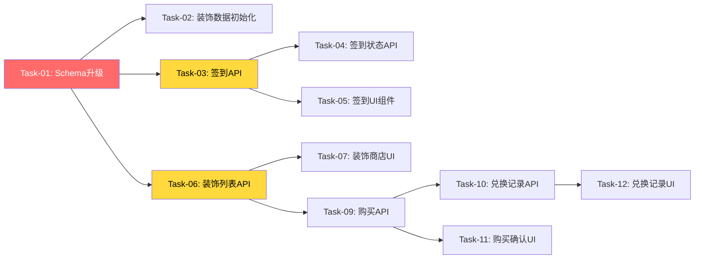

# 签到与装饰系统 — 开发任务计划

## 1. 任务概览

**总任务数**：12 个
**预计总工时**：360 分钟（约 6 小时）
**开发方法**：TDD — 每个任务按 RED → GREEN → REFACTOR 循环执行

**关键标注**：
- 🔒 阻塞任务：被多个任务依赖，建议优先完成
- ⚠️ 风险任务：技术难度高，可能需要额外时间

### 依赖关系图

### 可并行任务组

| 并行组 | 任务 | 说明 |
|--------|------|------|
| 组A | Task-03, Task-06 | 签到API和装饰列表API无依赖，可并行开发 |
| 组B | Task-05, Task-07 | 签到UI和装饰商店UI无依赖，可并行开发 |
| 组C | Task-10, Task-11 | 兑换记录API和购买确认UI无依赖，可并行开发 |

---

## 2. 开发任务

> 按垂直切片组织。每个阶段对应一个可独立运行和验证的用户行为（加可选的基础设施层）。切片内部的任务按技术层自然顺序排列。
>
> 每个任务按 TDD 循环执行：RED（根据验证标准写测试）→ GREEN（写最小实现通过测试）→ REFACTOR（重构）

### 基础设施

**阶段完成标准**：数据库 Schema 升级完成，装饰预置数据可用

---

#### Task-01: 数据库 Schema 升级 🔒

**通俗解释**：系统新增了签到记录、装饰、鱼圈装饰、兑换记录四张表，鱼圈新增了鱼币余额字段，为后续功能提供数据存储基础

**做什么**：
1. 修改 Prisma Schema，新增 SignInRecord、Decoration、CircleDecoration、ExchangeRecord 模型
2. Circle 模型新增 coinBalance 字段
3. 执行 Prisma 迁移

**涉及文件**：`server/prisma/schema.prisma`

**参考**：技术方案 第3章 数据库设计 → 全部AC

**依赖**：无

**预估工时**：30 分钟

**验证标准**（TDD RED 阶段直接转化为测试用例）：
- [ ] 执行 `npx prisma migrate dev` 成功，数据库包含 SignInRecord、Decoration、CircleDecoration、ExchangeRecord 表
- [ ] Circle 表包含 coinBalance 字段，默认值为 0
- [ ] SignInRecord 表有 (userId, circleId, signInDate) 唯一索引
- [ ] CircleDecoration 表有 (circleId, decorationId) 唯一索引

---

#### Task-02: 装饰数据初始化

**通俗解释**：系统预置了5款装饰（水草、气泡、石头、海星、珊瑚），用户可以在装饰商店看到它们

**做什么**：
1. 创建 Prisma seed 脚本
2. 初始化5款装饰数据

**涉及文件**：`server/prisma/seed.ts`

**参考**：技术方案 第7章 技术决策 → 装饰数据初始化

**依赖**：Task-01

**预估工时**：20 分钟

**验证标准**（TDD RED 阶段直接转化为测试用例）：
- [ ] 执行 `npx prisma db seed` 成功
- [ ] Decoration 表包含5条记录：水草(1币)、气泡(2币)、石头(3币)、海星(4币)、珊瑚(5币)
- [ ] 每条装饰记录有完整的 name、type、price、description 字段

---

### 切片一：每日签到

**阶段完成标准**：用户可以在当前鱼圈签到获得鱼币，查看签到状态和本周签到日历

---

#### Task-03: 签到 API 🔒

**通俗解释**：用户点击签到按钮后，系统记录签到并给鱼圈增加1鱼币

**做什么**：
1. 创建 signin 路由文件
2. 实现 POST /api/signin 接口
3. 实现签到逻辑：验证成员、检查重复、创建记录、更新鱼币

**涉及文件**：`server/src/routes/signin.ts`, `server/src/index.ts`

**参考**：技术方案 第4章 API 设计 → POST /api/signin，第5.1节 签到逻辑 → AC-001, AC-002, AC-201

**依赖**：Task-01

**预估工时**：40 分钟

**验证标准**（TDD RED 阶段直接转化为测试用例）：
- [ ] POST /api/signin 传入 `{circleId: "有效ID"}` → 返回 200，body.data 包含 signIn 记录、coinBalance、message
- [ ] 签到后 Circle.coinBalance 增加 1
- [ ] SignInRecord 表新增一条记录，signInDate 为今日日期
- [ ] POST /api/signin 传入已签到的 circleId → 返回 400，body.message = "今日已签到"
- [ ] POST /api/signin 传入无效 circleId → 返回 404

---

#### Task-04: 签到状态 API

**通俗解释**：用户打开页面时，系统显示今日是否已签到、鱼圈鱼币余额、本周签到日期

**做什么**：
1. 实现 GET /api/signin/status 接口
2. 查询今日签到状态、鱼币余额、本周签到日期列表

**涉及文件**：`server/src/routes/signin.ts`

**参考**：技术方案 第4章 API 设计 → GET /api/signin/status，第5.3节 签到状态检查逻辑 → AC-002, AC-005

**依赖**：Task-03

**预估工时**：30 分钟

**验证标准**（TDD RED 阶段直接转化为测试用例）：
- [ ] GET /api/signin/status?circleId=有效ID → 返回 200，body.data 包含 isSignedToday、coinBalance、signInDates
- [ ] 已签到时 isSignedToday = true，未签到时 isSignedToday = false
- [ ] signInDates 包含本周所有签到日期（YYYY-MM-DD 格式）
- [ ] 传入无效 circleId → 返回 404

---

#### Task-05: 签到 UI 组件

**通俗解释**：用户在摸鱼鱼页面看到签到日历卡片，可以点击签到按钮获得鱼币

**做什么**：
1. 创建 SignInCard 组件
2. 显示本周签到日历（7天）
3. 显示签到按钮和鱼币余额
4. 调用签到 API，更新 UI 状态

**涉及文件**：`client/src/components/game/SignInCard.tsx`

**参考**：技术方案 第4章 API 设计 → AC-001, AC-002, AC-005, AC-101

**依赖**：Task-04

**预估工时**：40 分钟

**验证标准**（TDD RED 阶段直接转化为测试用例）：
- [ ] 组件显示"签到领鱼币"按钮和鱼币余额
- [ ] 点击签到按钮 → 调用 POST /api/signin → 显示"签到成功！+1鱼币"提示
- [ ] 签到成功后按钮变为灰色"已签到"状态
- [ ] 已签到状态下按钮不可点击
- [ ] 本周签到日历正确显示已签到日期（高亮显示）
- [ ] 切换鱼圈后显示新鱼圈的签到状态

---

### 切片二：装饰商店浏览

**阶段完成标准**：用户可以打开装饰商店，浏览所有装饰，看到已购买和未购买状态

---

#### Task-06: 装饰列表 API 🔒

**通俗解释**：用户打开装饰商店时，系统显示所有5款装饰及当前鱼圈的购买状态

**做什么**：
1. 创建 decorations 路由文件
2. 实现 GET /api/decorations 接口
3. 查询装饰列表，标记已购买状态

**涉及文件**：`server/src/routes/decorations.ts`, `server/src/index.ts`

**参考**：技术方案 第4章 API 设计 → GET /api/decorations → AC-003, AC-103, AC-204

**依赖**：Task-01, Task-02

**预估工时**：30 分钟

**验证标准**（TDD RED 阶段直接转化为测试用例）：
- [ ] GET /api/decorations?circleId=有效ID → 返回 200，body.data 包含 decorations 数组和 coinBalance
- [ ] decorations 数组包含5款装饰，每款有 id、name、type、price、description、image、isPurchased 字段
- [ ] 已购买装饰 isPurchased = true，并包含 purchasedAt 字段
- [ ] 未购买装饰 isPurchased = false
- [ ] 传入无效 circleId → 返回 404

---

#### Task-07: 装饰商店 UI

**通俗解释**：用户在鱼缸区域看到装饰商店入口，点击后打开装饰商店弹窗，浏览所有装饰

**做什么**：
1. 创建 DecorationShop 组件
2. 显示装饰列表（卡片形式）
3. 显示鱼币余额
4. 未购买装饰显示价格和购买按钮
5. 已购买装饰显示"已拥有"标签

**涉及文件**：`client/src/components/game/DecorationShop.tsx`

**参考**：技术方案 第4章 API 设计 → AC-003, AC-103, AC-204

**依赖**：Task-06

**预估工时**：40 分钟

**验证标准**（TDD RED 阶段直接转化为测试用例）：
- [ ] 组件显示装饰列表，每款装饰显示图片、名称、价格
- [ ] 未购买装饰显示"购买"按钮
- [ ] 已购买装饰显示"已拥有"标签，不显示价格
- [ ] 顶部显示当前鱼圈鱼币余额
- [ ] 装饰按价格从低到高排序

---

### 切片三：装饰购买

**阶段完成标准**：用户可以用鱼币购买装饰，购买后装饰自动显示在鱼缸，可查看兑换记录

---

#### Task-08: 装饰购买 API

**通俗解释**：用户点击购买装饰后，系统扣除鱼币，记录购买，装饰自动显示在鱼缸

**做什么**：
1. 实现 POST /api/decorations/buy 接口
2. 实现购买逻辑：验证装饰、检查余额、检查重复、创建记录、扣除鱼币、记录兑换

**涉及文件**：`server/src/routes/decorations.ts`

**参考**：技术方案 第4章 API 设计 → POST /api/decorations/buy，第5.2节 装饰购买逻辑 → AC-003, AC-102, AC-202, AC-203

**依赖**：Task-06

**预估工时**：40 分钟

**验证标准**（TDD RED 阶段直接转化为测试用例）：
- [ ] POST /api/decorations/buy 传入 `{circleId, decorationId}` → 返回 200，body.data 包含 circleDecoration、coinBalance、message
- [ ] 购买后 Circle.coinBalance 减少装饰价格
- [ ] CircleDecoration 表新增一条记录
- [ ] ExchangeRecord 表新增一条记录
- [ ] 鱼币不足时返回 400，body.message = "鱼币不足，无法购买"
- [ ] 装饰已购买时返回 400，body.message = "该装饰已购买"
- [ ] 传入无效 decorationId → 返回 404

---

#### Task-09: 兑换记录 API

**通俗解释**：用户查看兑换记录时，系统显示该鱼圈所有装饰购买历史

**做什么**：
1. 实现 GET /api/decorations/records 接口
2. 查询兑换记录，关联用户昵称和装饰名称

**涉及文件**：`server/src/routes/decorations.ts`

**参考**：技术方案 第4章 API 设计 → GET /api/decorations/records → AC-004

**依赖**：Task-08

**预估工时**：25 分钟

**验证标准**（TDD RED 阶段直接转化为测试用例）：
- [ ] GET /api/decorations/records?circleId=有效ID → 返回 200，body.data 包含 records 数组
- [ ] records 按时间倒序排列
- [ ] 每条记录包含 id、userId、userName、decorationId、decorationName、cost、createdAt 字段
- [ ] 无兑换记录时返回空数组
- [ ] 传入无效 circleId → 返回 404

---

#### Task-10: 购买确认 UI

**通俗解释**：用户点击购买按钮后，系统弹出确认框，确认后扣除鱼币，装饰自动显示在鱼缸

**做什么**：
1. 在 DecorationShop 组件中添加购买确认弹窗
2. 点击购买按钮显示确认框："确认花费{价格}鱼币购买{装饰名称}？"
3. 确认后调用购买 API
4. 购买成功后更新装饰状态和鱼币余额

**涉及文件**：`client/src/components/game/DecorationShop.tsx`, `client/src/components/common/ConfirmModal.tsx`

**参考**：技术方案 第4章 API 设计 → AC-003, AC-102, AC-202

**依赖**：Task-07, Task-08

**预估工时**：30 分钟

**验证标准**（TDD RED 阶段直接转化为测试用例）：
- [ ] 点击购买按钮 → 显示确认弹窗，内容包含装饰名称和价格
- [ ] 点击确认 → 调用 POST /api/decorations/buy → 显示"购买成功！"提示
- [ ] 购买成功后装饰状态变为"已拥有"
- [ ] 购买成功后鱼币余额减少
- [ ] 点击取消 → 关闭弹窗，不调用 API
- [ ] 鱼币不足时点击购买 → 显示"鱼币不足，无法购买"提示

---

#### Task-11: 兑换记录 UI

**通俗解释**：用户在装饰商店内可以查看兑换记录，了解鱼币使用历史

**做什么**：
1. 在 DecorationShop 组件中添加兑换记录 Tab 或按钮
2. 显示兑换记录列表
3. 记录为空时显示"暂无兑换记录"

**涉及文件**：`client/src/components/game/DecorationShop.tsx`

**参考**：技术方案 第4章 API 设计 → AC-004

**依赖**：Task-09, Task-10

**预估工时**：25 分钟

**验证标准**（TDD RED 阶段直接转化为测试用例）：
- [ ] 装饰商店内有"兑换记录"入口
- [ ] 点击后显示兑换记录列表
- [ ] 记录显示兑换时间、用户昵称、装饰名称、消耗鱼币数
- [ ] 记录按时间倒序排列
- [ ] 无记录时显示"暂无兑换记录"

---

## 3. AC 覆盖总表

> 最终检查：每条 AC 是否都有任务承接。这是全文档唯一的 AC 映射汇总。

| AC 编号 | 验收标准概述 | 承接任务 | 验证方式 |
|---------|-------------|---------|---------|
| AC-001 | 签到成功获得1鱼币 | Task-03, Task-05 | POST /api/signin 返回成功，coinBalance 增加 1 |
| AC-002 | 已签到按钮灰色显示"已签到" | Task-04, Task-05 | GET /api/signin/status 返回 isSignedToday=true，UI 显示灰色按钮 |
| AC-003 | 购买装饰后自动显示在鱼缸 | Task-08, Task-10 | POST /api/decorations/buy 返回成功，UI 更新装饰状态 |
| AC-004 | 兑换记录正确显示 | Task-09, Task-11 | GET /api/decorations/records 返回记录列表，UI 正确显示 |
| AC-005 | 切换鱼圈显示当前鱼圈签到状态 | Task-04, Task-05 | 切换 circleId 后 GET /api/signin/status 返回对应鱼圈数据 |
| AC-101 | 重复签到显示"已签到" | Task-03 | POST /api/signin 重复调用返回 400 |
| AC-102 | 鱼币不足显示"鱼币不足" | Task-08, Task-10 | POST /api/decorations/buy 鱼币不足返回 400 |
| AC-103 | 已购买装饰显示"已拥有" | Task-06, Task-07 | GET /api/decorations 返回 isPurchased=true，UI 显示"已拥有"标签 |
| AC-104 | 私有鱼圈可以签到 | Task-03 | 私有鱼圈调用 POST /api/signin 返回成功 |
| AC-201 | 鱼币进入鱼圈公共账户 | Task-03 | 签到后 Circle.coinBalance 增加 1 |
| AC-202 | 购买后鱼币余额减少 | Task-08 | 购买后 Circle.coinBalance 减少装饰价格 |
| AC-203 | 记录兑换信息 | Task-08 | 购买后 ExchangeRecord 表新增记录 |
| AC-204 | 显示所有已购买装饰 | Task-06, Task-07 | GET /api/decorations 返回所有装饰，已购标记 isPurchased=true |

---

## 4. 完成定义

> 所有任务完成后，功能整体交付前的最终确认。只列出跟这个功能相关的检查项，不要套用通用清单。

- [ ] 所有任务的验证标准（测试用例）通过
- [ ] AC 覆盖总表中每条 AC 的验证方式已执行并通过
- [ ] Prisma 迁移脚本在测试环境验证通过
- [ ] 装饰 seed 数据正确初始化
- [ ] 签到功能在多鱼圈场景下正常工作
- [ ] 装饰购买并发场景无重复购买问题
- [ ] 鱼币余额更新使用原子操作，无并发问题
