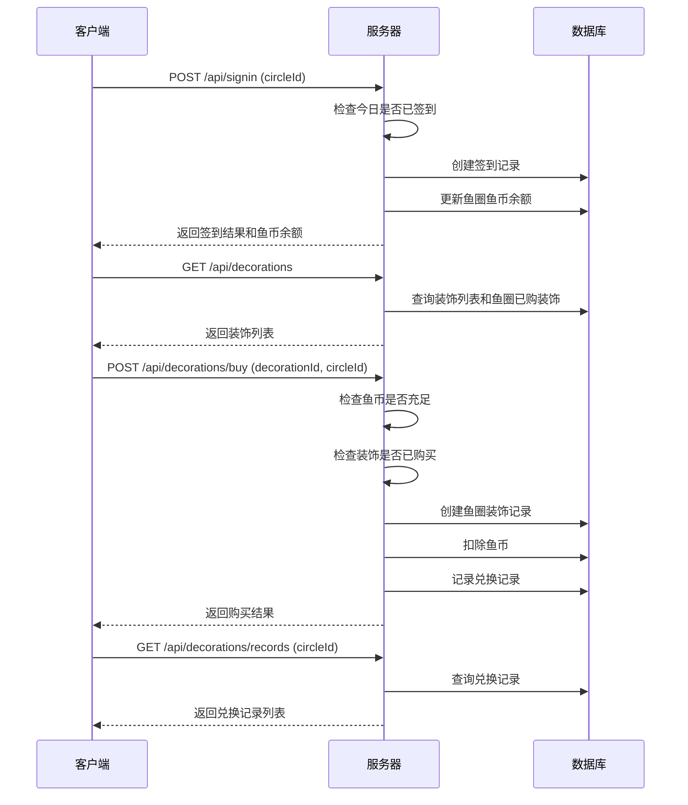

# 签到与装饰系统 — 技术设计文档

## 1. 设计概要

**功能描述**：实现每日签到获得鱼币、鱼币购买装饰、装饰自动显示在鱼缸的功能

**影响范围**：游戏模块、鱼圈模块、用户模块

**技术难点**：签到状态按鱼圈维度管理、鱼币余额实时更新、装饰购买并发控制

**外部依赖**：页面布局重构（Phase 1.2）、鱼圈管理优化（Phase 1.3）

---

## 2. 架构概览

签到与装饰系统提供REST API处理签到和装饰购买操作，前端通过API进行交互。

### 模块交互



---

## 3. 数据库设计

### 新增表

#### `SignInRecord`

**用途**：存储用户签到记录

| 字段名 | 类型 | 约束 | 说明 |
|--------|------|------|------|
| id | TEXT | PK | 记录ID (UUID) |
| userId | TEXT | FK(User.id), NOT NULL | 用户ID |
| circleId | TEXT | FK(Circle.id), NOT NULL | 鱼圈ID |
| signInDate | TEXT | NOT NULL | 签到日期 (YYYY-MM-DD) |
| createdAt | DATETIME | DEFAULT CURRENT_TIMESTAMP | 签到时间 |

**索引**：
- `(userId, circleId, signInDate)` 唯一索引（防止重复签到）
- `circleId` 索引（查询鱼圈签到记录）

```sql
CREATE TABLE "SignInRecord" (
    id TEXT PRIMARY KEY,
    userId TEXT NOT NULL,
    circleId TEXT NOT NULL,
    signInDate TEXT NOT NULL,
    createdAt DATETIME DEFAULT CURRENT_TIMESTAMP,
    FOREIGN KEY (userId) REFERENCES "User"(id),
    FOREIGN KEY (circleId) REFERENCES "Circle"(id),
    UNIQUE(userId, circleId, signInDate)
);
```

#### `Decoration`

**用途**：存储装饰定义（系统预置）

| 字段名 | 类型 | 约束 | 说明 |
|--------|------|------|------|
| id | TEXT | PK | 装饰ID |
| name | TEXT | NOT NULL | 装饰名称 |
| type | TEXT | NOT NULL | 装饰类型 (decoration/effect) |
| price | INTEGER | NOT NULL | 价格（鱼币） |
| description | TEXT | | 装饰描述 |
| image | TEXT | | 装饰图片路径 |

**索引**：
- `id` 主键索引

```sql
CREATE TABLE "Decoration" (
    id TEXT PRIMARY KEY,
    name TEXT NOT NULL,
    type TEXT NOT NULL,
    price INTEGER NOT NULL,
    description TEXT,
    image TEXT
);
```

#### `CircleDecoration`

**用途**：存储鱼圈已购买的装饰

| 字段名 | 类型 | 约束 | 说明 |
|--------|------|------|------|
| id | TEXT | PK | 记录ID (UUID) |
| circleId | TEXT | FK(Circle.id), NOT NULL | 鱼圈ID |
| decorationId | TEXT | FK(Decoration.id), NOT NULL | 装饰ID |
| purchasedBy | TEXT | FK(User.id), NOT NULL | 购买者用户ID |
| purchasedAt | DATETIME | DEFAULT CURRENT_TIMESTAMP | 购买时间 |

**索引**：
- `(circleId, decorationId)` 唯一索引（每个鱼圈每个装饰只能购买一次）
- `circleId` 索引

```sql
CREATE TABLE "CircleDecoration" (
    id TEXT PRIMARY KEY,
    circleId TEXT NOT NULL,
    decorationId TEXT NOT NULL,
    purchasedBy TEXT NOT NULL,
    purchasedAt DATETIME DEFAULT CURRENT_TIMESTAMP,
    FOREIGN KEY (circleId) REFERENCES "Circle"(id),
    FOREIGN KEY (decorationId) REFERENCES "Decoration"(id),
    FOREIGN KEY (purchasedBy) REFERENCES "User"(id),
    UNIQUE(circleId, decorationId)
);
```

#### `ExchangeRecord`

**用途**：存储鱼币兑换记录

| 字段名 | 类型 | 约束 | 说明 |
|--------|------|------|------|
| id | TEXT | PK | 记录ID (UUID) |
| circleId | TEXT | FK(Circle.id), NOT NULL | 鱼圈ID |
| userId | TEXT | FK(User.id), NOT NULL | 用户ID |
| decorationId | TEXT | FK(Decoration.id), NOT NULL | 装饰ID |
| cost | INTEGER | NOT NULL | 消耗鱼币数 |
| createdAt | DATETIME | DEFAULT CURRENT_TIMESTAMP | 兑换时间 |

**索引**：
- `circleId` 索引（查询鱼圈兑换记录）
- `createdAt` 索引（按时间排序）

```sql
CREATE TABLE "ExchangeRecord" (
    id TEXT PRIMARY KEY,
    circleId TEXT NOT NULL,
    userId TEXT NOT NULL,
    decorationId TEXT NOT NULL,
    cost INTEGER NOT NULL,
    createdAt DATETIME DEFAULT CURRENT_TIMESTAMP,
    FOREIGN KEY (circleId) REFERENCES "Circle"(id),
    FOREIGN KEY (userId) REFERENCES "User"(id),
    FOREIGN KEY (decorationId) REFERENCES "Decoration"(id)
);
```

### 修改现有表

#### `Circle`

**变更内容**：新增 `coinBalance` 字段存储鱼圈鱼币余额

```sql
ALTER TABLE "Circle" ADD COLUMN "coinBalance" INTEGER NOT NULL DEFAULT 0;
```

**数据迁移**：无需迁移，默认值为0

---

## 4. API 设计

### `POST /api/signin`

**描述**：用户签到 → AC-001, AC-002, AC-201

**鉴权**：需要JWT

**Request**：
```json
{
    "circleId": "鱼圈ID"
}
```

**Response（成功）**：
```json
{
    "success": true,
    "data": {
        "signIn": {
            "id": "uuid",
            "userId": "user-uuid",
            "circleId": "circle-uuid",
            "signInDate": "2026-06-17",
            "createdAt": "2026-06-17T10:30:00Z"
        },
        "coinBalance": 10,
        "message": "签到成功！+1鱼币"
    }
}
```

**异常响应**：

| 场景 | 状态码 | 响应 | 对应 AC |
|------|--------|------|---------|
| 今日已签到 | 400 | `{"success": false, "message": "今日已签到"}` | AC-101 |
| 鱼圈不存在 | 404 | `{"success": false, "message": "鱼圈不存在"}` | - |
| 不是鱼圈成员 | 403 | `{"success": false, "message": "不是该鱼圈成员"}` | - |

---

### `GET /api/signin/status`

**描述**：获取签到状态 → AC-002, AC-005

**鉴权**：需要JWT

**Request**：Query参数 `circleId`

**Response（成功）**：
```json
{
    "success": true,
    "data": {
        "isSignedToday": true,
        "coinBalance": 10,
        "signInDates": ["2026-06-15", "2026-06-16", "2026-06-17"]
    }
}
```

**异常响应**：

| 场景 | 状态码 | 响应 | 对应 AC |
|------|--------|------|---------|
| 鱼圈不存在 | 404 | `{"success": false, "message": "鱼圈不存在"}` | - |

---

### `GET /api/decorations`

**描述**：获取装饰列表 → AC-003

**鉴权**：需要JWT

**Request**：Query参数 `circleId`

**Response（成功）**：
```json
{
    "success": true,
    "data": {
        "decorations": [
            {
                "id": "water_grass",
                "name": "水草",
                "type": "decoration",
                "price": 1,
                "description": "鱼缸内的水草装饰",
                "image": "/decorations/water_grass.png",
                "isPurchased": false
            },
            {
                "id": "bubble",
                "name": "气泡",
                "type": "effect",
                "price": 2,
                "description": "鱼缸内的气泡效果",
                "image": "/decorations/bubble.png",
                "isPurchased": true,
                "purchasedAt": "2026-06-16T10:30:00Z"
            }
        ],
        "coinBalance": 10
    }
}
```

**异常响应**：

| 场景 | 状态码 | 响应 | 对应 AC |
|------|--------|------|---------|
| 鱼圈不存在 | 404 | `{"success": false, "message": "鱼圈不存在"}` | - |

---

### `POST /api/decorations/buy`

**描述**：购买装饰 → AC-003, AC-102, AC-202, AC-203

**鉴权**：需要JWT

**Request**：
```json
{
    "circleId": "鱼圈ID",
    "decorationId": "water_grass"
}
```

**Response（成功）**：
```json
{
    "success": true,
    "data": {
        "circleDecoration": {
            "id": "uuid",
            "circleId": "circle-uuid",
            "decorationId": "water_grass",
            "purchasedBy": "user-uuid",
            "purchasedAt": "2026-06-17T10:30:00Z"
        },
        "coinBalance": 9,
        "message": "购买成功！"
    }
}
```

**异常响应**：

| 场景 | 状态码 | 响应 | 对应 AC |
|------|--------|------|---------|
| 鱼币不足 | 400 | `{"success": false, "message": "鱼币不足，无法购买"}` | AC-102 |
| 装饰已购买 | 400 | `{"success": false, "message": "该装饰已购买"}` | AC-103 |
| 装饰不存在 | 404 | `{"success": false, "message": "装饰不存在"}` | - |
| 鱼圈不存在 | 404 | `{"success": false, "message": "鱼圈不存在"}` | - |

---

### `GET /api/decorations/records`

**描述**：获取兑换记录 → AC-004

**鉴权**：需要JWT

**Request**：Query参数 `circleId`

**Response（成功）**：
```json
{
    "success": true,
    "data": {
        "records": [
            {
                "id": "uuid",
                "circleId": "circle-uuid",
                "userId": "user-uuid",
                "userName": "摸鱼水獭",
                "decorationId": "water_grass",
                "decorationName": "水草",
                "cost": 1,
                "createdAt": "2026-06-17T10:30:00Z"
            }
        ]
    }
}
```

**异常响应**：

| 场景 | 状态码 | 响应 | 对应 AC |
|------|--------|------|---------|
| 鱼圈不存在 | 404 | `{"success": false, "message": "鱼圈不存在"}` | - |

---

## 5. 核心逻辑

### 5.1 签到逻辑 → AC-001, AC-002, AC-201

**触发条件**：用户点击签到按钮

**处理流程**：
1. 验证用户是否为鱼圈成员
2. 检查今日是否已签到（查询 SignInRecord）
3. 创建签到记录
4. 更新鱼圈鱼币余额（+1）
5. 返回签到结果

**伪代码**：
```typescript
async function signIn(userId: string, circleId: string) {
    // 验证鱼圈成员
    const circle = await prisma.circle.findUnique({ where: { id: circleId } });
    if (!circle) throw new Error('鱼圈不存在');
    
    // 检查今日签到
    const today = new Date().toISOString().split('T')[0];
    const existingRecord = await prisma.signInRecord.findFirst({
        where: { userId, circleId, signInDate: today }
    });
    if (existingRecord) throw new Error('今日已签到');
    
    // 创建签到记录
    const signInRecord = await prisma.signInRecord.create({
        data: { userId, circleId, signInDate: today }
    });
    
    // 更新鱼币余额
    const updatedCircle = await prisma.circle.update({
        where: { id: circleId },
        data: { coinBalance: { increment: 1 } }
    });
    
    return { signInRecord, coinBalance: updatedCircle.coinBalance };
}
```

### 5.2 装饰购买逻辑 → AC-003, AC-102, AC-202, AC-203

**触发条件**：用户点击购买装饰

**处理流程**：
1. 验证装饰是否存在
2. 验证鱼圈是否存在
3. 检查装饰是否已购买
4. 检查鱼币是否充足
5. 创建鱼圈装饰记录
6. 扣除鱼币
7. 记录兑换记录
8. 返回购买结果

**伪代码**：
```typescript
async function buyDecoration(userId: string, circleId: string, decorationId: string) {
    // 验证装饰
    const decoration = await prisma.decoration.findUnique({ where: { id: decorationId } });
    if (!decoration) throw new Error('装饰不存在');
    
    // 验证鱼圈
    const circle = await prisma.circle.findUnique({ where: { id: circleId } });
    if (!circle) throw new Error('鱼圈不存在');
    
    // 检查是否已购买
    const existingDecoration = await prisma.circleDecoration.findFirst({
        where: { circleId, decorationId }
    });
    if (existingDecoration) throw new Error('该装饰已购买');
    
    // 检查鱼币
    if (circle.coinBalance < decoration.price) {
        throw new Error('鱼币不足，无法购买');
    }
    
    // 购买装饰
    const circleDecoration = await prisma.circleDecoration.create({
        data: { circleId, decorationId, purchasedBy: userId }
    });
    
    // 扣除鱼币
    const updatedCircle = await prisma.circle.update({
        where: { id: circleId },
        data: { coinBalance: { decrement: decoration.price } }
    });
    
    // 记录兑换
    await prisma.exchangeRecord.create({
        data: {
            circleId,
            userId,
            decorationId,
            cost: decoration.price
        }
    });
    
    return { circleDecoration, coinBalance: updatedCircle.coinBalance };
}
```

### 5.3 签到状态检查逻辑

**触发条件**：页面加载时

**处理流程**：
1. 查询用户今日是否在该鱼圈签到
2. 查询鱼圈当前鱼币余额
3. 查询本周签到日期列表
4. 返回签到状态

**伪代码**：
```typescript
async function getSignInStatus(userId: string, circleId: string) {
    const today = new Date().toISOString().split('T')[0];
    
    // 今日签到状态
    const todayRecord = await prisma.signInRecord.findFirst({
        where: { userId, circleId, signInDate: today }
    });
    
    // 鱼币余额
    const circle = await prisma.circle.findUnique({ where: { id: circleId } });
    
    // 本周签到日期
    const weekStart = getWeekStart(); // 获取本周一日期
    const records = await prisma.signInRecord.findMany({
        where: {
            userId,
            circleId,
            signInDate: { gte: weekStart }
        },
        select: { signInDate: true }
    });
    
    return {
        isSignedToday: !!todayRecord,
        coinBalance: circle?.coinBalance || 0,
        signInDates: records.map(r => r.signInDate)
    };
}
```

---

## 6. 现有代码改动

| 模块 / 文件 | 改动内容 | 原因 | 对应 AC |
|-------------|---------|------|---------|
| server/prisma/schema.prisma | 新增 SignInRecord, Decoration, CircleDecoration, ExchangeRecord 模型，Circle 新增 coinBalance 字段 | 数据模型扩展 | - |
| server/src/index.ts | 添加 /api/signin 和 /api/decorations 路由 | 新增API | - |

---

## 7. 技术决策

### 鱼币存储位置

**背景**：鱼币是鱼圈公共财产，需要决定存储位置

**选项**：
- A: Circle 模型新增 coinBalance 字段 — 简单直接，查询方便
- B: 单独的 CircleCoin 表 — 灵活，可扩展（如支持多种货币）

**结论**：选择方案A，鱼币是单一类型，直接存在 Circle 模型更简单

### 签到记录去重

**背景**：需要防止用户在同一鱼圈重复签到

**选项**：
- A: 数据库唯一索引 (userId, circleId, signInDate) — 数据库层面保证
- B: 应用层查询检查 — 灵活但可能有并发问题

**结论**：选择方案A，数据库唯一索引是最可靠的保证

### 装饰数据初始化

**背景**：需要预置5款装饰数据

**选项**：
- A: Prisma seed 脚本 — 标准做法，易维护
- B: 代码中硬编码 — 简单但不灵活

**结论**：选择方案A，使用 Prisma seed 脚本初始化装饰数据

---

## 8. 安全与性能

**输入校验**：
- circleId 格式校验（UUID格式）
- decorationId 格式校验

**并发控制**：
- 鱼币余额更新使用 Prisma 的 increment/decrement 原子操作
- 签到记录使用数据库唯一索引防止重复

**性能考量**：
- 签到查询使用唯一索引
- 装饰列表查询使用索引优化
- 兑换记录分页查询（可选）

---

## 9. AC 覆盖总表

| AC 编号 | 验收标准概述 | 实现位置 |
|---------|-------------|---------|
| AC-001 | 签到成功获得1鱼币 | API POST /api/signin |
| AC-002 | 已签到按钮灰色显示"已签到" | API GET /api/signin/status |
| AC-003 | 购买装饰后自动显示在鱼缸 | API POST /api/decorations/buy |
| AC-004 | 兑换记录正确显示 | API GET /api/decorations/records |
| AC-005 | 切换鱼圈显示当前鱼圈签到状态 | API GET /api/signin/status |
| AC-101 | 重复签到显示"已签到" | API POST /api/signin 异常响应 |
| AC-102 | 鱼币不足显示"鱼币不足" | API POST /api/decorations/buy 异常响应 |
| AC-103 | 已购买装饰显示"已拥有" | API GET /api/decorations (isPurchased) |
| AC-104 | 私有鱼圈可以签到 | API POST /api/signin |
| AC-201 | 鱼币进入鱼圈公共账户 | API POST /api/signin |
| AC-202 | 购买后鱼币余额减少 | API POST /api/decorations/buy |
| AC-203 | 记录兑换信息 | API POST /api/decorations/buy |
| AC-204 | 显示所有已购买装饰 | API GET /api/decorations |

---

## 附录：变更记录

| 日期 | 变更内容 | 原因 |
|------|---------|------|
| 2026-06-17 | 初始版本 | — |
