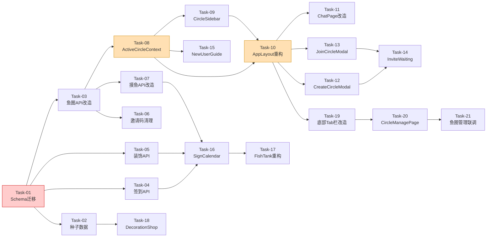

# 页面布局与交互设计 — 开发任务计划

## 1. 任务概览

**总任务数**：21 个
**开发方法**：TDD — 每个任务按 RED → GREEN → REFACTOR 循环执行

**关键标注**：
- 🔒 阻塞任务：被多个任务依赖，建议优先完成
- ⚠️ 风险任务：技术难度高，可能需要额外时间

### 依赖关系图

### 可并行任务组

| 并行组 | 任务 | 说明 |
|--------|------|------|
| A | Task-03, Task-04, Task-05 | 三个 API 模块相互独立，可并行开发 |
| B | Task-09, Task-11 | Sidebar 和 ChatPage 可并行（都依赖 Context） |
| C | Task-12, Task-13 | CreateCircleModal 和 JoinCircleModal 可并行 |
| D | Task-16, Task-17, Task-18 | 签到日历、金鱼池、装饰商店可并行 |

---

## 2. 开发任务

### 阶段一：数据库与多鱼圈基础

**阶段完成标准**：数据库完成迁移，后端 API 支持多鱼圈查询和操作

---

#### Task-01: Prisma Schema 迁移 — 多鱼圈数据模型 🔒

**通俗解释**：把数据库从"一人一圈"改成"一人多圈"，让系统能记住用户加入了哪些鱼圈。

**做什么**：
1. 修改 `schema.prisma`：
   - User 模型：删除 `joinedCircleId`、`privateCircleId` 字段及关联关系，新增 `userCircles UserCircle[]` 关系
   - Circle 模型：删除 `isPrivate`、`joinedUsers`、`privateUsers` 字段；新增 `icon`、`petFishGrowth`（替代 `petFishExp`）、`coinBalance`、`isActive` 字段；新增 `userCircles`、`invites`、`signRecords`、`circleDecorations` 关系
   - 新增 `UserCircle`、`Invite`、`SignRecord`、`Decoration`、`CircleDecoration` 模型（详见技术方案第3节）
2. 生成 Prisma 迁移脚本
3. 编写迁移脚本的数据迁移部分（petFishExp → petFishGrowth）

**涉及文件**：`server/prisma/schema.prisma`

**参考**：技术方案 §3 数据库设计

**依赖**：无

**验证标准**：
- [x] `npx prisma migrate dev` 成功执行
- [x] `npx prisma studio` 可以看到所有新表
- [x] 现有数据的 `petFishGrowth` 正确继承了 `petFishExp` 的值
- [x] User 模型不再有 `joinedCircleId` 和 `privateCircleId` 字段
- [x] Circle 模型不再有 `isPrivate` 字段

---

#### Task-02: 装饰种子数据

**通俗解释**：往数据库里预存5款装饰商品，让装饰商店有东西可卖。

**做什么**：
1. 创建 `server/prisma/seed.ts`
2. 预置5款装饰数据（水草🌿/1币、气泡🫧/2币、石头🪨/2币、海星⭐/3币、珊瑚🪸/5币）
3. 配置 `package.json` 的 prisma seed 脚本

**涉及文件**：`server/prisma/seed.ts`、`server/package.json`

**参考**：技术方案 §3.4 种子数据

**依赖**：Task-01

**验证标准**：
- [x] `npx prisma db seed` 成功执行
- [x] Decoration 表中有5条记录
- [x] 每条记录的 name、icon、price、description 与设计一致

---

### 阶段二：后端 API 改造

**阶段完成标准**：所有后端 API 支持多鱼圈，新增签到和装饰 API

---

#### Task-03: 鱼圈 API 重构 — 支持多鱼圈 🔒

**通俗解释**：让创建鱼圈、加入鱼圈、查询鱼圈列表等接口，都改用新的多鱼圈数据表来工作。

**做什么**：
1. 重构 `server/src/routes/circles.ts`：
   - `POST /api/circles`：创建鱼圈后 isActive=false，写入 Invite 表生成邀请码，创建者通过 UserCircle 加入
   - `POST /api/circles/join`：校验 Invite 表中的邀请码（status=active 且未过期），写入 UserCircle，检查 memberCount>=2 时自动激活
   - `POST /api/circles/:id/leave`：从 UserCircle 删除记录，成员降为0时删除鱼圈
   - `DELETE /api/circles/:id/members/:userId`：从 UserCircle 删除记录
   - `GET /api/circles/:id`：从 UserCircle 查询成员列表
   - 新增 `GET /api/circles`：查询当前用户通过 UserCircle 加入的所有鱼圈
2. 删除所有 `isPrivate`、`privateCircleId`、`joinedCircleId` 相关代码
3. 更新现有测试文件 `server/src/routes/circles.test.ts`、`server/src/routes/circles-join.test.ts`

**涉及文件**：`server/src/routes/circles.ts`、`server/src/routes/circles.test.ts`、`server/src/routes/circles-join.test.ts`

**参考**：技术方案 §4 API 设计（现有 API 改造部分）

**依赖**：Task-01

**验证标准**：
- [x] `POST /api/circles` 创建鱼圈后 isActive=false，返回邀请码和 expiresAt
- [x] `POST /api/circles/join` 通过邀请码加入成功，memberCount 正确递增
- [x] 第2人加入后鱼圈 isActive 自动变为 true
- [x] 过期邀请码加入返回 INVITE_EXPIRED 错误
- [x] 已在鱼圈的用户再次加入返回 CIRCLE_ALREADY_MEMBER 错误
- [x] `GET /api/circles` 返回用户加入的所有鱼圈列表
- [x] 所有现有测试通过

---

#### Task-04: 签到 API

**通俗解释**：让每个用户每天能在自己加入的鱼圈里签到一次，获得1鱼币。

**做什么**：
1. 创建 `server/src/routes/sign.ts`
2. 实现 `POST /api/circles/:id/sign`：校验成员身份、防重复签到、创建 SignRecord、coinBalance+1、返回本周签到天数
3. 实现 `GET /api/circles/:id/sign-status`：返回今日是否已签到、本周签到天数、coinBalance
4. 在 `server/src/index.ts` 挂载路由
5. 编写测试

**涉及文件**：`server/src/routes/sign.ts`（新增）、`server/src/index.ts`

**参考**：技术方案 §4 API 设计（POST /api/circles/:id/sign）

**依赖**：Task-01

**验证标准**：
- [x] 签到成功后 SignRecord 表新增一条记录
- [x] 签到成功后 coinBalance +1
- [x] 同一天同一鱼圈重复签到返回 ALREADY_SIGNED 错误
- [x] 非鱼圈成员签到返回 NOT_MEMBER 错误
- [x] sign-status 正确返回本周签到天数数组

---

#### Task-05: 装饰 API

**通俗解释**：让鱼圈能用鱼币买装饰，买了就自动展示在鱼缸里。

**做什么**：
1. 创建 `server/src/routes/decorations.ts`
2. 实现 `GET /api/decorations`：返回所有装饰列表
3. 实现 `GET /api/circles/:id/decorations`：返回鱼圈已购买的装饰
4. 实现 `POST /api/circles/:id/decorations/:decorationId/buy`：校验成员身份、校验余额、防重复购买、扣 coinBalance、创建 CircleDecoration
5. 在 `server/src/index.ts` 挂载路由
6. 编写测试

**涉及文件**：`server/src/routes/decorations.ts`（新增）、`server/src/index.ts`

**参考**：技术方案 §4 API 设计（装饰相关 API）

**依赖**：Task-01

**验证标准**：
- [x] `GET /api/decorations` 返回5款装饰
- [x] 购买成功后 CircleDecoration 表新增记录，coinBalance 减少
- [x] 鱼币不足返回 INSUFFICIENT_COINS 错误
- [x] 重复购买返回 ALREADY_PURCHASED 错误
- [x] 非成员购买返回 NOT_MEMBER 错误

---

#### Task-06: 邀请码定时清理服务

**通俗解释**：自动检查过期的邀请码，先标记过期，再延迟删除，防止数据库积累垃圾数据。

**做什么**：
1. 创建 `server/src/services/inviteCleanup.ts`
2. 实现清理逻辑：标记 status=active 且已过期的邀请为 expired；删除 status=expired 且超过1小时的记录
3. 在 `server/src/index.ts` 中启动 setInterval（每5分钟）
4. 编写单元测试

**涉及文件**：`server/src/services/inviteCleanup.ts`（新增）、`server/src/index.ts`

**参考**：技术方案 §5.1 邀请码生命周期

**依赖**：Task-03

**验证标准**：
- [x] 过期邀请码被标记为 status=expired
- [x] 超过2小时的邀请码被物理删除
- [x] 未过期的邀请码不受影响

---

#### Task-07: 摸鱼 API 改造 — 支持指定鱼圈 + 新成长体系 ⚠️

**通俗解释**：让摸鱼操作知道在哪个鱼圈摸，每次摸鱼固定加1点成长值，升级需要的点数改成10/20/30。

**做什么**：
1. 重构 `server/src/routes/moyu.ts`：
   - `POST /api/moyu/click`：接收 `circleId` 参数（替代从 user.joinedCircleId 获取）
   - 成长值逻辑：每次摸鱼 +1（替代 5×卡片数量）
   - 升级阈值：level 1→2 需10，level 2→3 需20，level 3→4 需30（替代 当前等级×50）
   - 进化形态对应更新：1级肥嘟嘟胖金鱼、2级带薪发愣神游鳌、3级太极双休太公鱼、4级极品七彩锦鲤皇
   - `GET /api/moyu/status`：URL 变更为 `/api/circles/:id/moyu/status`
   - `GET /api/moyu/leaderboard`：URL 变更为 `/api/circles/:id/moyu/leaderboard`
   - `GET /api/moyu/cards`：不变（用户级别）
2. 更新相关测试

**涉及文件**：`server/src/routes/moyu.ts`

**参考**：技术方案 §5.5 摸鱼操作改造；版本概述 §5.1 摸鱼规则、§5.2 宠物鱼规则

**依赖**：Task-03

**验证标准**：
- [x] 摸鱼后 petFishGrowth +1（不是 +5）
- [x] 成长值达到10时升级到 level 2
- [x] 成长值达到30时升级到 level 3（需累计 10+20=30）
- [x] 进化形态与等级对应正确
- [x] API 接收 circleId 参数，操作对应鱼圈的数据
- [x] 所有现有测试通过

---

### 阶段三：前端状态与布局骨架

**阶段完成标准**：左侧栏和主内容区布局可用，鱼圈切换工作正常

---

#### Task-08: ActiveCircleContext — 全局鱼圈状态 🔒 ⚠️

**通俗解释**：创建一个"全局记忆"，让整个应用知道用户当前在看哪个鱼圈，切换鱼圈时所有页面自动刷新。

**做什么**：
1. 创建 `client/src/contexts/ActiveCircleContext.tsx`
2. 实现：
   - `circles`: CircleListItem[] — 用户加入的所有鱼圈
   - `activeCircleId`: string | null — 当前活跃鱼圈 ID
   - `setActiveCircle(circleId)`: 切换活跃鱼圈
   - `refreshCircles()`: 重新加载鱼圈列表
   - 默认从 localStorage 恢复上次活跃的 circleId
3. 创建 `client/src/hooks/useCircleList.ts` — 封装鱼圈列表加载逻辑
4. 更新 `client/src/contexts/AuthContext.tsx`：登录成功后初始化鱼圈列表

**涉及文件**：`client/src/contexts/ActiveCircleContext.tsx`（新增）、`client/src/hooks/useCircleList.ts`（新增）、`client/src/contexts/AuthContext.tsx`

**参考**：技术方案 §2 架构概览、§7.1 多鱼圈状态管理方案

**依赖**：Task-03（GET /api/circles API）

**验证标准**：
- [x] 登录后自动加载鱼圈列表
- [x] 默认选中第一个鱼圈（或 localStorage 中保存的）
- [x] setActiveCircle 切换后，其他组件能感知到变化
- [x] 切换后 activeCircleId 保存到 localStorage
- [x] 没有鱼圈时 activeCircleId 为 null

---

#### Task-09: CircleSidebar — 左侧常驻鱼圈栏

**通俗解释**：在页面左侧做一个200px宽的栏，列出用户加入的所有鱼圈，点击就能切换。

**做什么**：
1. 创建 `client/src/components/circle/CircleSidebar.tsx`
2. 实现：
   - 顶部 [+] 按钮（点击展开创建/加入选项）
   - 鱼圈列表：图标 + 名称 + 未读角标（本期显示0）
   - 当前鱼圈高亮
   - 名称过长截断 + 省略号 + hover 显示全名
   - 底部"我的窝囊费"入口（分隔线隔开）
3. 遵循 UI 规范：cute-shadow、border-ink、font-display、rounded-2xl
4. 响应式：移动端隐藏或折叠

**涉及文件**：`client/src/components/circle/CircleSidebar.tsx`（新增）

**参考**：技术方案 §2 架构概览、需求文档 §4.2 左侧常驻鱼圈栏、§5.6 窝囊费页面布局；UI 规范 §7.3 卡片/面板

**依赖**：Task-08

**验证标准**：
- [x] 显示所有已加入的鱼圈列表
- [x] 点击鱼圈触发 setActiveCircle
- [x] 当前活跃鱼圈有高亮样式
- [x] 名称过长显示省略号
- [x] 底部显示"我的窝囊费"入口
- [x] [+] 按钮点击有响应（展开菜单/打开弹窗）
- [x] 无鱼圈时只显示 [+] 按钮和"我的窝囊费"

---

#### Task-10: AppLayout 重构 — 新布局骨架 🔒

**通俗解释**：把页面改成"左侧鱼圈栏 + 右侧主内容区 + 底部Tab切换"的三明治结构。窝囊费页面时隐藏左侧栏和底部Tab，全宽展示。

**做什么**：
1. 重构 `client/src/components/common/MainLayout.tsx`：
   - 左侧：CircleSidebar（200px 固定宽度）
   - 右侧：顶部 Navbar（简化）+ 主内容区 + 底部 Tab 栏
   - 窝囊费页面（`pathname === '/home/salary'`）时：隐藏 CircleSidebar，隐藏底部Tab栏，主内容区全宽展示
2. 重构 `client/src/components/common/Navbar.tsx`：
   - 移除原有的 3Tab 切换（窝囊费/蛐蛐蛐/摸鱼鱼）
   - 顶部只显示：[🐠 鱼圈名称 ▼] + [用户头像]
   - 窝囊费页面时显示返回按钮（`← 返回`），点击跳转到 `/home`
3. 新增底部 Tab 栏组件：[💬 蛐蛐间] [🎮 摸鱼鱼]
4. 重构 `client/src/App.tsx` 路由：
   - 移除独立的 `/salary`、`/chat`、`/game` 顶级路由
   - ActiveCircleContext 包裹首页
   - 路由结构：MainLayout 下嵌套 `/chat`（默认）和 `/game`
   - `/salary` 保留但从左侧栏底部入口访问
5. 新用户无鱼圈时显示 NewUserGuide（替代主内容区）

**涉及文件**：`client/src/components/common/MainLayout.tsx`、`client/src/components/common/Navbar.tsx`、`client/src/App.tsx`

**参考**：技术方案 §2 架构概览、§5.6 窝囊费页面独立布局、需求文档 §4.1 整体页面布局、§4.5 窝囊费页面布局；UI 规范 §5 间距规范

**依赖**：Task-08, Task-09

**验证标准**：
- [x] 页面左侧有200px宽的鱼圈栏
- [x] 主内容区占据剩余空间
- [x] 顶部 Navbar 显示当前鱼圈名称和用户头像
- [x] 底部有 [💬 蛐蛐间] [🎮 摸鱼鱼] Tab 栏
- [x] 默认显示聊天室（蛐蛐间）
- [x] 切换鱼圈后主内容区刷新
- [x] 底部 Tab 切换正常
- [x] 进入窝囊费页面时，左侧鱼圈栏隐藏，底部Tab栏隐藏 ✅ 2026-06-22
- [x] 窝囊费页面时，导航栏显示返回按钮（← 返回） ✅ 2026-06-22
- [x] 点击返回按钮跳转到 /home，左侧栏和底部Tab恢复显示 ✅ 2026-06-22

---

### 阶段四：创建/加入鱼圈流程

**阶段完成标准**：用户可以创建鱼圈（含邀请码等待）和通过邀请码加入鱼圈

---

#### Task-11: ChatPage 改造 — 适配多鱼圈

**通俗解释**：让聊天页面不再自己去查"我在哪个鱼圈"，而是从全局状态获取，这样切换鱼圈时聊天内容自动跟着变。

**做什么**：
1. 重构 `client/src/pages/ChatPage.tsx`：
   - 从 ActiveCircleContext 获取 activeCircleId
   - 移除自行加载 user.joinedCircleId 的逻辑
   - circleId 变化时重新加载聊天室
   - 无活跃鱼圈时显示空状态提示

**涉及文件**：`client/src/pages/ChatPage.tsx`

**参考**：技术方案 §6 现有代码改动

**依赖**：Task-08, Task-10

**验证标准**：
- [x] 进入页面自动加载当前活跃鱼圈的聊天室
- [x] 切换鱼圈后聊天内容切换到新鱼圈
- [x] 无鱼圈时显示"加入鱼圈解锁"提示

---

#### Task-12: CreateCircleModal — 创建鱼圈弹窗

**通俗解释**：做一个弹窗让用户输入鱼圈名字，点确认后生成邀请码并等待同伴加入。

**做什么**：
1. 创建 `client/src/components/circle/CreateCircleModal.tsx`
2. 实现：
   - 输入鱼圈名称（限50字，显示字符计数）
   - 点击"建立安全通道"调用 `POST /api/circles`
   - 创建成功后切换到 InviteWaiting 组件
3. 遵循 UI 规范：Modal 样式（cute-shadow-lg、rounded-3xl、backdrop-blur）

**涉及文件**：`client/src/components/circle/CreateCircleModal.tsx`（新增）

**参考**：需求文档 §5.4 创建/加入鱼圈；UI 规范 §7.6 Modal 弹窗

**依赖**：Task-10

**验证标准**：
- [x] 输入为空时禁用提交按钮
- [x] 名称超过50字时提示错误
- [x] 创建成功后显示邀请码等待界面
- [x] 创建成功后左侧栏刷新显示新鱼圈

---

#### Task-13: JoinCircleModal — 加入鱼圈弹窗

**通俗解释**：做一个弹窗让输入6位邀请码，提交后加入同事的鱼圈。

**做什么**：
1. 创建 `client/src/components/circle/JoinCircleModal.tsx`
2. 实现：
   - 6位数字输入框（自动聚焦、输满自动提交或显示确认按钮）
   - 点击确认调用 `POST /api/circles/join`
   - 成功后关闭弹窗、刷新鱼圈列表、自动切换到新鱼圈
   - 错误提示：邀请码无效、已过期、已在该圈、鱼圈已满
3. 遵循 UI 规范

**涉及文件**：`client/src/components/circle/JoinCircleModal.tsx`（新增）

**参考**：需求文档 §5.4 创建/加入鱼圈

**依赖**：Task-10

**验证标准**：
- [x] 输入非6位数字时显示错误
- [x] 无效邀请码显示"找不到匹配的鱼圈"提示
- [x] 过期邀请码显示"邀请已过期"提示
- [x] 加入成功后鱼圈列表刷新

---

#### Task-14: InviteWaiting — 邀请等待激活组件

**通俗解释**：创建鱼圈后显示一个"等待同伴加入"的界面，有邀请码和倒计时。

**做什么**：
1. 创建 `client/src/components/circle/InviteWaiting.tsx`
2. 实现：
   - 大号显示6位邀请码（可点击复制）
   - 倒计时显示剩余有效期（1小时）
   - 倒计时结束 → 显示"邀请已过期"，提供重新生成选项
   - 轮询或 WebSocket 监听是否有新成员加入
   - 成员加入达到2人 → 自动关闭，进入鱼圈
3. 遵循 UI 规范

**涉及文件**：`client/src/components/circle/InviteWaiting.tsx`（新增）

**参考**：技术方案 §5.1 邀请码生命周期、§5.2 创建鱼圈→自动激活

**依赖**：Task-12, Task-13

**验证标准**：
- [x] 邀请码正确显示且可复制
- [x] 倒计时每秒更新
- [x] 倒计时结束显示"邀请已过期"
- [x] 第2人加入后自动进入鱼圈

---

#### Task-15: NewUserGuide — 新用户引导页

**通俗解释**：新注册的用户没有鱼圈时，看到一个引导页，告诉他们可以"加入同事的鱼圈"或"创建新鱼圈"。

**做什么**：
1. 创建 `client/src/components/circle/NewUserGuide.tsx`
2. 实现：
   - 引导标题："加入鱼圈解锁摸鱼鱼、UNO卡片等功能"
   - 两个主按钮："加入同事的鱼圈"（打开 JoinCircleModal）、"创建新鱼圈"（打开 CreateCircleModal）
   - "暂时跳过"选项
3. 跳过后进入应用，只显示窝囊费，其他功能显示"加入鱼圈解锁"
4. 遵循 UI 规范

**涉及文件**：`client/src/components/circle/NewUserGuide.tsx`（新增）

**参考**：需求文档 §5.5 新用户引导

**依赖**：Task-08

**验证标准**：
- [x] 无鱼圈的用户登录后看到引导页
- [x] 点击"加入同事的鱼圈"打开 JoinCircleModal
- [x] 点击"创建新鱼圈"打开 CreateCircleModal
- [x] 点击"暂时跳过"关闭引导页
- [x] 加入/创建成功后引导页消失，进入鱼圈

---

### 阶段五：摸鱼鱼页面重构

**阶段完成标准**：摸鱼鱼页面改为左右布局，包含签到日历、金鱼池、排行榜、图鉴

---

#### Task-16: SignCalendar + 签到交互

**通俗解释**：做一个签到卡片，显示本周签到日历，点击"签到领鱼币"按钮完成签到。

**做什么**：
1. 创建 `client/src/components/game/SignCalendar.tsx`
2. 实现：
   - 本周签到日历（7天格子，已签到的显示高亮）
   - 连续签到天数
   - "签到领鱼币"按钮（今日已签到则显示"已签到"禁用态）
   - 鱼圈鱼币余额显示
3. 调用 `GET /api/circles/:id/sign-status` 加载状态
4. 调用 `POST /api/circles/:id/sign` 执行签到
5. 遵循 UI 规范：卡片样式（cute-shadow、border-ink、rounded-2xl）

**涉及文件**：`client/src/components/game/SignCalendar.tsx`（新增）

**参考**：需求文档 §5.3 摸鱼鱼页面（签到日历卡片）；UI 规范 §7.3 卡片/面板

**依赖**：Task-04, Task-05, Task-07

**验证标准**：
- [x] 显示本周7天的签到状态
- [x] 已签到的天数高亮显示
- [x] 点击"签到领鱼币"签到成功，按钮变为"已签到"
- [x] 签到后鱼币余额 +1
- [x] 同一天重复签到禁用按钮

---

#### Task-17: FishTank 重构 — 治愈金鱼池 ⚠️

**通俗解释**：把摸鱼鱼页面的核心区域改成一个"鱼缸"样式，显示宠物鱼、成长进度条、今日配额，点击鱼触发摸鱼动画。

**做什么**：
1. 创建 `client/src/components/game/FishTank.tsx`
2. 实现：
   - 鱼缸区域：宠物鱼 emoji + 名称
   - 点击宠物鱼触发1秒摸鱼动画（左→右→左）
   - 动画结束后弹出卡片掉落弹窗（复用现有 CardDropModal）
   - 成长值进度条（petFishGrowth / 升级所需值）
   - 今日配额进度条（todayCount / 30）
   - 达到上限时禁用点击，显示"你已触及今日防沉迷保护网！"
   - 装扮商城入口按钮
3. 调用改造后的 `POST /api/moyu/click`（传 circleId）
4. 遵循 UI 规范：进度条样式

**涉及文件**：`client/src/components/game/FishTank.tsx`（新增）

**参考**：需求文档 §4.4 摸鱼鱼页面布局（治愈金鱼池）；UI 规范 §7.5 进度条

**依赖**：Task-07, Task-16

**验证标准**：
- [x] 显示宠物鱼 emoji 和名称
- [x] 点击宠物鱼播放1秒动画
- [x] 动画结束后弹出卡片掉落弹窗
- [x] 成长值进度条正确显示
- [x] 今日配额进度条正确显示（/30）
- [x] 达到上限后不可点击，显示提示文字

---

#### Task-18: DecorationShop + GamePage 重构

**通俗解释**：做一个装饰商店弹窗可以买装饰；把整个摸鱼鱼页面改成左右布局，把签到、鱼缸、排行榜、图鉴都放进去。

**做什么**：
1. 创建 `client/src/components/game/DecorationShop.tsx`：
   - 显示所有装饰列表（图标+名称+价格+描述）
   - 已购买的标记"已拥有"
   - 点击"购买"调用 `POST /api/circles/:id/decorations/:decorationId/buy`
   - 购买成功后更新余额和列表
2. 重构 `client/src/pages/GamePage.tsx`：
   - 移除原有的摸鱼大按钮布局
   - 改为左右两行布局：
     - 第一行：左-SignCalendar / 右-FishTank
     - 第二行：左-Leaderboard（复用现有组件）/ 右-UNO图鉴（复用现有CardCollection逻辑）
   - 图鉴区域：收集进度条 + 卡牌统计 + "查看全部图鉴"按钮 + "装扮商城"按钮
   - 从 ActiveCircleContext 获取 circleId
   - 无鱼圈时显示"加入鱼圈解锁"提示

**涉及文件**：`client/src/components/game/DecorationShop.tsx`（新增）、`client/src/pages/GamePage.tsx`

**参考**：需求文档 §4.4 摸鱼鱼页面布局、§5.3 摸鱼鱼页面；UI 规范

**依赖**：Task-02, Task-05, Task-07, Task-16, Task-17

**验证标准**：
- [x] 摸鱼鱼页面为左右两行布局
- [x] 第一行左侧显示签到日历，右侧显示金鱼池
- [x] 第二行左侧显示排行榜，右侧显示图鉴
- [x] 点击"装扮商城"打开装饰商店弹窗
- [x] 装饰商店显示5款装饰，可购买
- [x] 购买成功后鱼币余额减少
- [x] 无鱼圈时显示"加入鱼圈解锁"提示

---

### 阶段六：鱼圈管理页面

**阶段完成标准**：底部Tab栏增加"鱼圈管理"入口，鱼圈管理页面可用

---

#### Task-19: 底部Tab栏改造 — 增加"鱼圈管理"入口

**通俗解释**：在底部Tab栏从2个变成3个，新增"鱼圈管理"Tab，点击跳转到鱼圈管理页面。

**做什么**：
1. 修改 `client/src/components/common/MainLayout.tsx`：
   - 底部Tab栏从 `[💬蛐蛐间] [🎮摸鱼鱼]` 变为 `[💬蛐蛐间] [🎮摸鱼鱼] [⚙️鱼圈管理]`
   - 新增Tab路由到 `/home/circle-manage`
   - 窝囊费页面时整个底部Tab栏隐藏（逻辑不变）
2. 修改 `client/src/App.tsx`：
   - 新增路由 `circle-manage` → `CircleManagePage`
3. Tab切换高亮逻辑：当前路径匹配时高亮对应Tab

**涉及文件**：`client/src/components/common/MainLayout.tsx`、`client/src/App.tsx`

**参考**：技术方案 §5.7 底部Tab栏改造；需求文档 §4.1 整体页面布局、§4.3 主内容区

**依赖**：Task-10

**验证标准**：
- [x] 底部Tab栏显示3个Tab：蛐蛐间、摸鱼鱼、鱼圈管理 ✅ 2026-06-22
- [x] 点击"鱼圈管理"Tab跳转到 `/home/circle-manage` ✅ 2026-06-22
- [x] 当前Tab有高亮样式 ✅ 2026-06-22
- [x] 窝囊费页面时底部Tab栏隐藏（不受影响） ✅ 2026-06-22

---

#### Task-20: CircleManagePage — 鱼圈管理页面组件

**通俗解释**：做一个鱼圈管理页面，显示鱼圈信息、成员列表、邀请码，群主能踢人，普通成员能退出。

**做什么**：
1. 创建 `client/src/pages/CircleManagePage.tsx`
2. 实现：
   - **鱼圈信息区**：鱼圈图标、名称、成员数量、创建时间
   - **成员列表区**：成员头像、昵称、角色标识（群主👑）、加入时间；群主可见"踢出"按钮
   - **邀请码区**：显示当前有效邀请码（可点击复制）
   - **操作区**：普通成员显示"退出鱼圈"按钮，群主显示"解散鱼圈"按钮
3. 调用 `GET /api/circles/:id` 获取鱼圈详情和成员列表
4. 调用 `DELETE /api/circles/:id/members/:userId` 踢出成员
5. 调用 `POST /api/circles/:id/leave` 退出鱼圈
6. 从 `ActiveCircleContext` 获取当前 `activeCircleId`
7. 遵循 UI 规范：卡片样式（cute-shadow、border-ink、rounded-2xl）

**涉及文件**：`client/src/pages/CircleManagePage.tsx`（新增）

**参考**：技术方案 §5.7 鱼圈管理页面；需求文档 §4.3 主内容区（鱼圈管理部分）

**依赖**：Task-19

**验证标准**：
- [x] 显示鱼圈图标、名称、成员数量 ✅ 2026-06-22
- [x] 显示成员列表，每个成员有头像和昵称 ✅ 2026-06-22
- [x] 群主看到成员旁边的"踢出"按钮 ✅ 2026-06-22
- [x] 群主看到"解散鱼圈"按钮 ✅ 2026-06-22
- [x] 普通成员看到"退出鱼圈"按钮 ✅ 2026-06-22
- [x] 点击"踢出"调用API成功后成员从列表消失
- [x] 点击"退出鱼圈"调用API成功后跳转回首页
- [x] 显示邀请码并可复制
- [x] 无活跃鱼圈时显示空状态提示 ✅ 2026-06-22

---

#### Task-21: 鱼圈管理页面 — 路由集成与联调验证

**通俗解释**：把鱼圈管理页面接入路由系统，确保从底部Tab点击能正确跳转，切换鱼圈后管理页面内容跟着变。

**做什么**：
1. 确认 `App.tsx` 中 `/home/circle-manage` 路由已注册
2. 确认底部Tab栏"鱼圈管理"高亮逻辑正确
3. 确认切换鱼圈后 `CircleManagePage` 自动刷新数据
4. 编写集成测试：Tab切换 → 页面渲染 → 数据加载

**涉及文件**：`client/src/App.tsx`、`client/src/components/common/MainLayout.tsx`、`client/src/pages/CircleManagePage.tsx`

**参考**：技术方案 §5.7

**依赖**：Task-20

**验证标准**：
- [x] 点击底部Tab"鱼圈管理"正确跳转到 `/home/circle-manage` ✅ 2026-06-22
- [x] 鱼圈管理Tab有高亮样式 ✅ 2026-06-22
- [x] 切换鱼圈后管理页面数据刷新 ✅ 2026-06-22
- [x] 窝囊费页面不显示底部Tab栏（含鱼圈管理） ✅ 2026-06-22
- [x] 所有现有测试不受影响 ✅ 2026-06-22

---

## 3. AC 覆盖总表

| AC 编号 | 验收标准概述 | 承接任务 | 验证方式 |
|---------|-------------|---------|---------|
| AC-001 | 左侧栏显示所有已加入的鱼圈，底部显示"我的窝囊费" | Task-09 | E2E：登录后查看左侧栏 |
| AC-002 | 点击鱼圈切换聊天内容，默认进入聊天室 | Task-08, Task-10, Task-11 | E2E：切换鱼圈验证内容变化 |
| AC-003 | 底部Tab切换到摸鱼鱼，显示当前鱼圈的摸鱼鱼页面 | Task-10, Task-18 | E2E：点击摸鱼鱼Tab |
| AC-004 | 签到成功，鱼币余额+1，按钮变为"已签到" | Task-04, Task-16 | 单元测试 + E2E |
| AC-005 | 点击宠物鱼触发1秒摸鱼动画，弹出卡片掉落弹窗 | Task-07, Task-17 | E2E：点击宠物鱼 |
| AC-006 | 点击"我的窝囊费"跳转到窝囊费页面 | Task-09, Task-10 | E2E：点击左侧栏底部 |
| AC-007 | 新用户注册后显示引导页面 | Task-15 | E2E：新账号登录 |
| AC-008 | 创建鱼圈生成邀请码，显示邀请状态 | Task-03, Task-12, Task-14 | E2E：创建鱼圈流程 |
| AC-009 | 超过1小时未有人加入，邀请失效 | Task-03, Task-06, Task-14 | 单元测试 + 手动验证 |
| AC-010 | 打开装饰商店，显示装饰列表和购买功能 | Task-02, Task-05, Task-18 | E2E：打开装饰商店 |
| AC-011 | 窝囊费页面隐藏左侧栏，全宽展示，显示返回按钮 | Task-10 | E2E：进入窝囊费页面验证布局 |
| AC-012 | 点击返回按钮跳转到 /home，布局恢复 | Task-10 | E2E：点击返回按钮验证跳转 |
| AC-101 | 只显示一个鱼圈和"我的窝囊费" | Task-09 | 单元测试 |
| AC-102 | 名称截断并显示省略号 | Task-09 | 单元测试 + 视觉验证 |
| AC-103 | 鱼圈右上角显示红色数字角标 | Task-09 | 组件测试（占位数据） |
| AC-104 | 显示"加入鱼圈解锁"提示 | Task-11, Task-15, Task-18 | E2E：无鱼圈状态 |
| AC-105 | 达到2人自动激活鱼圈 | Task-03, Task-14 | 单元测试 + E2E |
| AC-106 | 宠物鱼不可点击，显示"你已触及今日防沉迷保护网！" | Task-17 | E2E：达到上限后验证 |
| AC-107 | 窝囊费页面不显示底部Tab栏 | Task-10 | E2E：进入窝囊费页面验证 |
| AC-201 | 切换鱼圈后默认进入聊天室 | Task-08, Task-10 | E2E：切换鱼圈验证路由 |
| AC-202 | 邀请码有效期1小时，至少需要1人加入才能激活 | Task-03, Task-06 | 单元测试 |
| AC-203 | 鱼币进入当前鱼圈的公共账户 | Task-04 | 单元测试 |
| AC-204 | 每次摸鱼固定获得1点成长值 | Task-07 | 单元测试 |
| AC-205 | 装饰自动显示在鱼缸，所有鱼圈成员可见 | Task-05, Task-18 | 单元测试 + E2E |
| AC-206 | 窝囊费页面左侧栏和底部Tab均隐藏，全宽展示 | Task-10 | E2E：进入窝囊费页面验证布局 |
| AC-018 | 底部Tab栏显示"鱼圈管理"入口，点击进入鱼圈管理页面 | Task-19 | E2E：点击鱼圈管理Tab |
| AC-019 | 鱼圈管理页面显示鱼圈信息、成员列表、邀请码 | Task-20 | E2E：进入鱼圈管理页面验证内容 |
| AC-020 | 群主可踢出成员/解散鱼圈，普通成员可退出鱼圈 | Task-20 | E2E：踢出/退出/解散操作 |

---

## 4. 完成定义

- [x] 所有任务的验证标准（测试用例）通过
- [x] AC 覆盖总表中每条 AC 的验证方式已执行并通过
- [x] Prisma 迁移脚本在测试环境验证通过（数据不丢失）
- [x] 左侧栏切换鱼圈 < 500ms 响应
- [x] 创建鱼圈邀请码1小时过期逻辑通过时间模拟测试
- [x] 所有现有测试（auth、salary、chat）不受影响，全部通过
- [x] UI 遵循 design.md 规范：cute-shadow、border-ink、font-display、rounded 元素
