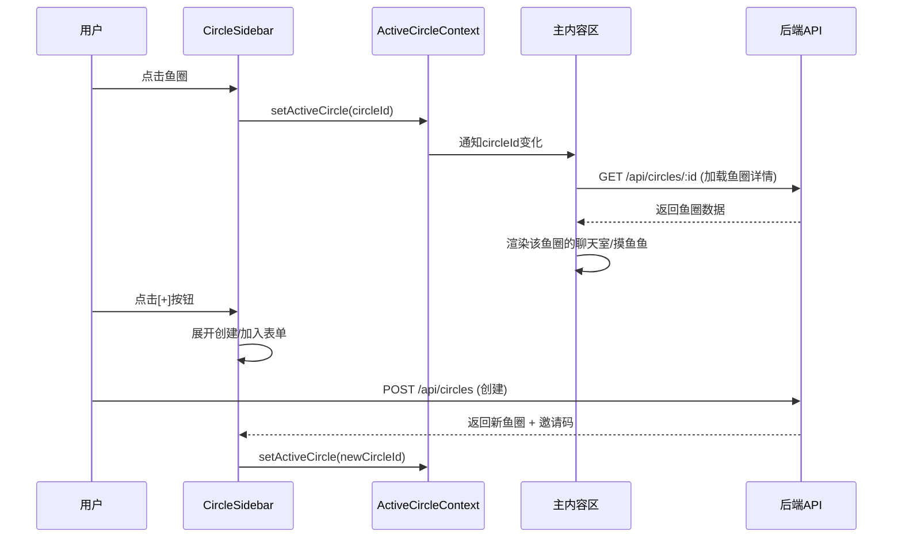
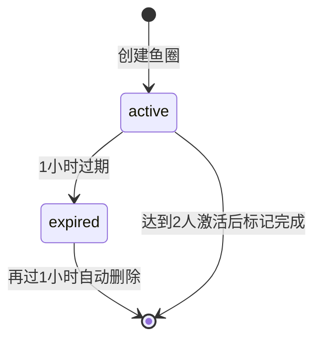

# 页面布局与交互设计 — 技术设计文档

## 1. 设计概要

**功能描述**：重新设计页面布局，新增左侧常驻鱼圈栏（200px），支持多鱼圈切换，区分个人功能（窝囊费）和鱼圈功能（蛐蛐间、摸鱼鱼、鱼圈管理），新增创建/加入鱼圈的实时邀请机制和新用户引导流程。底部Tab栏新增"鱼圈管理"入口，以页面形式展示鱼圈信息、成员列表、邀请码和退出/踢人操作。

**影响范围**：用户模块、鱼圈模块、导航/布局模块、聊天模块、摸鱼鱼模块、路由模块

**技术难点**：从单鱼圈（joinedCircleId）到多鱼圈（UserCircle 多对多）的架构迁移；邀请码时效性管理；鱼圈切换后全局状态同步

**外部依赖**：无新增外部依赖，使用现有技术栈

---

## 2. 架构概览

本次改动的核心是从"一个用户属于一个鱼圈"变为"一个用户可加入多个鱼圈，同一时刻只浏览一个"。需要对数据模型、API 层、前端路由和状态管理进行全面改造。

### 模块职责

| 模块 | 职责 |
|------|------|
| `CircleSidebar` | 左侧常驻鱼圈栏，展示已加入鱼圈列表，切换当前活跃鱼圈 |
| `ActiveCircleContext` | React Context，维护当前活跃 circleId，提供切换方法 |
| `AppLayout` | 新布局组件，左侧栏 + 主内容区 + 底部 Tab；窝囊费页面时隐藏左侧栏和底部Tab |
| `Navbar` | 顶部导航栏，窝囊费页面时显示返回按钮 |
| `NewUserGuide` | 新用户引导页，引导创建/加入鱼圈 |
| `CreateCircleModal` | 创建鱼圈弹窗，含邀请码生成和等待激活流程 |
| `JoinCircleModal` | 加入鱼圈弹窗，输入6位邀请码 |
| `CircleManagePage` | 鱼圈管理页面，展示鱼圈信息、成员列表、邀请码，支持退出/踢人操作 |

### 关键数据流



---

## 3. 数据库设计

### 3.1 删除的字段和表（私有鱼圈清理）

#### `User` 表 — 删除字段

| 删除字段 | 说明 |
|---------|------|
| `joinedCircleId` | 改用 UserCircle 多对多关系表 |
| `privateCircleId` | 私有鱼圈概念移除 |

#### `Circle` 表 — 删除字段

| 删除字段 | 说明 |
|---------|------|
| `isPrivate` | 私有鱼圈概念移除 |

### 3.2 修改现有表

#### `Circle` 表 — 新增字段

| 字段名 | 类型 | 约束 | 说明 |
|--------|------|------|------|
| icon | String | DEFAULT '🐟' | 鱼圈图标（系统默认图标标识符） |
| petFishGrowth | Int | DEFAULT 0 | 宠物鱼成长值（替代 petFishExp） |
| coinBalance | Int | DEFAULT 0 | 鱼币余额（鱼圈公共财产） |
| isActive | Boolean | DEFAULT false | 鱼圈是否已激活（邀请机制） |

**注意**：`petFishExp` 字段在迁移时重命名为 `petFishGrowth`，数据保留。

**迁移说明**：
```sql
-- 1. 添加新字段
ALTER TABLE "Circle" ADD COLUMN "icon" TEXT NOT NULL DEFAULT '🐟';
ALTER TABLE "Circle" ADD COLUMN "petFishGrowth" INTEGER NOT NULL DEFAULT 0;
ALTER TABLE "Circle" ADD COLUMN "coinBalance" INTEGER NOT NULL DEFAULT 0;
ALTER TABLE "Circle" ADD COLUMN "isActive" BOOLEAN NOT NULL DEFAULT true;

-- 2. 迁移 petFishExp → petFishGrowth
UPDATE "Circle" SET "petFishGrowth" = "petFishExp";

-- 3. 删除旧字段（SQLite 不直接支持 DROP COLUMN，需要重建表）
-- 通过 Prisma migrate 实现

-- 4. 删除 User 表的旧字段
-- 重建 User 表，移除 joinedCircleId 和 privateCircleId

-- 5. 删除 Circle 表的 isPrivate 字段
```

### 3.3 新增表

#### `UserCircle`

**用途**：用户与鱼圈的多对多关系，记录用户加入了哪些鱼圈

| 字段名 | 类型 | 约束 | 说明 |
|--------|------|------|------|
| id | String | PK, uuid | 主键 |
| userId | String | FK → User.id | 用户ID |
| circleId | String | FK → Circle.id | 鱼圈ID |
| joinedAt | DateTime | DEFAULT now() | 加入时间 |

**索引**：
- `@@unique([userId, circleId])` — 用户不能重复加入同一鱼圈
- `@@index([userId])` — 按用户查所有鱼圈
- `@@index([circleId])` — 按鱼圈查所有成员

```prisma
model UserCircle {
  id        String   @id @default(uuid())
  userId    String
  circleId  String
  joinedAt  DateTime @default(now())

  user      User     @relation(fields: [userId], references: [id])
  circle    Circle   @relation(fields: [circleId], references: [id])

  @@unique([userId, circleId])
  @@index([userId])
  @@index([circleId])
}
```

#### `Invite`

**用途**：管理创建鱼圈后的邀请码，支持1小时过期，过期后保留1小时自动删除

| 字段名 | 类型 | 约束 | 说明 |
|--------|------|------|------|
| id | String | PK, uuid | 主键 |
| circleId | String | FK → Circle.id | 鱼圈ID |
| code | String | UNIQUE, 6位数字 | 邀请码 |
| createdBy | String | FK → User.id | 创建者 |
| status | String | DEFAULT 'active' | 状态: active / expired |
| expiresAt | DateTime | NOT NULL | 过期时间（创建后1小时） |
| createdAt | DateTime | DEFAULT now() | 创建时间 |

**索引**：
- `@@unique([code])` — 邀请码唯一
- `@@index([circleId])` — 按鱼圈查邀请码
- `@@index([status])` — 按状态查询用于清理

```prisma
model Invite {
  id        String   @id @default(uuid())
  circleId  String
  code      String   @unique
  createdBy String
  status    String   @default("active")
  expiresAt DateTime
  createdAt DateTime @default(now())

  circle    Circle   @relation(fields: [circleId], references: [id])

  @@unique([code])
  @@index([circleId])
  @@index([status])
}
```

#### `SignRecord`

**用途**：签到记录，每个用户每天在每个鱼圈只能签到一次

| 字段名 | 类型 | 约束 | 说明 |
|--------|------|------|------|
| id | String | PK, uuid | 主键 |
| userId | String | FK → User.id | 用户ID |
| circleId | String | FK → Circle.id | 鱼圈ID |
| signDate | String | NOT NULL | 签到日期 YYYY-MM-DD |
| createdAt | DateTime | DEFAULT now() | 创建时间 |

**索引**：
- `@@unique([userId, circleId, signDate])` — 每人每天每圈只能签一次

```prisma
model SignRecord {
  id        String   @id @default(uuid())
  userId    String
  circleId  String
  signDate  String
  createdAt DateTime @default(now())

  user      User     @relation(fields: [userId], references: [id])
  circle    Circle   @relation(fields: [circleId], references: [id])

  @@unique([userId, circleId, signDate])
  @@index([userId])
  @@index([circleId])
}
```

#### `Decoration`

**用途**：装饰定义（系统预置5款）

| 字段名 | 类型 | 约束 | 说明 |
|--------|------|------|------|
| id | String | PK, uuid | 主键 |
| name | String | NOT NULL | 装饰名称 |
| icon | String | NOT NULL | 装饰图标（emoji） |
| price | Int | NOT NULL | 价格（鱼币） |
| description | String | DEFAULT '' | 描述 |
| createdAt | DateTime | DEFAULT now() | 创建时间 |

```prisma
model Decoration {
  id          String   @id @default(uuid())
  name        String
  icon        String
  price       Int
  description String   @default("")
  createdAt   DateTime @default(now())

  circleDecorations CircleDecoration[]
}
```

#### `CircleDecoration`

**用途**：鱼圈已购买的装饰（每个鱼圈每款装饰只能购买一次，购买后自动显示）

| 字段名 | 类型 | 约束 | 说明 |
|--------|------|------|------|
| id | String | PK, uuid | 主键 |
| circleId | String | FK → Circle.id | 鱼圈ID |
| decorationId | String | FK → Decoration.id | 装饰ID |
| purchasedAt | DateTime | DEFAULT now() | 购买时间 |

**索引**：
- `@@unique([circleId, decorationId])` — 每圈每款只能买一次

```prisma
model CircleDecoration {
  id           String   @id @default(uuid())
  circleId     String
  decorationId String
  purchasedAt  DateTime @default(now())

  circle       Circle     @relation(fields: [circleId], references: [id])
  decoration   Decoration @relation(fields: [decorationId], references: [id])

  @@unique([circleId, decorationId])
  @@index([circleId])
}
```

### 3.4 种子数据

装饰表需要预置5款装饰：

| name | icon | price | description |
|------|------|-------|-------------|
| 水草 | 🌿 | 1 | 摇曳的水草，增添鱼缸生机 |
| 气泡 | 🫧 | 2 | 咕嘟咕嘟的小气泡 |
| 石头 | 🪨 | 2 | 圆润的鹅卵石 |
| 海星 | ⭐ | 3 | 可爱的海星装饰 |
| 珊瑚 | 🪸 | 5 | 华丽的珊瑚，鱼缸的C位装饰 |

---

## 4. API 设计

### 现有 API 改造

#### `GET /api/circles`

**描述**：获取当前用户加入的所有鱼圈列表 → AC-001

**鉴权**：需要JWT

**Response（成功）**：
```json
{
  "success": true,
  "data": {
    "circles": [
      {
        "id": "uuid",
        "name": "技术部摸鱼会",
        "icon": "🐟",
        "memberCount": 5,
        "unreadCount": 3,
        "isActive": true
      }
    ]
  }
}
```

**说明**：通过 UserCircle 关联表查询用户加入的所有鱼圈。unreadCount 通过 Socket.io 实时更新或查询消息记录计算。

---

#### `POST /api/circles`

**描述**：创建鱼圈 → AC-008, AC-202

**鉴权**：需要JWT

**Request**：
```json
{
  "name": "第五工位躺平分会"
}
```

**Response（成功）**：
```json
{
  "success": true,
  "data": {
    "circle": {
      "id": "uuid",
      "name": "第五工位躺平分会",
      "icon": "🐟",
      "isActive": false,
      "memberCount": 1
    },
    "invite": {
      "code": "123456",
      "expiresAt": "2026-06-17T12:00:00.000Z"
    }
  }
}
```

**变更说明**：
- 创建鱼圈后 `isActive = false`，需要等待成员加入才激活
- 生成邀请码（1小时有效期），存入 Invite 表
- 创建者自动加入鱼圈（写入 UserCircle）
- 创建者自动成为 owner

**异常响应**：

| 场景 | 状态码 | 错误码 | 对应 AC |
|------|--------|--------|---------|
| 名称为空 | 400 | CIRCLE_NAME_EMPTY | - |
| 名称超过50字符 | 400 | CIRCLE_NAME_TOO_LONG | AC-104 |

---

#### `POST /api/circles/join`

**描述**：通过邀请码加入鱼圈 → AC-002, AC-105

**鉴权**：需要JWT

**Request**：
```json
{
  "code": "123456"
}
```

**Response（成功）**：
```json
{
  "success": true,
  "data": {
    "circle": {
      "id": "uuid",
      "name": "第五工位躺平分会",
      "icon": "🐟",
      "isActive": true,
      "memberCount": 2
    }
  }
}
```

**变更说明**：
- 校验邀请码有效性（存在且 status=active 且未过期）
- 用户加入鱼圈（写入 UserCircle，更新 memberCount）
- 检查鱼圈人数是否达到2人，达到则自动激活 `isActive = true`

**异常响应**：

| 场景 | 状态码 | 错误码 | 对应 AC |
|------|--------|--------|---------|
| 邀请码不存在 | 400 | CIRCLE_INVALID_CODE | AC-101 |
| 邀请码已过期 | 400 | INVITE_EXPIRED | AC-009 |
| 已在该圈 | 400 | CIRCLE_ALREADY_MEMBER | AC-103 |
| 鱼圈已满 | 400 | CIRCLE_FULL | AC-102 |

---

#### `POST /api/circles/:id/leave`

**描述**：退出鱼圈 → AC-006（间接）

**鉴权**：需要JWT

**变更说明**：
- 从 UserCircle 表删除记录
- 更新 circle.memberCount - 1
- 如果鱼圈成员降至0，自动删除鱼圈

---

#### `DELETE /api/circles/:id/members/:userId`

**描述**：踢出成员

**鉴权**：需要JWT（仅群主可操作）

**变更说明**：
- 逻辑不变，但需从 UserCircle 表删除记录

---

#### `GET /api/circles/:id`

**描述**：获取鱼圈详情

**鉴权**：需要JWT

**变更说明**：
- 成员列表从 UserCircle 关联查询（替代原来的 User.joinedCircleId 查询）

---

### 新增 API

#### `POST /api/circles/:id/sign`

**描述**：签到领鱼币 → AC-004, AC-203

**鉴权**：需要JWT

**Request**：无

**Response（成功）**：
```json
{
  "success": true,
  "data": {
    "signed": true,
    "coinBalance": 5,
    "signDays": [1, 2, 3]
  }
}
```

**处理逻辑**：
1. 检查用户是否为该鱼圈成员
2. 检查今天是否已签到（SignRecord 查 userId + circleId + today）
3. 创建签到记录
4. 鱼圈 coinBalance + 1
5. 返回本周签到天数和最新余额

**异常响应**：

| 场景 | 状态码 | 错误码 | 对应 AC |
|------|--------|--------|---------|
| 今日已签到 | 400 | ALREADY_SIGNED | - |
| 非鱼圈成员 | 403 | NOT_MEMBER | - |

---

#### `GET /api/circles/:id/sign-status`

**描述**：获取当前用户在该鱼圈的签到状态 → AC-004

**鉴权**：需要JWT

**Response（成功）**：
```json
{
  "success": true,
  "data": {
    "signedToday": true,
    "signDays": [1, 2, 3],
    "coinBalance": 5
  }
}
```

---

#### `GET /api/decorations`

**描述**：获取装饰列表 → AC-010

**鉴权**：需要JWT

**Response（成功）**：
```json
{
  "success": true,
  "data": {
    "decorations": [
      {
        "id": "uuid",
        "name": "水草",
        "icon": "🌿",
        "price": 1,
        "description": "摇曳的水草，增添鱼缸生机"
      }
    ]
  }
}
```

---

#### `POST /api/circles/:id/decorations/:decorationId/buy`

**描述**：购买装饰 → AC-205

**鉴权**：需要JWT

**Response（成功）**：
```json
{
  "success": true,
  "data": {
    "coinBalance": 3,
    "decoration": {
      "id": "uuid",
      "name": "水草",
      "icon": "🌿"
    }
  }
}
```

**处理逻辑**：
1. 检查用户是否为该鱼圈成员
2. 检查该鱼圈是否已购买此装饰
3. 检查鱼圈 coinBalance >= price
4. 创建 CircleDecoration 记录
5. 扣除 coinBalance

**异常响应**：

| 场景 | 状态码 | 错误码 | 对应 AC |
|------|--------|--------|---------|
| 鱼币不足 | 400 | INSUFFICIENT_COINS | - |
| 已购买 | 400 | ALREADY_PURCHASED | - |

---

#### `GET /api/circles/:id/decorations`

**描述**：获取鱼圈已购买的装饰

**鉴权**：需要JWT

**Response（成功）**：
```json
{
  "success": true,
  "data": {
    "decorations": [
      {
        "id": "uuid",
        "name": "水草",
        "icon": "🌿",
        "purchasedAt": "2026-06-17T10:00:00.000Z"
      }
    ]
  }
}
```

---

### 现有 API 参数变更

以下 API 需要新增 `circleId` 参数，从 URL 路径中获取：

| API | 变更 |
|-----|------|
| `POST /api/moyu/click` | Request 新增 `circleId` 字段 |
| `GET /api/moyu/status` | URL 变更为 `/api/circles/:id/moyu/status` |
| `GET /api/moyu/leaderboard` | URL 变更为 `/api/circles/:id/moyu/leaderboard` |
| `GET /api/moyu/cards` | 不变（用户级别，非鱼圈级别） |

---

## 5. 核心逻辑

### 5.1 邀请码生命周期 → AC-008, AC-009, AC-202

**触发条件**：创建鱼圈时

**处理流程**：
1. 创建鱼圈，`isActive = false`
2. 生成6位数字邀请码，存入 Invite 表，`expiresAt = now + 1h`
3. 返回邀请码给前端显示

**邀请码状态流转**：


**定时清理逻辑**：
- 每5分钟执行一次清理任务
- 将 `expiresAt < now` 且 `status = 'active'` 的邀请标记为 `status = 'expired'`
- 将 `status = 'expired'` 且 `createdAt < now - 2h` 的邀请物理删除

**伪代码**：
```
// 定时任务（每5分钟）
function cleanupInvites():
    // 标记过期
    UPDATE Invite SET status = 'expired' 
    WHERE status = 'active' AND expiresAt < now()
    
    // 删除已过期超过1小时的记录
    DELETE FROM Invite 
    WHERE status = 'expired' AND createdAt < now() - 2h
```

### 5.2 创建鱼圈 → 成员加入 → 自动激活 → AC-105

**触发条件**：第二个成员通过邀请码加入

**处理流程**：
1. 用户B输入邀请码
2. 校验邀请码有效（status=active, 未过期）
3. 创建 UserCircle 记录
4. 更新 circle.memberCount
5. 检查 memberCount >= 2 → `isActive = true`
6. 邀请码标记为完成

### 5.3 新用户引导 → AC-007, AC-201, AC-202, AC-203

**触发条件**：用户登录后，通过 UserCircle 查询无任何鱼圈

**处理流程**：
1. 前端获取用户信息后查询 `/api/circles`
2. 如果 circles 数组为空 → 显示新用户引导页
3. 用户选择"加入同事的鱼圈"或"创建新鱼圈"
4. 操作成功后刷新鱼圈列表，进入鱼圈

### 5.4 左侧栏加载与鱼圈切换 → AC-001, AC-002, AC-201

**触发条件**：页面加载 / 用户点击左侧栏鱼圈

**处理流程**：
1. 页面加载 → `GET /api/circles` 获取鱼圈列表
2. 默认选中第一个鱼圈（或上次活跃的鱼圈，存储在 localStorage）
3. 用户点击鱼圈 → 更新 ActiveCircleContext → 主内容区重新加载数据
4. 切换后默认进入聊天室（蛐蛐间）

### 5.5 摸鱼操作改造 → AC-005, AC-106, AC-204

**变更点**：`POST /api/moyu/click` 需要接收 `circleId` 参数

**处理流程**：
1. 前端从 ActiveCircleContext 获取当前 circleId
2. 传入 API
3. 后端操作对应的鱼圈数据（MoyuStat、宠物鱼成长值等）

**宠物鱼成长值变更**：
- 每次摸鱼固定获得1点成长值（替代原来的 5×卡片数量）
- 升级所需成长值：10 → 20 → 30（替代原来的 当前等级 × 50）

### 5.6 窝囊费页面独立布局 → AC-011, AC-012, AC-206

**触发条件**：用户通过左侧栏底部"我的窝囊费"进入窝囊费页面

**处理流程**：
1. 用户点击左侧栏"我的窝囊费" → 路由跳转到 `/home/salary`
2. `MainLayout` 通过 `useLocation()` 检测当前路径
3. 当 `pathname === '/home/salary'` 时：
   - 隐藏 `CircleSidebar` 组件（不渲染）
   - 隐藏底部 Tab 栏（不渲染）
   - 主内容区 `flex-1` 占满剩余宽度
4. `Navbar` 检测到窝囊费页面时，显示返回按钮（`← 返回`）
5. 用户点击返回按钮 → `navigate('/home')` 跳转回首页

**布局条件渲染逻辑**（MainLayout 伪代码）：
```tsx
const isSalaryPage = location.pathname === '/home/salary';

return (
  <div className="h-screen bg-surface flex flex-col">
    <Navbar />
    <div className="flex-1 flex overflow-hidden">
      {!isSalaryPage && <CircleSidebar />}
      <main className="flex-1 overflow-hidden">
        <Outlet />
      </main>
    </div>
    {!isSalaryPage && <BottomTabBar />}
  </div>
);
```

**返回按钮逻辑**（Navbar 伪代码）：
```tsx
const isSalaryPage = location.pathname === '/home/salary';

return (
  <header>
    <div className="flex items-center gap-3">
      <button onClick={() => navigate('/')}>🦦 摸鱼鱼</button>
      {isSalaryPage && (
        <button onClick={() => navigate('/home')}>
          ← 返回
        </button>
      )}
    </div>
  </header>
);
```

### 5.7 鱼圈管理页面 → AC-018, AC-019, AC-020

**触发条件**：用户点击底部Tab栏"⚙️ 鱼圈管理"

**处理流程**：
1. 用户点击底部Tab"鱼圈管理" → 路由跳转到 `/home/circle-manage`
2. `CircleManagePage` 从 `ActiveCircleContext` 获取当前 `activeCircleId`
3. 调用 `GET /api/circles/:id` 获取鱼圈详情和成员列表
4. 渲染鱼圈管理页面

**页面组成**：
- **鱼圈信息区**：鱼圈图标、名称、成员数量、创建时间
- **成员列表区**：成员头像、昵称、角色标识（群主👑）、加入时间；群主可看到"踢出"按钮
- **邀请码区**：显示当前有效邀请码（可点击复制），无有效邀请码时显示"生成邀请码"按钮
- **操作区**：普通成员显示"退出鱼圈"按钮，群主显示"解散鱼圈"按钮

**权限设计**：

| 操作 | 群主 | 普通成员 |
|------|------|----------|
| 查看鱼圈信息 | ✅ | ✅ |
| 查看成员列表 | ✅ | ✅ |
| 踢出成员 | ✅（除自己外） | ❌ |
| 退出鱼圈 | ❌（需先转让或解散） | ✅ |
| 解散鱼圈 | ✅ | ❌ |
| 查看/复制邀请码 | ✅ | ✅ |

**底部Tab栏改造**（MainLayout 伪代码）：
```tsx
// 底部Tab栏从2个变为3个
const tabs = [
  { key: 'chat', label: '💬 蛐蛐间', path: '/home/chat' },
  { key: 'game', label: '🎮 摸鱼鱼', path: '/home/game' },
  { key: 'manage', label: '⚙️ 鱼圈管理', path: '/home/circle-manage' },
];

// 窝囊费页面隐藏整个底部Tab栏（与之前逻辑一致）
const isSalaryPage = location.pathname === '/home/salary';
{!isSalaryPage && <BottomTabBar tabs={tabs} />}
```

**路由配置**（App.tsx 新增路由）：
```tsx
<Route path="/home" element={<MainLayout />}>
  <Route index element={<ChatPage />} />
  <Route path="chat" element={<ChatPage />} />
  <Route path="game" element={<GamePage />} />
  <Route path="circle-manage" element={<CircleManagePage />} />
  <Route path="salary" element={<SalaryPage />} />
</Route>
```

**CircleManagePage 组件结构**：
```tsx
function CircleManagePage() {
  const { activeCircleId } = useActiveCircle();
  const { user } = useAuth();
  const [circle, setCircle] = useState(null);
  const [members, setMembers] = useState([]);

  // 加载鱼圈详情 + 成员列表
  useEffect(() => {
    if (!activeCircleId) return;
    api.get(`/api/circles/${activeCircleId}`).then(res => {
      setCircle(res.data.circle);
      setMembers(res.data.members);
    });
  }, [activeCircleId]);

  const isOwner = circle?.ownerId === user?.id;

  return (
    <div className="p-6 space-y-6 max-w-2xl mx-auto">
      {/* 鱼圈信息区 */}
      <CircleInfoSection circle={circle} />
      {/* 成员列表区 */}
      <MemberListSection members={members} isOwner={isOwner} onKick={handleKick} />
      {/* 邀请码区 */}
      <InviteCodeSection circleId={activeCircleId} />
      {/* 操作区 */}
      <ActionSection isOwner={isOwner} circleId={activeCircleId} />
    </div>
  );
}
```

---

## 6. 现有代码改动

| 模块 / 文件 | 改动内容 | 原因 | 对应 AC |
|-------------|---------|------|---------|
| `server/prisma/schema.prisma` | 新增 UserCircle/Invite/SignRecord/Decoration/CircleDecoration 模型；修改 User/Circle 模型 | 支持多鱼圈和新功能 | 全部 |
| `server/src/routes/circles.ts` | 重构：使用 UserCircle 替代 joinedCircleId；新增 GET /api/circles 列表接口 | 多鱼圈支持 | AC-001, AC-002 |
| `server/src/routes/moyu.ts` | 改造：API 接收 circleId 参数；成长值改为固定1点/次；升级阈值改为 10→20→30 | 适配新成长体系 | AC-005, AC-106, AC-204 |
| `server/src/index.ts` | 新增 sign/decoration 路由挂载 | 新功能路由 | AC-004, AC-010 |
| `client/src/App.tsx` | 重构路由：移除 /salary、/chat、/game 独立路由，改为 ActiveCircleContext 包裹的新布局 | 新页面布局 | AC-001, AC-002 |
| `client/src/components/common/MainLayout.tsx` | 重构：新增左侧栏（200px）+ 主内容区 + 底部Tab的新布局；窝囊费页面时隐藏左侧栏和底部Tab，主内容区全宽展示 | 左侧常驻鱼圈栏 + 窝囊费独立布局 | AC-001, AC-002, AC-011, AC-206 |
| `client/src/components/common/Navbar.tsx` | 重构：顶部只显示鱼圈名称和用户头像；窝囊费页面时显示返回按钮（← 返回） | 新导航结构 + 窝囊费返回 | AC-001, AC-011, AC-012 |
| `client/src/pages/ChatPage.tsx` | 改造：从 ActiveCircleContext 获取 circleId，移除自行加载逻辑 | 适配多鱼圈 | AC-002 |
| `client/src/pages/GamePage.tsx` | 重构：改为左右布局的摸鱼鱼页面，包含签到、宠物鱼、排行榜、图鉴 | 摸鱼鱼页面重构 | AC-003, AC-004, AC-005 |
| `client/src/pages/SalaryPage.tsx` | 改造：窝囊费页面保留，布局不变（全宽展示）；通过 MainLayout 的条件渲染实现隐藏左侧栏 | 窝囊费独立布局 | AC-006, AC-011, AC-012 |
| `client/src/components/common/MainLayout.tsx` | 底部Tab栏从2个变为3个，新增"⚙️ 鱼圈管理"Tab | 鱼圈管理入口 | AC-018 |
| `client/src/App.tsx` | 新增 `/home/circle-manage` 路由 | 鱼圈管理页面路由 | AC-018 |

### 新增文件

| 文件 | 说明 | 对应 AC |
|------|------|---------|
| `client/src/contexts/ActiveCircleContext.tsx` | 当前活跃鱼圈 Context | AC-002 |
| `client/src/components/circle/CircleSidebar.tsx` | 左侧常驻鱼圈栏组件 | AC-001, AC-103 |
| `client/src/components/circle/CreateCircleModal.tsx` | 创建鱼圈弹窗（含邀请码等待流程） | AC-008 |
| `client/src/components/circle/JoinCircleModal.tsx` | 加入鱼圈弹窗（输入邀请码） | AC-002 |
| `client/src/components/circle/NewUserGuide.tsx` | 新用户引导页面 | AC-007 |
| `client/src/components/circle/InviteWaiting.tsx` | 邀请等待激活组件（显示邀请码+倒计时） | AC-008, AC-009 |
| `client/src/components/game/SignCalendar.tsx` | 签到日历卡片组件 | AC-004 |
| `client/src/components/game/FishTank.tsx` | 治愈金鱼池组件（含摸鱼动画） | AC-005, AC-106 |
| `client/src/components/game/DecorationShop.tsx` | 装饰商店弹窗 | AC-010 |
| `client/src/pages/CircleManagePage.tsx` | 鱼圈管理页面（鱼圈信息、成员列表、邀请码、退出/踢人） | AC-018, AC-019, AC-020 |
| `client/src/hooks/useCircleList.ts` | 鱼圈列表 Hook | AC-001 |
| `server/src/routes/sign.ts` | 签到相关 API 路由 | AC-004, AC-203 |
| `server/src/routes/decorations.ts` | 装饰相关 API 路由 | AC-010, AC-205 |
| `server/src/services/inviteCleanup.ts` | 邀请码定时清理服务 | AC-009 |
| `server/prisma/seed.ts` | 种子数据（装饰预置数据） | AC-010 |

---

## 7. 技术决策

### 7.1 多鱼圈状态管理方案

**背景**：用户可加入多个鱼圈，需要维护"当前正在浏览哪个鱼圈"的状态

**选项**：
- A: 前端 React Context（ActiveCircleContext） — 轻量，不需要持久化到服务端，切换快
- B: 服务端记录 currentCircleId — 增加 API 调用，多端同步但不需要的场景

**结论**：选择方案A。当前是单端应用，前端 Context + localStorage 持久化即可。localStorage 保存上次活跃的 circleId，下次打开时恢复。

### 7.2 路由设计：URL 是否携带 circleId

**背景**：切换鱼圈时，URL 应该如何变化

**选项**：
- A: `/chat` 不带 circleId，circleId 通过 Context 获取 — URL 简洁，但无法通过 URL 直接定位到特定鱼圈
- B: `/circles/:circleId/chat` URL 携带 circleId — 可分享链接，支持浏览器前进/后退

**结论**：选择方案A。理由：当前应用是封闭的工具型应用，不需要分享链接。URL 不带 circleId 可以简化路由配置和切换逻辑。circleId 全局通过 Context 管理。

### 7.3 未读消息数实现方案

**背景**：左侧栏鱼圈需要显示未读消息数角标

**选项**：
- A: 服务端统计：查询消息表计算未读数 — 准确但每次加载都要查询
- B: Socket.io 实时推送：用户在某个鱼圈时标记为已读，其他鱼圈累加未读 — 实时性好但复杂度高
- C: 简化方案：暂不实现实时未读数，显示0 — MVP 快速上线

**结论**：选择方案C（本期简化）。版本概述中已提到，本次不涉及复杂的消息未读统计。左侧栏的未读角标先用占位数据，后续版本补充实时未读推送。

---

## 8. 安全与性能

**输入校验**：
- 鱼圈名称长度 ≤ 50 字符
- 邀请码格式校验（6位纯数字）
- 签到请求校验用户是否为鱼圈成员
- 装饰购买校验鱼币余额

**性能考量**：
- 左侧栏鱼圈列表查询：UserCircle 表按 userId 索引查询，性能 < 1秒 ✓
- 鱼圈切换响应：前端 Context 切换 + API 并行加载，< 500ms ✓
- 邀请码清理：后台定时任务每5分钟执行，轻量无压力

**敏感数据处理**：
- 鱼币余额（coinBalance）由服务端计算，前端只读显示
- 每日摸鱼配额由服务端 MoyuStat 控制，防止客户端篡改
- 签到逻辑服务端校验，防重复签到

---

## 9. AC 覆盖总表

| AC 编号 | 验收标准概述 | 实现位置 |
|---------|-------------|---------|
| AC-001 | 左侧栏显示所有已加入的鱼圈，底部显示"我的窝囊费" | CircleSidebar 组件 + GET /api/circles |
| AC-002 | 点击鱼圈切换聊天内容，默认进入聊天室 | ActiveCircleContext + ChatPage |
| AC-003 | 底部Tab切换到摸鱼鱼，显示当前鱼圈的摸鱼鱼页面 | GamePage 重构（左右布局） |
| AC-004 | 签到成功，鱼币余额+1，按钮变为"已签到" | POST /api/circles/:id/sign + SignCalendar |
| AC-005 | 点击宠物鱼触发1秒摸鱼动画，弹出卡片掉落弹窗 | FishTank 组件 + POST /api/moyu/click |
| AC-006 | 点击"我的窝囊费"跳转到窝囊费页面 | CircleSidebar 底部入口 + SalaryPage |
| AC-007 | 新用户注册后显示引导页面 | NewUserGuide 组件 + ActiveCircleContext |
| AC-008 | 创建鱼圈生成邀请码，显示邀请状态 | CreateCircleModal + InviteWaiting |
| AC-009 | 超过1小时未有人加入，邀请失效 | Invite 表 + inviteCleanup 服务 |
| AC-010 | 打开装饰商店，显示装饰列表和购买功能 | DecorationShop + GET /api/decorations |
| AC-101 | 只显示一个鱼圈和"我的窝囊费" | CircleSidebar（列表为空边界处理） |
| AC-102 | 名称截断并显示省略号 | CircleSidebar（CSS text-overflow） |
| AC-103 | 鱼圈右上角显示红色数字角标 | CircleSidebar 未读角标（简化实现） |
| AC-104 | 显示"加入鱼圈解锁"提示 | NewUserGuide + GamePage 空状态 |
| AC-105 | 达到2人自动激活鱼圈 | POST /api/circles/join |
| AC-106 | 宠物鱼不可点击，显示"你已触及今日防沉迷保护网！" | FishTank 组件禁用态 |
| AC-201 | 切换鱼圈后默认进入聊天室 | ActiveCircleContext + 路由重置 |
| AC-202 | 邀请码有效期1小时，至少需要1人加入才能激活 | Invite 表 + 创建鱼圈逻辑 |
| AC-203 | 鱼币进入当前鱼圈的公共账户 | POST /api/circles/:id/sign |
| AC-204 | 每次摸鱼固定获得1点成长值 | POST /api/moyu/click 改造 |
| AC-205 | 装饰自动显示在鱼缸，所有鱼圈成员可见 | POST /api/circles/:id/decorations/:id/buy |
| AC-018 | 底部Tab栏显示"鱼圈管理"入口，点击进入鱼圈管理页面 | MainLayout 底部Tab + CircleManagePage + /home/circle-manage 路由 |
| AC-019 | 鱼圈管理页面显示鱼圈信息、成员列表、邀请码 | CircleManagePage + GET /api/circles/:id |
| AC-020 | 群主可踢出成员/解散鱼圈，普通成员可退出鱼圈 | CircleManagePage + DELETE /api/circles/:id/members/:userId + POST /api/circles/:id/leave |

---

## 附录：变更记录

| 日期 | 变更内容 | 原因 |
|------|---------|------|
| 2026-06-17 | 初始版本 | — |
| 2026-06-22 | 新增鱼圈管理页面技术设计（§5.7），底部Tab栏从2个变为3个，新增CircleManagePage组件 | 鱼圈管理功能Tab需求 |
