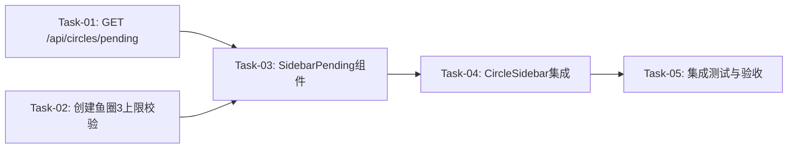

# 鱼圈管理-邀请等待状态 开发任务计划

## 1. 任务概览

**总任务数**：5 个
**预计总工时**：180 分钟（约 3 小时）
**开发方法**：TDD — 每个任务按 RED → GREEN → REFACTOR 循环执行

**关键标注**：
- 🔒 阻塞任务：被多个任务依赖，建议优先完成

**注意**：数据库 schema、Invite 表、创建鱼圈+邀请码、加入+自动激活、过期清理均已实现，本次仅需补充侧边栏展示逻辑。

### 依赖关系图

### 可并行任务组

| 并行组 | 任务 | 说明 |
|--------|------|------|
| 组1 | Task-01, Task-02 | 后端API可并行开发 |

---

## 2. 开发任务

### 阶段一：后端API补充

**阶段完成标准**：等待中鱼圈列表API可用，创建鱼圈有3上限校验

---

#### Task-01: 获取等待中鱼圈API 🔒

**通俗解释**：实现一个接口，让前端能拿到当前用户"等待中"的鱼圈列表，用于侧边栏展示

**做什么**：
- 在 `server/src/routes/circles.ts` 中新增 `GET /api/circles/pending` 接口
- 查询当前用户创建的 `isActive=false` 的鱼圈
- 关联查询 Invite 表获取邀请码和过期时间
- 按创建时间倒序排列
- 编写测试

**涉及文件**：
- `server/src/routes/circles.ts`
- `server/src/routes/circles.test.ts`

**参考**：技术方案 第3节"API 设计" - GET /api/circles/pending

**依赖**：无

**预估工时**：30 分钟

**验证标准**：
- [x] GET /api/circles/pending → 返回当前用户的"等待中"鱼圈列表
- [x] 列表包含 circleId, circleName, circleIcon, inviteCode, expiresAt, memberCount, createdAt
- [x] 按创建时间倒序排列
- [x] 无"等待中"鱼圈时返回空数组
- [x] 不返回其他用户创建的等待中鱼圈
- [x] 不返回已激活的鱼圈（isActive=true）

---

#### Task-02: 创建鱼圈3上限校验

**通俗解释**：在创建鱼圈前检查用户是否已有3个"等待中"的鱼圈，达到上限则阻止创建

**做什么**：
- 在 `server/src/routes/circles.ts` 的 `POST /api/circles` 中新增校验
- 查询 `COUNT(Circle WHERE ownerId = userId AND isActive = false)`
- 如果 count >= 3，返回错误
- 编写测试

**涉及文件**：
- `server/src/routes/circles.ts`
- `server/src/routes/circles.test.ts`

**参考**：技术方案 第4.2节"创建鱼圈数量校验"

**依赖**：无

**预估工时**：20 分钟

**验证标准**：
- [x] 已有3个等待中鱼圈时创建 → 返回 400，message 包含"3个"
- [x] 已有2个等待中鱼圈时创建 → 正常创建成功
- [x] 无等待中鱼圈时创建 → 正常创建成功
- [x] 等待中鱼圈过期后不计入数量

---

### 阶段二：前端组件开发

**阶段完成标准**：侧边栏展示"等待中"的鱼圈，点击可打开邀请弹窗

---

#### Task-03: SidebarPending 侧边栏待激活鱼圈组件

**通俗解释**：做一个组件放在侧边栏里，展示"等待中"的鱼圈，带倒计时和状态标签

**做什么**：
1. 创建 `client/src/components/circle/SidebarPending.tsx`
2. 实现：
   - 调用 `GET /api/circles/pending` 加载"等待中"鱼圈列表
   - 特殊样式展示（半透明背景 opacity: 0.7、灰色图标）
   - 显示状态标签"⏳ 等待加入"
   - 显示过期倒计时（每秒更新，等宽数字字体 `font-mono tabular-nums`）
   - 剩余时间 < 10分钟时倒计时变红色（`text-danger`）
   - 剩余时间 ≤ 0 时从列表移除
   - 显示已邀请人数"X/1 人加入"
   - 点击打开 InviteWaiting 弹窗
   - 每30秒轮询检查激活状态
3. 遵循 UI 规范（cute-shadow、border-ink、rounded-2xl、font-display）

**涉及文件**：
- `client/src/components/circle/SidebarPending.tsx`（新增）

**参考**：需求文档 第5.1节、技术方案 第5.1节

**依赖**：Task-01

**预估工时**：50 分钟

**验证标准**：
- [x] 创建鱼圈后侧边栏显示"等待中"的鱼圈
- [x] 显示"⏳ 等待加入"状态标签
- [x] 倒计时每秒更新，显示格式"MM:SS"
- [x] 倒计时<10分钟时文字变红色
- [x] 显示"X/1 人加入"
- [x] 点击打开 InviteWaiting 弹窗
- [x] 倒计时归零后鱼圈从列表消失
- [x] 第2人加入后轮询检测到激活，鱼圈从等待中列表消失

---

#### Task-04: CircleSidebar集成等待中展示

**通俗解释**：把 SidebarPending 组件嵌入到侧边栏中，位于已激活鱼圈列表下方

**做什么**：
1. 修改 `client/src/components/circle/CircleSidebar.tsx`
2. 在已激活鱼圈列表下方、个人功能区上方插入 `<SidebarPending />`
3. 传递 `onOpenInvite` 回调（点击等待中鱼圈时打开 InviteWaiting 弹窗）
4. 创建鱼圈成功后自动刷新等待中列表

**涉及文件**：
- `client/src/components/circle/CircleSidebar.tsx`

**参考**：技术方案 第5.2节

**依赖**：Task-03

**预估工时**：30 分钟

**验证标准**：
- [x] 侧边栏中已激活鱼圈下方显示"等待中"鱼圈
- [x] 已激活鱼圈和等待中鱼圈之间有分隔线
- [x] 创建鱼圈成功后"等待中"鱼圈立即出现
- [x] 点击"等待中"鱼圈打开 InviteWaiting 弹窗

---

### 阶段三：集成测试与验收

**阶段完成标准**：完整流程可跑通，用户可手动验收

---

#### Task-05: 集成测试与验收

**通俗解释**：测试完整的创建→等待→加入→激活流程，确保各环节串联正常

**做什么**：
- 测试创建鱼圈 → 侧边栏显示"等待中" → 倒计时更新
- 测试点击"等待中"鱼圈 → 打开邀请弹窗 → 复制邀请码
- 测试邀请码过期 → 侧边栏消失
- 测试3个上限 → 创建被阻止
- 测试第2人加入 → 自动激活 → 从等待中列表消失
- 启动前后端服务，手动验收所有 AC

**涉及文件**：
- `server/src/routes/circles.test.ts`（补充测试用例）

**参考**：需求文档 第6节"验收标准"

**依赖**：Task-04

**预估工时**：50 分钟

**验证标准**：
- [ ] AC-001: 创建鱼圈后侧边栏显示"等待中"
- [ ] AC-002: 点击打开邀请弹窗
- [ ] AC-003: 复制邀请码（已实现）
- [ ] AC-004: 第2人加入后自动激活（已实现）
- [ ] AC-005: 关闭弹窗后仍显示
- [ ] AC-101: 过期后消失
- [ ] AC-102: 3个上限阻止创建
- [ ] AC-103: <10分钟红色警示
- [ ] AC-104: 倒序排列
- [ ] AC-105: 过期邀请码加入失败（已实现）

---

## 3. AC 覆盖总表

| AC 编号 | 验收标准概述 | 承接任务 | 验证方式 |
|---------|-------------|---------|---------|
| AC-001 | 创建鱼圈后侧边栏显示"等待中" | Task-01, Task-03, Task-04 | 测试API + 手动验证UI |
| AC-002 | 点击打开邀请弹窗 | Task-03, Task-04 | 手动验证UI |
| AC-003 | 复制邀请码 | 已实现 | 手动验证UI |
| AC-004 | 第2人加入后自动激活 | 已实现 | 测试API |
| AC-005 | 关闭弹窗后仍显示 | Task-03, Task-04 | 手动验证UI |
| AC-101 | 过期后消失 | Task-03 | 手动验证UI |
| AC-102 | 3个上限阻止创建 | Task-02 | 测试API |
| AC-103 | <10分钟红色警示 | Task-03 | 手动验证UI |
| AC-104 | 倒序排列 | Task-01 | 测试API |
| AC-105 | 过期邀请码加入失败 | 已实现 | 测试API |
| AC-201 | 1小时有效期 | 已实现 | - |
| AC-202 | 3个上限 | Task-02 | 测试API |
| AC-203 | 2人激活 | 已实现 | - |
| AC-204 | 倒序排列 | Task-01 | 测试API |
| AC-205 | 等宽数字字体 | Task-03 | 手动验证UI |

---

## 4. 完成定义

- [ ] 所有任务的验证标准（测试用例）通过
- [ ] AC 覆盖总表中每条 AC 的验证方式已执行并通过
- [ ] 创建鱼圈后侧边栏显示"等待中"的鱼圈，包含倒计时和已邀请人数
- [ ] 点击"等待中"鱼圈可打开邀请弹窗
- [ ] 邀请码过期后鱼圈从侧边栏自动消失
- [ ] 第2人加入后鱼圈自动激活
- [ ] 达到3个上限时创建被阻止

---

## 附录：变更记录

| 日期 | 变更内容 | 原因 |
|------|---------|------|
| 2026-06-22 | 初始版本（5个任务） | 邀请等待状态展示功能 |
