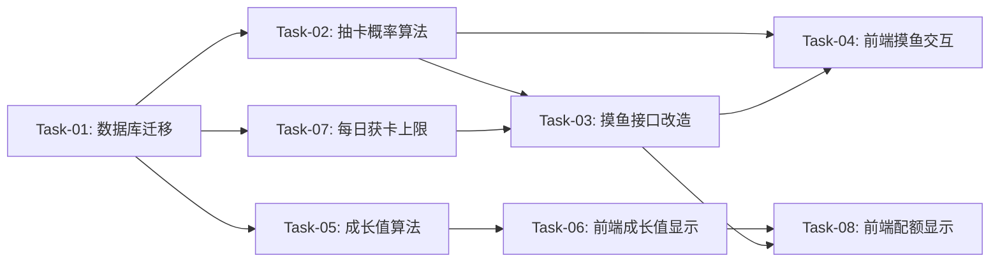

# 摸鱼鱼交互优化 — 开发任务计划

## 1. 任务概览

**总任务数**：8 个
**预计总工时**：180 分钟（约 3 小时）
**开发方法**：TDD — 每个任务按 RED → GREEN → REFACTOR 循环执行

**关键标注**：
- 🔒 阻塞任务：被多个任务依赖，建议优先完成
- ⚠️ 风险任务：技术难度高，可能需要额外时间

### 依赖关系图

### 可并行任务组

| 并行组 | 任务 | 说明 |
|--------|------|------|
| A | Task-02, Task-05, Task-07 | 三个算法任务相互独立，可在 Task-01 完成后并行执行 |

---

## 2. 开发任务

> 按垂直切片组织。每个阶段对应一个可独立运行和验证的用户行为。切片内部的任务按技术层自然顺序排列。

### 阶段一：基础设施

**阶段完成标准**：数据库表结构更新完成，支持每日获卡计数

---

#### Task-01: 数据库迁移 — MoyuStat 新增字段 🔒

**通俗解释**：系统能够记录每个用户每天在每个鱼圈获得了多少张卡片

**做什么**：
1. 修改 Prisma schema，MoyuStat 新增 `todayCardCount` 字段（Int, default 0）
2. 生成增量迁移脚本
3. 验证迁移成功

**涉及文件**：`server/prisma/schema.prisma`

**参考**：技术方案 第3节 → AC-109, AC-209

**依赖**：无

**预估工时**：15 分钟

**验证标准**（TDD RED 阶段直接转化为测试用例）：
- [x] 创建 MoyuStat 记录后，todayCardCount 默认值为 0
- [x] 更新 todayCardCount 后，值正确持久化
- [x] 查询 MoyuStat 时，todayCardCount 字段存在且可读

---

### 阶段二：摸鱼抽卡

**阶段完成标准**：用户点击小鱼后，能按新概率获得卡片或看到不掉卡提示

---

#### Task-02: 调整抽卡概率算法 ⚠️

**通俗解释**：调整卡片掉落概率，让收集更有挑战性；支持每日获卡上限和全收集兜底

**做什么**：
1. 修改 `drawCard` 函数，新增 `todayCardCount` 参数
2. 调整概率分布：60%不掉卡 / 20%重复 / 10%N / 7%R / 3%SR
3. 实现每日获卡上限检查（todayCardCount >= 5 则 100%不掉卡）
4. 实现全收集兜底逻辑（54张全收集后 80%不掉卡 + 20%重复）

**涉及文件**：`server/src/data/unoCards.ts`

**参考**：技术方案 第5.1节 → AC-105, AC-109, AC-201

**依赖**：Task-01

**预估工时**：30 分钟

**验证标准**（TDD RED 阶段直接转化为测试用例）：
- [x] 传入 todayCardCount=5 → 返回 null（100%不掉卡）
- [x] 传入 todayCardCount=4 且全收集 → 80%概率返回 null，20%返回重复卡
- [x] 大量调用（1000次）统计概率分布：不掉卡约60%，重复约20%，新卡约20%
- [x] 传入空 ownedCardIds → 掉卡时 isNew=true

---

#### Task-03: 改造摸鱼接口

**通俗解释**：后端摸鱼接口支持新的概率算法和每日获卡计数

**做什么**：
1. 修改 `POST /api/moyu/click` 接口
2. 查询并传递 todayCardCount 给 drawCard 函数
3. 掉卡时更新 todayCardCount（+1）
4. 重置逻辑：todayCardCount 随 todayCount 一起重置
5. 响应中新增 todayCardCount 和 maxCardCount 字段

**涉及文件**：`server/src/routes/moyu.ts`

**参考**：技术方案 第4节、第5.1节 → AC-109, AC-209

**依赖**：Task-02

**预估工时**：30 分钟

**验证标准**（TDD RED 阶段直接转化为测试用例）：
- [x] 摸鱼掉卡后，todayCardCount 增加 1
- [x] 摸鱼不掉卡后，todayCardCount 不变
- [x] todayCardCount=5 时继续摸鱼，响应 cards=[]（不掉卡）
- [x] 跨天后，todayCardCount 重置为 0
- [x] 响应中包含 todayCardCount 和 maxCardCount 字段

---

#### Task-04: 前端摸鱼交互优化

**通俗解释**：用户点击小鱼后，如果不掉卡会看到"这次运气不佳~"提示

**做什么**：
1. 修改 `FishTank` 组件，新增不掉卡轻量提示状态
2. 摸鱼返回 cards=[] 时，显示"这次运气不佳~"提示，1.5秒后自动消失
3. 从接口响应中获取并显示 todayCardCount

**涉及文件**：`client/src/components/game/FishTank.tsx`

**参考**：技术方案 第6节 → AC-106

**依赖**：Task-03

**预估工时**：20 分钟

**验证标准**（TDD RED 阶段直接转化为测试用例）：
- [x] 摸鱼返回 cards=[] 时，显示"这次运气不佳~"提示
- [x] 提示显示 1.5 秒后自动消失
- [x] 摸鱼返回 cards 非空时，不显示提示

---

### 阶段三：宠物鱼成长

**阶段完成标准**：宠物鱼按新阈值成长，满级后显示"MAX"

---

#### Task-05: 调整成长值算法 🔒

**通俗解释**：宠物鱼升级需要更多成长值，满级为5级

**做什么**：
1. 修改 `GROWTH_THRESHOLDS` 常量：`[1000, 2000, 3000, 4000]`
2. 修改 `FISH_TYPE_MAP`，新增 5 级配置：`5: { name: '传说级摸鱼之神', emoji: '🐉' }`
3. 修改成长值更新逻辑，满级（5级）时停止增长
4. 修改 `petFish` 响应，新增 `isMaxLevel` 字段

**涉及文件**：`server/src/data/unoCards.ts`, `server/src/routes/moyu.ts`

**参考**：技术方案 第5.2节 → AC-107, AC-202, AC-203

**依赖**：Task-01

**预估工时**：25 分钟

**验证标准**（TDD RED 阶段直接转化为测试用例）：
- [x] 宠物鱼等级1，成长值从 999 增加到 1000 → 升级到等级2，溢出值为 0
- [x] 宠物鱼等级1，成长值从 999 增加到 1005 → 升级到等级2，溢出值为 5
- [x] 宠物鱼等级5（满级），成长值不变，isMaxLevel=true
- [x] 等级4 宠物鱼，品类为"极品七彩锦鲤皇"
- [x] 等级5 宠物鱼，品类为"传说级摸鱼之神"

---

#### Task-06: 前端成长值显示优化

**通俗解释**：满级宠物鱼显示"MAX"而不是成长值进度条

**做什么**：
1. 修改 `FishTank` 组件，判断 petFish.isMaxLevel
2. 满级时成长值显示"MAX"，不显示进度条
3. 满级时宠物鱼 emoji 使用 🐉

**涉及文件**：`client/src/components/game/FishTank.tsx`

**参考**：技术方案 第6节 → AC-107

**依赖**：Task-05

**预估工时**：15 分钟

**验证标准**（TDD RED 阶段直接转化为测试用例）：
- [x] isMaxLevel=true 时，成长值显示"MAX"
- [x] isMaxLevel=true 时，不显示成长值进度条
- [x] isMaxLevel=false 时，正常显示成长值和进度条

---

### 阶段四：每日配额

**阶段完成标准**：用户能看到今日配额和获卡数，达到上限后不可摸鱼

---

#### Task-07: 每日获卡上限后端逻辑

**通俗解释**：后端限制每个用户每天在每个鱼圈最多获得5张卡片

**做什么**：
1. 修改 `GET /api/moyu/status` 接口，响应中新增 todayCardCount 和 maxCardCount
2. 确保摸鱼接口的每日获卡上限检查逻辑正确（已在 Task-03 完成）

**涉及文件**：`server/src/routes/moyu.ts`

**参考**：技术方案 第4节 → AC-109, AC-209

**依赖**：Task-01

**预估工时**：15 分钟

**验证标准**（TDD RED 阶段直接转化为测试用例）：
- [x] GET /api/moyu/status 响应包含 todayCardCount 字段
- [x] GET /api/moyu/status 响应包含 maxCardCount 字段，值为 5
- [x] todayCardCount 正确反映今日获卡数量

---

#### Task-08: 前端配额显示优化

**通俗解释**：用户能在界面上看到"今日获卡 X/5"

**做什么**：
1. 修改 `FishTank` 组件，新增今日获卡数显示
2. 显示格式："{todayCardCount} / 5"
3. 从接口响应中获取 todayCardCount

**涉及文件**：`client/src/components/game/FishTank.tsx`, `client/src/components/game/PetFish.tsx`

**参考**：技术方案 第6节 → AC-006

**依赖**：Task-07

**预估工时**：15 分钟

**验证标准**（TDD RED 阶段直接转化为测试用例）：
- [x] 页面显示"今日获卡"标签和 "{todayCardCount}/5"
- [x] todayCardCount 变化时，显示值实时更新
- [x] maxCardCount 固定显示为 5

---

## 3. AC 覆盖总表

> 最终检查：每条 AC 是否都有任务承接。

| AC 编号 | 验收标准概述 | 承接任务 | 验证方式 |
|---------|-------------|---------|---------|
| AC-001 | 点击宠物鱼播放动画 | Task-04 | 前端动画测试 |
| AC-002 | 摸鱼成功成长值+1 | Task-05 | 单元测试验证成长值计算 |
| AC-003 | 卡片保存到收集库 | Task-03 | 接口测试验证卡片保存 |
| AC-004 | 宠物鱼升级显示进化动画 | Task-06 | 前端动画测试 |
| AC-005 | 显示今日配额 | Task-08 | 前端显示测试 |
| AC-006 | 显示今日获卡数 | Task-08 | 前端显示测试 |
| AC-101 | 达到上限不可点击 | Task-03 | 接口返回400测试 |
| AC-102 | 重复卡片count累加 | Task-03 | 接口测试验证count增加 |
| AC-103 | 溢出成长值保留 | Task-05 | 单元测试验证溢出计算 |
| AC-104 | 未登录不可摸鱼 | Task-03 | 中间件鉴权测试 |
| AC-105 | 全收集兜底80%不掉卡 | Task-02 | 概率统计测试 |
| AC-106 | 不掉卡显示提示 | Task-04 | 前端提示显示测试 |
| AC-107 | 满级显示"MAX" | Task-06 | 前端显示测试 |
| AC-108 | 以点击时间为准 | Task-03 | 现有逻辑已支持 |
| AC-109 | 每日获卡上限5张 | Task-02, Task-03 | 接口测试验证上限 |
| AC-201 | 抽卡概率分布 | Task-02 | 概率统计测试 |
| AC-202 | 每次摸鱼+1成长值 | Task-05 | 单元测试验证 |
| AC-203 | 品类随等级变化 | Task-05 | 单元测试验证品类映射 |
| AC-204 | 每日摸鱼上限30次 | Task-03 | 现有逻辑已支持 |
| AC-205 | 继续摸鱼按钮 | Task-04 | 现有逻辑已支持 |
| AC-206 | 关闭按钮 | Task-04 | 现有逻辑已支持 |
| AC-207 | 集齐全套显示兑换资格 | Task-04 | 前端判断逻辑 |
| AC-208 | 记录花色收集数量 | Task-03 | 现有逻辑已支持 |
| AC-209 | 每日获卡上限5张 | Task-02, Task-03, Task-07 | 接口测试验证 |

---

## 4. 完成定义

> 所有任务完成后，功能整体交付前的最终确认。

- [x] 所有任务的验证标准（测试用例）通过
- [x] AC 覆盖总表中每条 AC 的验证方式已执行并通过
- [x] 数据库增量迁移脚本在测试环境验证通过
- [x] 摸鱼概率分布符合设计（60%不掉卡/20%重复/20%新卡）
- [x] 每日获卡上限5张逻辑正确
- [x] 宠物鱼5级满级后显示"MAX"
- [x] 前端今日获卡数显示正确
- [x] 不掉卡提示"这次运气不佳~"正确显示和消失
