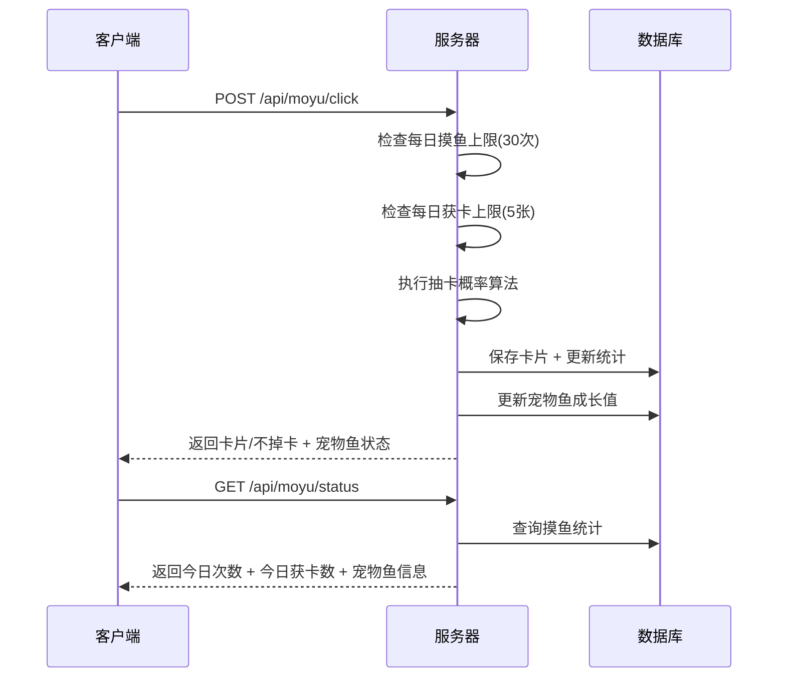

# 摸鱼鱼交互优化 — 技术设计文档

## 1. 设计概要

**功能描述**：优化摸鱼鱼系统，调整抽卡概率、新增每日卡片上限、重构宠物鱼成长体系、增加满级和全收集兜底规则

**影响范围**：游戏模块（摸鱼、卡片、宠物鱼）、数据库迁移

**技术难点**：概率算法调整、全收集兜底逻辑、每日获卡上限计数

**外部依赖**：无

---

## 2. 架构概览

本次优化是对现有摸鱼系统的数值和逻辑调整，不新增模块，主要修改：

1. **后端**：调整抽卡概率算法、新增每日获卡上限逻辑、更新成长值阈值
2. **前端**：新增今日获卡数显示、新增不掉卡轻量提示



---

## 3. 数据库设计

### 修改现有表

#### `MoyuStat` — 摸鱼统计表

**变更内容**：新增 `todayCardCount` 字段，用于记录每日获卡数量（限制每人每天每鱼圈最多5张）

| 字段名 | 类型 | 约束 | 说明 |
|--------|------|------|------|
| todayCardCount | Int | DEFAULT 0 | 今日获卡数量 |

**迁移脚本**：
```sql
ALTER TABLE "MoyuStat" ADD COLUMN "todayCardCount" INTEGER NOT NULL DEFAULT 0;
```

**数据迁移**：无需迁移，新字段默认值为0

---

## 4. API 设计

### `POST /api/moyu/click`

**描述**：摸鱼点击 → AC-001, AC-002, AC-003, AC-105, AC-106, AC-109, AC-201, AC-202

**鉴权**：需要JWT

**Request**：
```json
{
  "circleId": "uuid"
}
```

**Response（成功 - 掉卡）**：
```json
{
  "success": true,
  "data": {
    "cards": [
      {
        "id": "R_0",
        "name": "红色 0",
        "color": "Red",
        "value": "0",
        "rarity": "N",
        "bonusText": "红运当头，一切归零！",
        "isNew": true
      }
    ],
    "petFish": {
      "name": "懵懂胖金鱼",
      "level": 1,
      "growth": 5,
      "type": "肥嘟嘟胖金鱼",
      "requiredGrowth": 1000,
      "leveledUp": false
    },
    "todayCount": 5,
    "maxCount": 30,
    "todayCardCount": 2,
    "maxCardCount": 5,
    "totalCount": 10
  }
}
```

**Response（成功 - 不掉卡）**：
```json
{
  "success": true,
  "data": {
    "cards": [],
    "petFish": {
      "name": "懵懂胖金鱼",
      "level": 1,
      "growth": 6,
      "type": "肥嘟嘟胖金鱼",
      "requiredGrowth": 1000,
      "leveledUp": false
    },
    "todayCount": 6,
    "maxCount": 30,
    "todayCardCount": 2,
    "maxCardCount": 5,
    "totalCount": 11
  }
}
```

**异常响应**：

| 场景 | 状态码 | 响应 | 对应 AC |
|------|--------|------|---------|
| 今日摸鱼已达上限 | 400 | `{"success": false, "message": "你已触及今日防沉迷保护网！"}` | AC-101 |
| 缺少鱼圈ID | 400 | `{"success": false, "message": "缺少鱼圈ID"}` | - |

---

### `GET /api/moyu/status`

**描述**：获取今日摸鱼状态 + 宠物鱼信息 → AC-005, AC-006

**鉴权**：需要JWT

**Request Query**：
- `circleId` (string, 必填) — 鱼圈ID

**Response**：
```json
{
  "success": true,
  "data": {
    "todayCount": 5,
    "maxCount": 30,
    "todayCardCount": 2,
    "maxCardCount": 5,
    "petFish": {
      "name": "懵懂胖金鱼",
      "level": 1,
      "growth": 50,
      "type": "肥嘟嘟胖金鱼",
      "requiredGrowth": 1000
    }
  }
}
```

---

## 5. 核心逻辑

### 5.1 抽卡概率算法（V1.2.0 重构） → AC-201

**触发条件**：用户摸鱼成功

**处理流程**：
1. 检查每日获卡上限（5张），达到上限则100%不掉卡
2. 检查是否全收集（54张），全收集则进入兜底逻辑
3. 按概率决定是否掉卡及掉卡类型

**概率分布**：

| 结果 | 概率 | 说明 |
|------|------|------|
| 不掉卡 | 60% | 什么都不掉 |
| 已有卡（重复） | 20% | 掉一张用户已收集的卡 |
| 不重复普通卡 | 10% | 掉一张用户未收集的N稀有度卡 |
| 不重复稀有卡 | 7% | 掉一张用户未收集的R稀有度卡 |
| 不重复超稀有卡 | 3% | 掉一张用户未收集的SR稀有度卡 |

**全收集兜底规则**（AC-105）：
- 当所有54张卡都收集完后，40%的新卡概率（10%+7%+3%）转为不掉卡概率
- 最终为：80%不掉卡 + 20%重复卡

**伪代码**：
```typescript
async function drawCard(ownedCardIds: Set<string>, todayCardCount: number): Promise<DrawResult | null> {
  // AC-109: 每日获卡上限检查
  if (todayCardCount >= 5) {
    return null; // 100%不掉卡
  }

  // 计算未收集卡片
  const availableN = CARDS_BY_RARITY.N.filter(c => !ownedCardIds.has(c.id));
  const availableR = CARDS_BY_RARITY.R.filter(c => !ownedCardIds.has(c.id));
  const availableSR = CARDS_BY_RARITY.SR.filter(c => !ownedCardIds.has(c.id));
  const allCollected = availableN.length === 0 && availableR.length === 0 && availableSR.length === 0;

  // AC-105: 全收集兜底
  if (allCollected) {
    // 80%不掉卡，20%重复卡
    if (Math.random() < 0.8) return null;
    const ownedCards = UNO_CARDS.filter(c => ownedCardIds.has(c.id));
    return { card: pickRandom(ownedCards), isNew: false };
  }

  // 正常概率分布
  const rand = Math.random() * 100;

  // 60% 不掉卡
  if (rand < 60) return null;

  // 20% 重复卡
  if (rand < 80) {
    if (ownedCardIds.size === 0) {
      return { card: pickRandom(UNO_CARDS), isNew: true };
    }
    const ownedCards = UNO_CARDS.filter(c => ownedCardIds.has(c.id));
    return { card: pickRandom(ownedCards), isNew: false };
  }

  // 10% 不重复N卡
  if (rand < 90 && availableN.length > 0) {
    return { card: pickRandom(availableN), isNew: true };
  }

  // 7% 不重复R卡
  if (rand < 97 && availableR.length > 0) {
    return { card: pickRandom(availableR), isNew: true };
  }

  // 3% 不重复SR卡
  if (availableSR.length > 0) {
    return { card: pickRandom(availableSR), isNew: true };
  }

  // 兜底：掉重复卡
  if (ownedCardIds.size > 0) {
    const ownedCards = UNO_CARDS.filter(c => ownedCardIds.has(c.id));
    return { card: pickRandom(ownedCards), isNew: false };
  }

  return null;
}
```

---

### 5.2 宠物鱼成长体系（V1.2.0 重构） → AC-002, AC-004, AC-103, AC-107, AC-202, AC-203

**触发条件**：用户摸鱼成功

**处理流程**：
1. 每次摸鱼固定获得1点成长值（无论是否掉卡）
2. 检查是否达到升级条件
3. 如果升级，更新等级、品类，溢出成长值保留
4. 如果满级（5级），成长值停止增长

**升级所需成长值**：

| 等级 | 品类名称 | 所需成长值 |
|------|----------|------------|
| 1 | 肥嘟嘟胖金鱼 | - |
| 2 | 带薪发愣神游鳌 | 1000 |
| 3 | 太极双休太公鱼 | 2000 |
| 4 | 极品七彩锦鲤皇 | 3000 |
| 5 | 传说级摸鱼之神 | 4000 |

**满级规则**（AC-107）：
- 5级为满级，满级后成长值停止增长
- 成长值显示为"MAX"
- 继续摸鱼仍可获得卡片，但成长值不再增加

**伪代码**：
```typescript
function updateGrowth(circle: Circle): PetFishResult {
  const GROWTH_THRESHOLDS = [1000, 2000, 3000, 4000]; // 等级1→2, 2→3, 3→4, 4→5

  // AC-107: 满级检查
  if (circle.petFishLevel >= 5) {
    return {
      level: 5,
      growth: circle.petFishGrowth,
      type: FISH_TYPE_MAP[5].name,
      requiredGrowth: 4000,
      leveledUp: false,
      isMaxLevel: true
    };
  }

  const newGrowth = circle.petFishGrowth + 1;
  const levelIndex = circle.petFishLevel - 1;
  const threshold = GROWTH_THRESHOLDS[levelIndex];

  // AC-103: 溢出保留
  if (newGrowth >= threshold) {
    const newLevel = circle.petFishLevel + 1;
    const overflow = newGrowth - threshold;
    const fishType = FISH_TYPE_MAP[newLevel];

    return {
      level: newLevel,
      growth: overflow,
      type: fishType.name,
      requiredGrowth: GROWTH_THRESHOLDS[newLevel - 1] || 4000,
      leveledUp: true,
      isMaxLevel: newLevel >= 5
    };
  }

  return {
    level: circle.petFishLevel,
    growth: newGrowth,
    type: circle.petFishType,
    requiredGrowth: threshold,
    leveledUp: false,
    isMaxLevel: false
  };
}
```

---

## 6. 现有代码改动

| 模块 / 文件 | 改动内容 | 原因 | 对应 AC |
|-------------|---------|------|---------|
| `server/prisma/schema.prisma` | MoyuStat 新增 todayCardCount 字段 | 每日获卡上限计数 | AC-109, AC-209 |
| `server/src/data/unoCards.ts` | 调整 GROWTH_THRESHOLDS、FISH_TYPE_MAP、drawCard 函数 | 概率调整、阈值更新、满级支持 | AC-201, AC-202, AC-203, AC-105, AC-107 |
| `server/src/routes/moyu.ts` | 修改摸鱼接口，增加 todayCardCount 逻辑 | 每日获卡上限检查和更新 | AC-109, AC-209 |
| `client/src/components/game/FishTank.tsx` | 新增今日获卡数显示 | 显示"{今日获卡数}/5" | AC-006 |
| `client/src/components/game/FishTank.tsx` | 满级时显示"MAX" | 满级成长值显示 | AC-107 |
| `client/src/components/game/FishTank.tsx` | 不掉卡时显示轻量提示 | 不掉卡反馈 | AC-106 |

---

## 7. 技术决策

### 抽卡概率调整

**背景**：原有概率（30%不掉卡）过低，用户获得卡片太容易，不符合"长期收集"的设计目标

**选项**：
- A: 调整为60%不掉卡 — 符合需求文档，卡片收集更有挑战性
- B: 保持30%不掉卡 — 用户体验更好，但卡片收集太快

**结论**：选择 A，遵循需求文档的 60% 不掉卡概率，让卡片收集成为长期目标

### 每日获卡上限存储方式

**背景**：需要记录每个用户每天在每个鱼圈的获卡数量

**选项**：
- A: 新增 MoyuStat 字段 todayCardCount — 与摸鱼统计在一起，逻辑简单
- B: 新建独立表 DailyCardCount — 更灵活，但增加复杂度

**结论**：选择 A，复用现有 MoyuStat 表，减少表数量和查询复杂度

---

## 8. 安全与性能

**性能考量**：
- 抽卡概率计算在服务端完成，防客户端篡改
- 每日获卡上限基于服务端统计，防止重复刷卡

---

## 9. AC 覆盖总表

| AC 编号 | 验收标准概述 | 实现位置 |
|---------|-------------|---------|
| AC-001 | 点击宠物鱼播放1秒摸鱼动画 | 前端动画实现 |
| AC-002 | 摸鱼成功成长值+1 | 核心逻辑 5.2 |
| AC-003 | 卡片保存到收集库 | API POST /api/moyu/click |
| AC-004 | 宠物鱼升级显示进化动画 | 核心逻辑 5.2 + 前端 |
| AC-005 | 显示今日配额 | API GET /api/moyu/status |
| AC-006 | 显示今日获卡数 | API GET /api/moyu/status + 前端 |
| AC-101 | 达到上限不可点击 | API POST /api/moyu/click 异常 |
| AC-102 | 重复卡片count累加 | API POST /api/moyu/click |
| AC-103 | 溢出成长值保留 | 核心逻辑 5.2 |
| AC-104 | 未登录/未加入鱼圈不可摸鱼 | 前端校验 |
| AC-105 | 全收集兜底80%不掉卡 | 核心逻辑 5.1 |
| AC-106 | 不掉卡显示"这次运气不佳~" | 前端实现 |
| AC-107 | 满级显示"MAX" | 核心逻辑 5.2 + 前端 |
| AC-108 | 以点击时间为准 | 现有逻辑已支持 |
| AC-109 | 每日获卡上限5张 | 核心逻辑 5.1 |
| AC-201 | 抽卡概率分布 | 核心逻辑 5.1 |
| AC-202 | 每次摸鱼+1成长值 | 核心逻辑 5.2 |
| AC-203 | 品类随等级变化 | 核心逻辑 5.2 |
| AC-204 | 每日摸鱼上限30次 | 现有逻辑已支持 |
| AC-205 | 继续摸鱼按钮 | 前端现有实现 |
| AC-206 | 关闭按钮 | 前端现有实现 |
| AC-207 | 集齐全套显示兑换资格 | 前端判断 |
| AC-208 | 记录花色收集数量 | 现有逻辑已支持 |
| AC-209 | 每日获卡上限5张 | 核心逻辑 5.1 |

---

## 附录：变更记录

| 日期 | 变更内容 | 原因 |
|------|---------|------|
| 2026-06-25 | 初始版本 | — |
