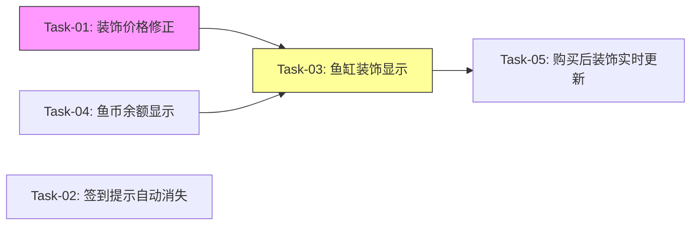

# 签到与装饰系统 — 开发任务计划（差异修正版）

## 1. 任务概览

**总任务数**：5 个
**预计总工时**：90 分钟（约 1.5 小时）
**开发方法**：TDD — 每个任务按 RED → GREEN → REFACTOR 循环执行

**关键标注**：
- 🔒 阻塞任务：被多个任务依赖，建议优先完成
- ⚠️ 风险任务：技术难度高，可能需要额外时间

**说明**：签到与装饰系统的核心功能已实现，本任务计划聚焦于4个差异修正点。

### 依赖关系图

### 可并行任务组

| 并行组 | 任务 | 说明 |
|--------|------|------|
| A | Task-01, Task-02, Task-04 | 三个任务相互独立，可并行执行 |
| B | Task-03, Task-05 | 串行执行，Task-05 依赖 Task-03 |

---

## 2. 开发任务

> 按垂直切片组织。每个阶段对应一个可独立运行和验证的用户行为。切片内部的任务按技术层自然顺序排列。
>
> 每个任务按 TDD 循环执行：RED（根据验证标准写测试）→ GREEN（写最小实现通过测试）→ REFACTOR（重构）

### 阶段一：基础数据与体验修正

**阶段完成标准**：装饰价格与需求一致，签到提示能自动消失，摸鱼主界面显示鱼币余额

---

#### Task-01: 修正装饰种子数据价格

**通俗解释**：用户在装饰商店看到的价格将与产品设计一致（水草5币、气泡10币、石头10币、海星20币、珊瑚20币）

**做什么**：修改 `server/prisma/seed.ts` 中的装饰价格，然后执行种子数据更新

**涉及文件**：`server/prisma/seed.ts`

**参考**：技术方案 3.1 → AC-202

**依赖**：无

**预估工时**：10 分钟

**验证标准**（TDD RED 阶段直接转化为测试用例）：
- [x] 运行 `npx prisma db seed` 后，查询 Decoration 表，deco-001 的 price = 5
- [x] deco-002 的 price = 10
- [x] deco-003 的 price = 10
- [x] deco-004 的 price = 20
- [x] deco-005 的 price = 20
- [x] 前端装饰商店页面显示的价格与数据库一致

---

#### Task-02: 签到成功提示1.5秒自动消失

**通俗解释**：用户签到后看到"签到成功！+1鱼币"提示，1.5秒后提示自动消失，不需要手动关闭

**做什么**：在 `SignCalendar.tsx` 的 `handleSign` 函数中添加 setTimeout 定时器

**涉及文件**：`client/src/components/game/SignCalendar.tsx`

**参考**：技术方案 3.2 → AC-205, BR-019

**依赖**：无

**预估工时**：15 分钟

**验证标准**（TDD RED 阶段直接转化为测试用例）：
- [x] 签到成功后，message 状态被设置为 "签到成功！+1鱼币"
- [x] 1.5秒后，message 状态被清空为空字符串
- [x] 签到失败时，错误提示不会自动消失（仅成功提示有定时器）
- [x] 组件卸载时，定时器被正确清理（避免内存泄漏）

---

#### Task-04: 摸鱼主界面显示鱼币余额

**通俗解释**：用户进入摸鱼鱼页面时，能在标题区域直接看到当前鱼圈的鱼币余额，不需要打开签到或商店才能看到

**做什么**：
1. 后端：修改 `moyu.ts` 的 status 接口，返回 `coinBalance` 字段
2. 前端：在 `GamePage.tsx` 中添加 coinBalance 状态，在标题区显示

**涉及文件**：
- `server/src/routes/moyu.ts`
- `client/src/pages/GamePage.tsx`

**参考**：技术方案 3.4 → BR-007

**依赖**：无

**预估工时**：20 分钟

**验证标准**（TDD RED 阶段直接转化为测试用例）：
- [x] GET /api/moyu/status?circleId=xxx 返回的 data 中包含 coinBalance 字段
- [x] coinBalance 的值等于 Circle 表中对应鱼圈的 coinBalance
- [x] GamePage 标题区域渲染鱼币余额标签（包含 🪙 图标和数字）
- [x] 签到成功后，GamePage 中的 coinBalance 同步更新（+1）
- [x] 购买装饰后，GamePage 中的 coinBalance 同步更新（-价格）

---

### 阶段二：装饰可视化

**阶段完成标准**：用户购买装饰后，能在鱼缸中看到装饰显示在固定位置

---

#### Task-03: 鱼缸显示已购买装饰 ⚠️

**通俗解释**：用户购买装饰后，能在鱼缸区域看到装饰出现在固定位置（水草在左下、气泡在中间偏左、石头在右下、海星在底部中间、珊瑚在右下边缘）

**做什么**：
1. 在 `FishTank.tsx` 中添加装饰位置配置常量
2. 修改 FishTank 组件接口，新增 `ownedDecorations` 属性
3. 在鱼缸 div 中渲染已购买的装饰（使用绝对定位）
4. 在 `GamePage.tsx` 中获取已购买装饰数据并传递给 FishTank

**涉及文件**：
- `client/src/components/game/FishTank.tsx`
- `client/src/pages/GamePage.tsx`

**参考**：技术方案 3.3 → AC-204, BR-013, BR-014, BR-015

**依赖**：Task-01, Task-04

**预估工时**：30 分钟

**验证标准**（TDD RED 阶段直接转化为测试用例）：
- [x] DECORATION_POSITIONS 常量包含 5 个装饰的位置配置
- [x] FishTank 组件接受 ownedDecorations 属性
- [x] 当 ownedDecorations 为空数组时，鱼缸区域不渲染任何装饰 emoji
- [x] 当 ownedDecorations 包含 deco-001 时，鱼缸左下角显示 🌿
- [x] 当 ownedDecorations 包含 deco-002 时，鱼缸中间偏左显示 🫧
- [x] 当 ownedDecorations 包含 deco-003 时，鱼缸右下角显示 🪨
- [x] 当 ownedDecorations 包含 deco-004 时，鱼缸底部中间显示 ⭐
- [x] 当 ownedDecorations 包含 deco-005 时，鱼缸右下边缘显示 🪸
- [x] GamePage 加载时，从 /api/decorations 获取已购买装饰并传递给 FishTank
- [x] 装饰使用绝对定位，不影响宠物鱼和进度条的布局

---

#### Task-05: 购买装饰后实时更新鱼缸显示

**通俗解释**：用户在装饰商店购买装饰后，关闭商店回到鱼缸时，能立即看到新购买的装饰出现在鱼缸中

**做什么**：
1. 修改 `DecorationShop.tsx`，新增 `onPurchased` 回调属性
2. 购买成功后调用 `onPurchased` 回调
3. 在 `GamePage.tsx` 中实现回调，重新加载装饰数据

**涉及文件**：
- `client/src/components/game/DecorationShop.tsx`
- `client/src/pages/GamePage.tsx`

**参考**：技术方案 3.3.5 → AC-202, BR-013

**依赖**：Task-03

**预估工时**：15 分钟

**验证标准**（TDD RED 阶段直接转化为测试用例）：
- [x] DecorationShop 组件接受 onPurchased 可选回调属性
- [x] 购买成功后，onPurchased 回调被调用
- [x] GamePage 中 onPurchased 回调触发 loadData 重新获取数据
- [x] 重新加载后，ownedDecorations 状态更新，包含新购买的装饰
- [x] FishTank 组件接收到新的 ownedDecorations 后，渲染新装饰

---

## 3. AC 覆盖总表

> 最终检查：每条 AC 是否都有任务承接。这是全文档唯一的 AC 映射汇总。

| AC 编号 | 验收标准概述 | 承接任务 | 验证方式 |
|---------|-------------|---------|---------|
| AC-001 | 签到成功显示"+1鱼币" | 已实现（无需任务） | 手动验证 |
| AC-002 | 已签到按钮灰色 | 已实现（无需任务） | 手动验证 |
| AC-003 | 购买装饰显示"购买成功" | 已实现（无需任务） | 手动验证 |
| AC-004 | 查看兑换记录 | 已实现（无需任务） | 手动验证 |
| AC-005 | 切换鱼圈显示签到状态 | 已实现（无需任务） | 手动验证 |
| AC-101 | 已签到再次签到按钮灰色 | 已实现（无需任务） | 手动验证 |
| AC-102 | 鱼币不足显示提示 | 已实现（无需任务） | 手动验证 |
| AC-103 | 已购买显示"已拥有" | 已实现（无需任务） | 手动验证 |
| AC-104 | 私有鱼圈签到 | 已实现（无需任务） | 手动验证 |
| AC-105 | 退出鱼圈装饰保留 | 已实现（无需任务） | 手动验证 |
| AC-106 | 23:59签到以点击时间为准 | 已实现（无需任务） | 手动验证 |
| AC-201 | 鱼币进入公共账户 | 已实现（无需任务） | 手动验证 |
| AC-202 | 购买后装饰自动显示 | Task-01, Task-03, Task-05 | 价格正确 + 鱼缸显示 + 购买后更新 |
| AC-203 | 记录兑换信息 | 已实现（无需任务） | 手动验证 |
| AC-204 | 装饰在固定位置显示 | Task-03 | 5个装饰位置验证 |
| AC-205 | 签到提示1.5秒消失 | Task-02 | 定时器验证 |

---

## 4. 完成定义

> 所有任务完成后，功能整体交付前的最终确认。只列出跟这个功能相关的检查项。

- [x] 所有任务的验证标准（测试用例）通过
- [x] AC 覆盖总表中每条 AC 的验证方式已执行并通过
- [x] 种子数据更新后，装饰商店显示的价格为 5/10/10/20/20 鱼币
- [x] 签到成功提示在 1.5 秒后自动消失
- [x] 摸鱼主界面标题区显示鱼币余额
- [x] 鱼缸中正确显示已购买的装饰，位置与需求文档一致
- [x] 购买装饰后，关闭商店回到鱼缸能看到新装饰
- [x] 所有修改不影响现有功能（签到、购买、兑换记录等）
