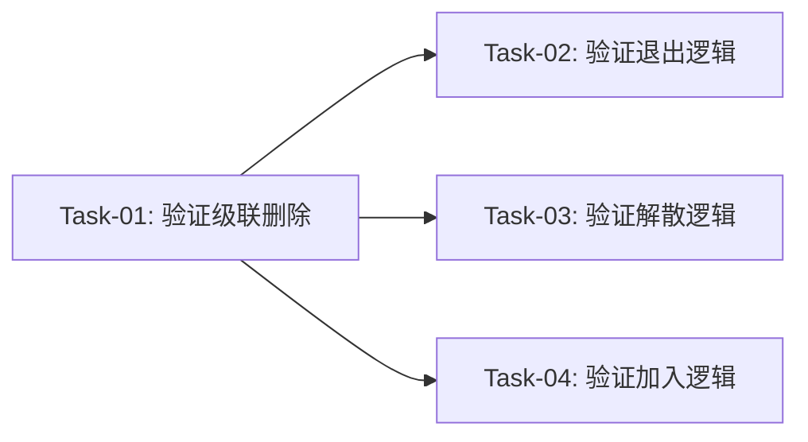

# 鱼圈资产归属规则 — 开发任务计划

## 1. 任务概览

**总任务数**：4 个
**预计总工时**：60 分钟（约 1 小时）
**开发方法**：TDD — 每个任务按 RED → GREEN → REFACTOR 循环执行

**关键标注**：
- 🔒 阻塞任务：被多个任务依赖，建议优先完成
- ⚠️ 风险任务：技术难度高，可能需要额外时间

**说明**：本功能是"规则确认"性质，主要是验证现有代码符合资产归属规则，不新增用户行为。

### 依赖关系图

### 可并行任务组

| 并行组 | 任务 | 说明 |
|--------|------|------|
| A | Task-02, Task-03, Task-04 | 三个验证任务相互独立，可在 Task-01 完成后并行执行 |

---

## 2. 开发任务

> 本功能是"规则确认"性质，按工作性质拆分，不按垂直切片拆分（没有新的用户行为）。每个任务验证现有代码是否符合资产归属规则。

### 阶段一：基础设施验证

**阶段完成标准**：确认 Prisma schema 设置了正确的级联删除关系，确保鱼圈解散时资产能正确删除

---

#### Task-01: 验证/添加 Prisma 级联删除关系 🔒

**通俗解释**：确保删除鱼圈时，所有相关数据（装饰、卡片、记录）会自动一起删除，不会留下垃圾数据

**做什么**：
1. 检查 `server/prisma/schema.prisma` 中 Circle 模型的关联关系
2. 确认 `CircleDecoration`、`UnoCard`、`MoyuStat`、`SignRecord`、`ExchangeRecord` 是否设置了 `onDelete: Cascade`
3. 如果未设置，添加级联删除配置
4. 运行 `npx prisma migrate dev` 生成迁移

**涉及文件**：`server/prisma/schema.prisma`

**参考**：技术方案 第3节、第5.2节 → AC-101

**依赖**：无

**预估工时**：15 分钟

**验证标准**（TDD RED 阶段直接转化为测试用例）：
- [x] 删除 Circle 记录后，关联的 CircleDecoration 记录自动删除
- [x] 删除 Circle 记录后，关联的 UnoCard 记录自动删除
- [x] 删除 Circle 记录后，关联的 MoyuStat 记录自动删除
- [x] 删除 Circle 记录后，关联的 SignRecord 记录自动删除
- [x] 删除 Circle 记录后，关联的 ExchangeRecord 记录自动删除

---

### 阶段二：业务逻辑验证

**阶段完成标准**：确认退出/解散/加入鱼圈时，资产处理符合归属规则

---

#### Task-02: 验证退出鱼圈逻辑

**通俗解释**：确保用户退出鱼圈后，鱼圈的装饰、卡片、宠物鱼等资产仍然保留，不会被误删

**做什么**：
1. 检查 `server/src/routes/circles.ts` 的 `POST /:id/leave` 接口
2. 确认逻辑：删除 UserCircle 记录 + 更新 memberCount
3. 确认不会误删资产（资产通过 circleId 外键关联，删除成员关系不影响资产）
4. 编写测试验证

**涉及文件**：`server/src/routes/circles.ts`

**参考**：技术方案 第5.1节 → AC-001, AC-002, AC-202

**依赖**：Task-01

**预估工时**：15 分钟

**验证标准**（TDD RED 阶段直接转化为测试用例）：
- [x] 用户退出鱼圈后，CircleDecoration 记录仍然存在
- [x] 用户退出鱼圈后，UnoCard 记录仍然存在
- [x] 用户退出鱼圈后，MoyuStat 记录仍然存在
- [x] 用户退出鱼圈后，SignRecord 记录仍然存在
- [x] 用户退出鱼圈后，Circle.coinBalance 不变
- [x] 用户退出鱼圈后，Circle.petFishGrowth/Level 不变

---

#### Task-03: 验证鱼圈解散逻辑

**通俗解释**：确保鱼圈解散时，所有资产（鱼币、装饰、卡片、记录）都被正确删除，不会留下垃圾数据

**做什么**：
1. 检查 `server/src/routes/circles.ts` 的解散逻辑（memberCount <= 0 时删除鱼圈）
2. 确认删除 Circle 记录时会触发级联删除
3. 编写测试验证所有关联数据被删除

**涉及文件**：`server/src/routes/circles.ts`

**参考**：技术方案 第5.2节 → AC-101

**依赖**：Task-01

**预估工时**：15 分钟

**验证标准**（TDD RED 阶段直接转化为测试用例）：
- [x] 鱼圈解散后，Circle 记录被删除
- [x] 鱼圈解散后，关联的 CircleDecoration 记录被删除
- [x] 鱼圈解散后，关联的 UnoCard 记录被删除
- [x] 鱼圈解散后，关联的 MoyuStat 记录被删除
- [x] 鱼圈解散后，关联的 SignRecord 记录被删除
- [x] 鱼圈解散后，关联的 ExchangeRecord 记录被删除

---

#### Task-04: 验证加入鱼圈逻辑

**通俗解释**：确保新成员加入鱼圈后，可以看到鱼圈的装饰、卡片、宠物鱼等资产

**做什么**：
1. 检查 `server/src/routes/circles.ts` 的 `POST /join` 接口
2. 确认逻辑：创建 UserCircle 记录 + 更新 memberCount
3. 确认新成员可以直接访问鱼圈资产（资产通过 circleId 外键关联）
4. 编写测试验证

**涉及文件**：`server/src/routes/circles.ts`

**参考**：技术方案 第5.3节 → AC-003, AC-004, AC-201, AC-203

**依赖**：Task-01

**预估工时**：15 分钟

**验证标准**（TDD RED 阶段直接转化为测试用例）：
- [x] 新成员加入鱼圈后，可以查询到鱼圈的 CircleDecoration 记录
- [x] 新成员加入鱼圈后，可以查询到鱼圈的 UnoCard 记录
- [x] 新成员加入鱼圈后，可以查询到鱼圈的 MoyuStat 排行榜
- [x] 新成员加入鱼圈后，可以看到 Circle.coinBalance
- [x] 新成员加入鱼圈后，可以看到 Circle.petFishGrowth/Level

---

## 3. AC 覆盖总表

> 最终检查：每条 AC 是否都有任务承接。这是全文档唯一的 AC 映射汇总。

| AC 编号 | 验收标准概述 | 承接任务 | 验证方式 |
|---------|-------------|---------|---------|
| AC-001 | 用户退出鱼圈，装饰保留在鱼圈 | Task-02 | 测试验证退出后 CircleDecoration 记录存在 |
| AC-002 | 用户退出鱼圈，卡片保留在鱼圈 | Task-02 | 测试验证退出后 UnoCard 记录存在 |
| AC-003 | 用户加入鱼圈，可看到鱼圈已有卡片 | Task-04 | 测试验证加入后可查询 UnoCard 记录 |
| AC-004 | 用户加入鱼圈，可使用鱼圈鱼币 | Task-04 | 测试验证加入后可看到 coinBalance |
| AC-101 | 鱼圈解散，所有资产删除 | Task-03 | 测试验证解散后所有关联记录被删除 |
| AC-102 | 用户退出后重新加入，装饰仍存在 | Task-02 + Task-04 | 组合测试：退出 → 加入 → 验证装饰存在 |
| AC-103 | 用户加入多个鱼圈，资产独立 | Task-04 | 测试验证不同鱼圈的资产互不影响 |
| AC-201 | 所有资产属于鱼圈，不属于个人 | Task-01 + Task-02 | 数据模型设计 + 退出逻辑验证 |
| AC-202 | 用户退出后历史记录保留在鱼圈 | Task-02 | 测试验证退出后 MoyuStat/SignRecord 存在 |
| AC-203 | 用户加入后可为鱼圈贡献成长值 | Task-04 | 测试验证加入后可执行摸鱼操作 |

---

## 4. 完成定义

> 所有任务完成后，功能整体交付前的最终确认。只列出跟这个功能相关的检查项，不要套用通用清单。

- [x] 所有任务的验证标准（测试用例）通过
- [x] AC 覆盖总表中每条 AC 的验证方式已执行并通过
- [x] Prisma schema 级联删除配置正确，迁移脚本在测试环境验证通过
- [x] 退出/解散/加入鱼圈的资产处理逻辑符合归属规则
