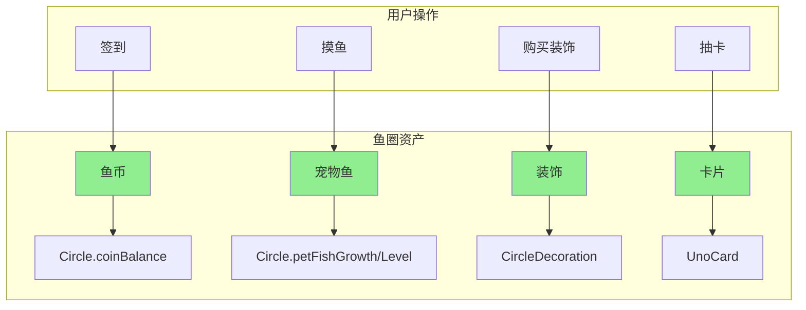

# 鱼圈资产归属规则 — 技术设计文档

## 1. 设计概要

**功能描述**：明确鱼圈所有资产（鱼币、宠物鱼、装饰、卡片）归属规则，确保用户退出/加入鱼圈、鱼圈解散时资产处理正确

**影响范围**：鱼圈模块、游戏模块（摸鱼、签到、装饰）

**技术难点**：无（现有数据模型已支持，主要是规则确认和代码验证）

**外部依赖**：无

---

## 2. 架构概览

本功能是**规则定义与确认**，不新增接口或模块，而是确保现有代码符合资产归属规则。

**资产归属原则**：所有资产都属于鱼圈，不属于个人用户。



---

## 3. 数据库设计

### 现有表确认

本功能**不新增表**，仅确认现有表结构符合资产归属规则。

#### `Circle` — 鱼圈表

| 字段名 | 类型 | 约束 | 说明 | 资产类型 |
|--------|------|------|------|----------|
| coinBalance | Int | DEFAULT 0 | 鱼币余额 | 鱼圈公共 |
| petFishGrowth | Int | DEFAULT 0 | 宠物鱼成长值 | 鱼圈共享 |
| petFishLevel | Int | DEFAULT 1 | 宠物鱼等级 | 鱼圈共享 |

**索引**：`@@index([code])` — 按邀请码查询

#### `CircleDecoration` — 鱼圈装饰表

| 字段名 | 类型 | 约束 | 说明 | 资产类型 |
|--------|------|------|------|----------|
| circleId | String | FK → Circle.id | 鱼圈ID | 鱼圈公共 |
| decorationId | String | FK → Decoration.id | 装饰ID | 鱼圈公共 |
| purchasedBy | String | FK → User.id | 购买者 | 记录用，不归属 |

**约束**：`@@unique([circleId, decorationId])` — 每个鱼圈每种装饰只能购买一次

#### `UnoCard` — 卡片表

| 字段名 | 类型 | 约束 | 说明 | 资产类型 |
|--------|------|------|------|----------|
| circleId | String | FK → Circle.id | 鱼圈ID | 鱼圈共享 |
| cardId | String | 业务ID | 卡片定义ID | 鱼圈共享 |
| count | Int | DEFAULT 1 | 持有数量 | 鱼圈共享 |

**约束**：`@@unique([circleId, cardId])` — 每个鱼圈每种卡片只有一条记录

> **设计说明**：卡片使用 `circleId + cardId` 唯一约束，而非 `userId + cardId`，因为卡片是鱼圈共享资产，不是用户私有。

#### `MoyuStat` — 摸鱼统计表

| 字段名 | 类型 | 约束 | 说明 | 资产类型 |
|--------|------|------|------|----------|
| userId | String | FK → User.id | 用户ID | 记录用，不归属 |
| circleId | String | FK → Circle.id | 鱼圈ID | 鱼圈共享 |

**约束**：`@@unique([userId, circleId])` — 每个用户在每个鱼圈有一条统计

#### `SignRecord` — 签到记录表

| 字段名 | 类型 | 约束 | 说明 | 资产类型 |
|--------|------|------|------|----------|
| userId | String | FK → User.id | 用户ID | 记录用，不归属 |
| circleId | String | FK → Circle.id | 鱼圈ID | 鱼圈共享 |

**约束**：`@@unique([userId, circleId, signDate])` — 每个用户每天在每个鱼圈只能签到一次

#### `ExchangeRecord` — 兑换记录表

| 字段名 | 类型 | 约束 | 说明 | 资产类型 |
|--------|------|------|------|----------|
| circleId | String | FK → Circle.id | 鱼圈ID | 鱼圈共享 |
| userId | String | FK → User.id | 用户ID | 记录用，不归属 |

---

## 4. API 设计

本功能**不新增 API**，只需确认现有 API 遵循资产归属规则。

### 现有 API 验证清单

| API | 验证点 | 状态 |
|-----|--------|------|
| `POST /api/circles/:id/leave` | 退出时资产保留在鱼圈 | ✅ 已符合 |
| `POST /api/circles/:id/dissolve` | 解散时级联删除所有资产 | ⚠️ 需验证 |
| `POST /api/circles/join` | 加入时可看到鱼圈资产 | ✅ 已符合 |
| `POST /api/moyu/click` | 摸鱼增长鱼圈宠物鱼 | ✅ 已符合 |
| `POST /api/sign/signin` | 签到增加鱼圈鱼币 | ✅ 已符合 |
| `POST /api/decorations/buy` | 购买装饰归属鱼圈 | ✅ 已符合 |

---

## 5. 核心逻辑

### 5.1 用户退出鱼圈 → AC-001, AC-002, AC-202

**触发条件**：用户点击"退出鱼圈"

**处理流程**：
1. 删除 `UserCircle` 记录（成员关系）
2. 更新 `Circle.memberCount -= 1`
3. 如果成员数为 0，删除鱼圈（级联删除所有资产）
4. **无需处理资产**：鱼币、宠物鱼、装饰、卡片都保留给鱼圈

**关键点**：
- 资产通过 `circleId` 外键关联，删除成员关系不影响资产
- 摸鱼记录、签到记录保留在鱼圈（历史数据）

**现有代码验证**：

```typescript
// server/src/routes/circles.ts (POST /:id/leave)
// 当前逻辑：删除 UserCircle + 更新 memberCount
// ✅ 符合规则：资产通过外键自动保留
```

---

### 5.2 鱼圈解散 → AC-101

**触发条件**：群主解散鱼圈或成员数降为 0

**处理流程**：
1. 删除 `Circle` 记录
2. Prisma 级联删除关联数据：
   - `CircleDecoration`（装饰）
   - `UnoCard`（卡片）
   - `MoyuStat`（摸鱼统计）
   - `SignRecord`（签到记录）
   - `ExchangeRecord`（兑换记录）
3. 鱼币随 Circle 记录删除而清零

**关键点**：
- 需要确认 Prisma 关联关系设置了 `onDelete: Cascade`
- 如果未设置级联删除，需要手动删除关联数据

**现有代码验证**：

```typescript
// server/src/routes/circles.ts (POST /:id/leave)
// 当前逻辑：memberCount <= 0 时删除鱼圈
// ⚠️ 需要确认是否设置了级联删除
```

---

### 5.3 用户加入鱼圈 → AC-003, AC-004, AC-201, AC-203

**触发条件**：用户通过邀请码加入鱼圈

**处理流程**：
1. 创建 `UserCircle` 记录（成员关系）
2. 更新 `Circle.memberCount += 1`
3. **无需初始化资产**：新成员直接共享鱼圈现有资产

**关键点**：
- 新成员可看到鱼圈已购买的装饰
- 新成员可看到鱼圈的宠物鱼
- 新成员可使用鱼圈公共账户的鱼币
- 新成员的卡片收集继承鱼圈已有卡片（从零开始指的是鱼圈维度）

**现有代码验证**：

```typescript
// server/src/routes/circles.ts (POST /join)
// 当前逻辑：创建 UserCircle + 更新 memberCount
// ✅ 符合规则：资产通过外键自动共享
```

---

## 6. 现有代码改动

| 模块 / 文件 | 改动内容 | 原因 | 对应 AC |
|-------------|---------|------|---------|
| `server/prisma/schema.prisma` | 验证/添加级联删除关系 | 确保鱼圈解散时资产正确删除 | AC-101 |
| `server/src/routes/circles.ts` | 验证退出逻辑 | 确保退出时资产保留 | AC-001, AC-002 |
| `specs/features/V1.3.0/鱼圈资产归属规则.md` | 更新AC描述 | 卡片改为鱼圈共享 | AC-002, AC-003, AC-101 |

---

## 7. 技术决策

### 卡片归属：鱼圈共享 vs 用户私有

**背景**：需求文档原始描述"卡片属于用户私有"与现有数据模型 `@@unique([circleId, cardId])` 冲突

**选项**：
- A: 卡片用户私有 — 需要修改为 `@@unique([userId, cardId])`，数据迁移复杂
- B: 卡片鱼圈共享 — 维持现有模型，逻辑简单一致

**结论**：选择 B，卡片为鱼圈共享资产。理由：
1. 现有数据模型已支持，无需迁移
2. 与其他资产（鱼币、宠物鱼、装饰）保持一致
3. 逻辑更简单，避免"用户退出后卡片归属"的复杂问题

---

## 8. 安全与性能

**输入校验**：无新增校验需求

**性能考量**：无性能影响，仅规则确认

---

## 9. AC 覆盖总表

> **注意**：以下 AC 已根据用户确认更新，卡片改为鱼圈共享资产。

| AC 编号 | 验收标准概述 | 实现位置 |
|---------|-------------|---------|
| AC-001 | 用户退出鱼圈，装饰保留在鱼圈 | 核心逻辑 5.1 + 现有 circles.ts |
| AC-002 | 用户退出鱼圈，卡片保留在鱼圈（共享资产） | 核心逻辑 5.1 + 现有 circles.ts |
| AC-003 | 用户加入鱼圈，可看到鱼圈已有卡片 | 核心逻辑 5.3 + 现有 circles.ts |
| AC-004 | 用户加入鱼圈，可使用鱼圈鱼币 | 核心逻辑 5.3 + 现有 circles.ts |
| AC-101 | 鱼圈解散，所有资产删除（鱼币/宠物鱼/装饰/卡片） | 核心逻辑 5.2 + Prisma 级联删除 |
| AC-102 | 用户退出后重新加入，装饰仍存在 | 核心逻辑 5.1 + 5.3 |
| AC-103 | 用户加入多个鱼圈，资产独立 | 现有数据模型已支持 |
| AC-201 | 所有资产属于鱼圈，不属于个人 | 数据模型设计 + 业务规则 |
| AC-202 | 用户退出后历史记录保留在鱼圈 | 核心逻辑 5.1 |
| AC-203 | 用户加入后可为鱼圈贡献成长值 | 核心逻辑 5.3 + 现有 moyu.ts |

---

## 附录：变更记录

| 日期 | 变更内容 | 原因 |
|------|---------|------|
| 2026-06-25 | 初始版本 | — |
| 2026-06-25 | 卡片归属从"用户私有"改为"鱼圈共享" | 与现有数据模型一致，逻辑更简单 |
