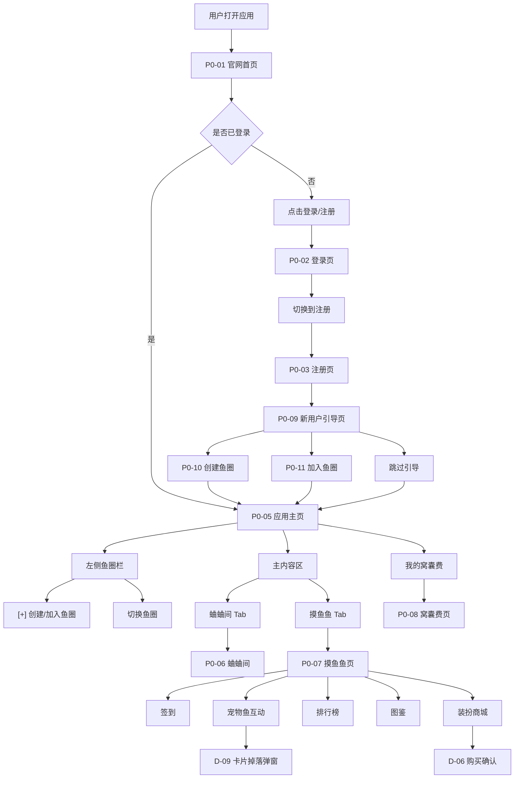
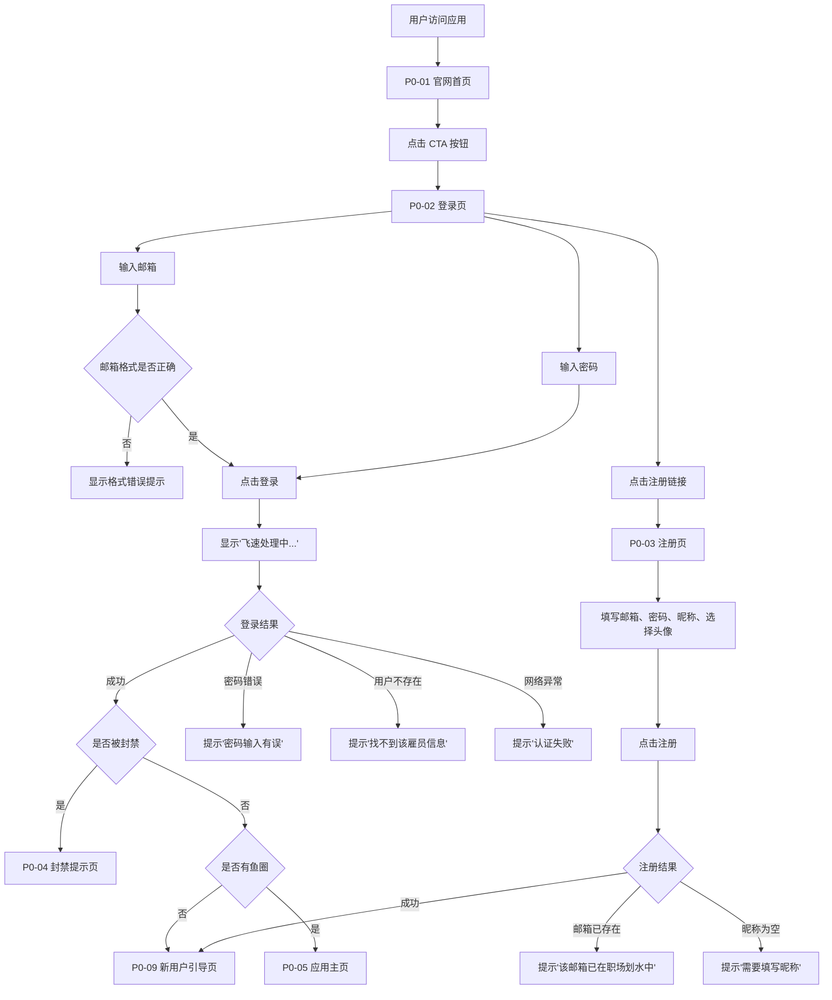
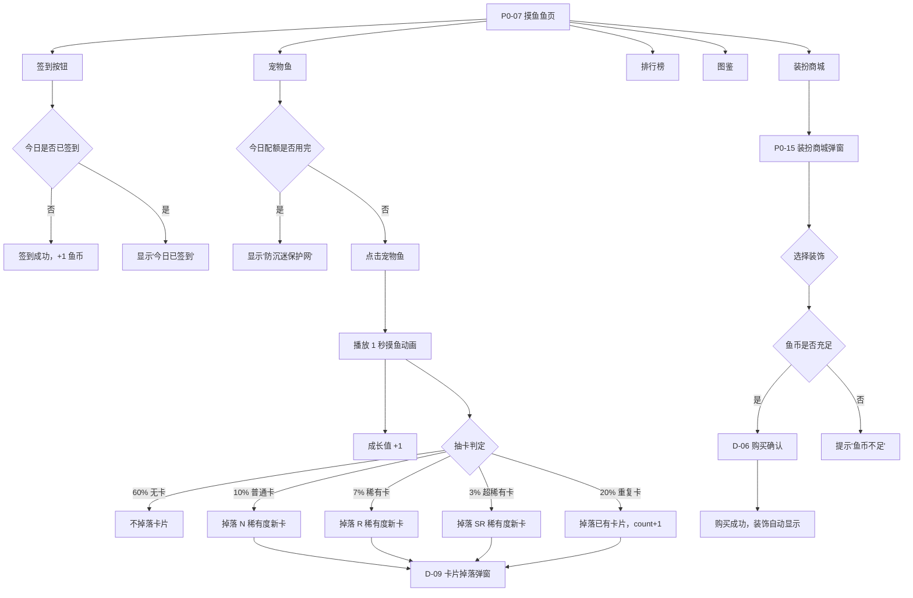
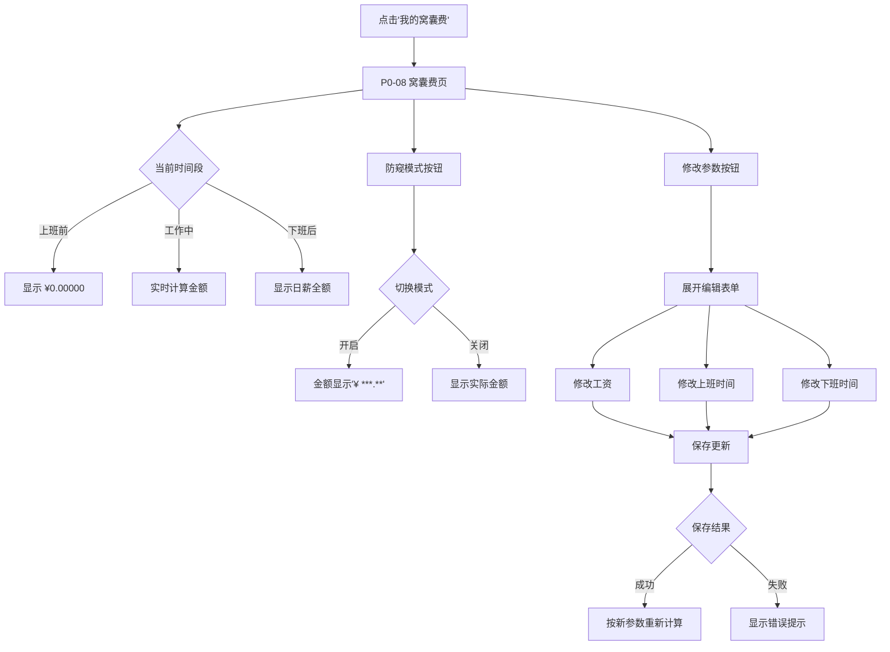
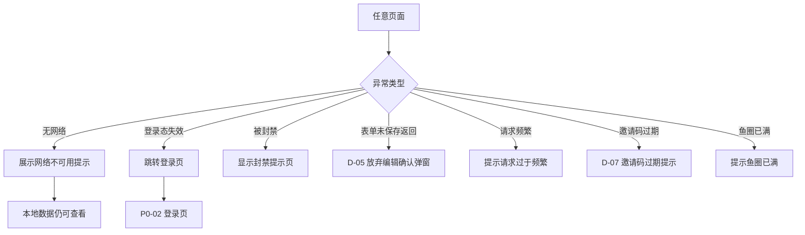

# 吐司 - 全局页面规则

## 1. 全局页面规则

### 1.1 通用交互规则

| 规则 | 说明 |
|---|---|
| 首页优先 | App 启动后默认进入官网首页，未登录用户可浏览功能介绍，已登录用户点击 CTA 直接进入应用。 |
| 主页面菜单 | 应用主界面采用左侧常驻鱼圈栏 + 主内容区布局；主内容区底部 Tab 切换"蛐蛐间"和"摸鱼鱼"。 |
| 鱼圈切换 | 左侧栏点击鱼圈直接切换聊天内容，默认进入聊天室（蛐蛐间）。 |
| 简单操作轻量化 | 删除、退出、确认等简单操作优先使用弹窗或底部抽屉。 |
| 高风险二次确认 | 退出登录、注销账号、解散鱼圈、移除成员等高风险操作必须二次确认。 |
| 表单提交 | 提交中主按钮 loading，禁止重复点击；失败后保留用户输入。 |
| 未保存离开 | 表单有未保存内容时，返回需弹出放弃编辑确认。 |
| 即时反馈 | 每个用户操作都应在 100ms 内给予视觉反馈。 |
| 防误操作 | 关键操作需二次确认，防止意外触发。 |
| 容错性 | 操作失败时提供明确的错误信息和恢复路径。 |
| 一致性 | 相似操作的交互方式保持统一。 |

### 1.2 通用字段与限制

| 字段 | 规则 |
|---|---|
| 邮箱 | 必填，有效邮箱格式，注册后不可重复。 |
| 密码 | 必填，不少于 6 位，传输和存储必须加密。 |
| 昵称 | 1-40 字符，必填，不允许控制字符或全空格。 |
| 个人简介 | 0-200 字符，选填，默认为空字符串。 |
| 头像 | 从 12 个预设头像中选择，默认为"摸鱼水獭"。 |
| 鱼圈名称 | 1-50 字符，必填。 |
| 邀请码 | 6 位数字，有效期 1 小时。 |
| 聊天消息 | 纯文字，单条最大 500 字符，5 分钟后自动销毁。 |
| 日薪 | 正数，默认 250 元/天。 |
| 上班时间 | 时间格式，默认 09:00。 |
| 下班时间 | 时间格式，默认 18:00，必须晚于上班时间。 |

### 1.3 通用异常文案

| 场景 | 中文 |
|---|---|
| 网络异常 | 网络不可用，请稍后重试 |
| 保存失败 | 保存失败，请重试 |
| 删除失败 | 删除失败，请重试 |
| 请求频繁 | 请求过于频繁，请稍后再试 |
| 登录要求 | 请先登录后使用 |
| 邮箱已注册 | 该邮箱已在职场划水中！请尝试直接登录 |
| 密码错误 | 密码输入有误，请核实后再敲门！ |
| 用户不存在 | 找不到该雇员信息，请确认邮箱或切换为注册页面！ |
| 认证失败 | 认证失败：密码过短或网络超时 |
| 昵称为空 | 注册需要填写一个萌新新昵称哦~ |
| 昵称编辑为空 | 昵称不能为空，给职场花名留个位置~ |
| 密码过短 | 新密码不少于6位 |
| 密码不一致 | 两次输入的新密码不一致 |
| 旧密码错误 | 原密码输入有误，请核实后再试！ |
| 封禁提示 | 你已被管理员关进【冷冻鱼缸】！ |
| 邀请码无效 | 邀请码无效或已过期 |
| 鱼圈已满 | 鱼圈已满（10人上限） |
| 已在鱼圈 | 你已是该鱼圈成员 |
| 摸鱼上限 | 你已触及今日防沉迷保护网！ |
| 鱼币不足 | 鱼币不足，继续签到攒鱼币吧！ |
| 邀请失效 | 邀请已失效，请重新创建鱼圈 |

---

## 2. 页面总表

### 2.1 独立页面

| 编号 | 页面 | 页面目标 | 层级/入口 |
|---:|---|---|---|
| P0-01 | 官网首页 | 产品介绍、功能预览、引导注册/登录 | 应用入口 `/` |
| P0-02 | 登录页 | 邮箱+密码登录 | 首页 CTA / 导航栏 |
| P0-03 | 注册页 | 邮箱+密码+昵称+头像注册 | 登录页底部链接 |
| P0-04 | 封禁提示页 | 展示封禁信息 | 登录成功后检测到 isBanned |
| P0-05 | 应用主页 | 左侧鱼圈栏 + 主内容区 | 登录成功后跳转 `/home` |
| P0-06 | 蛐蛐间 | 鱼圈即时聊天，消息 5 分钟自动销毁 | 主页底部 Tab |
| P0-07 | 摸鱼鱼页 | 签到、宠物鱼、排行榜、图鉴 | 主页底部 Tab |
| P0-08 | 窝囊费页 | 工作时间价值实时可视化 | 左侧栏底部"我的窝囊费" |
| P0-09 | 新用户引导页 | 引导创建/加入鱼圈 | 注册成功后 |
| P0-10 | 创建鱼圈页 | 输入鱼圈名称，生成邀请码 | 左侧栏 [+] 按钮 |
| P0-11 | 加入鱼圈页 | 输入 6 位邀请码加入鱼圈 | 左侧栏 [+] 按钮 |
| P0-12 | 鱼圈管理弹窗 | 查看成员、移除成员、解散/退出鱼圈 | 主内容区右上角 |
| P0-13 | 个人资料编辑弹窗 | 修改头像、昵称、个人简介 | 导航栏头像下拉菜单 |
| P0-14 | 修改密码弹窗 | 修改登录密码 | 导航栏头像下拉菜单 |
| P0-15 | 装扮商城弹窗 | 购买鱼缸装饰 | 摸鱼鱼页"装扮商城"按钮 |
| P0-16 | 卡片掉落弹窗 | 展示本次获得的 UNO 卡片 | 摸鱼成功后自动弹出 |
| P0-17 | 卡片详情弹窗 | 查看单张卡片详情和彩蛋文字 | 图鉴中点击卡片 |

### 2.2 弹窗与底部抽屉

| 编号 | 组件 | 类型 | 触发场景 |
|---:|---|---|---|
| D-01 | 退出登录确认 | 弹窗 | 点击"退出登录" |
| D-02 | 解散鱼圈确认 | 弹窗 | 鱼圈管理中点击"解散鱼圈" |
| D-03 | 退出鱼圈确认 | 弹窗 | 鱼圈管理中点击"退出鱼圈" |
| D-04 | 移除成员确认 | 弹窗 | 鱼圈管理中点击移除成员 |
| D-05 | 放弃编辑确认 | 弹窗 | 表单未保存返回 |
| D-06 | 购买装饰确认 | 弹窗 | 装扮商城中点击购买 |
| D-07 | 邀请码过期提示 | 弹窗 | 创建鱼圈超过 1 小时 |
| D-08 | 新用户引导 | 页面 | 注册成功后首次进入 |
| D-09 | 摸鱼成功提示 | 弹窗 | 摸鱼成功后展示卡片 |
| D-10 | 签到成功提示 | Toast | 签到成功后 |
| D-11 | 复制成功提示 | Toast | 复制邀请码/链接后 |
| D-12 | 购买成功提示 | Toast | 装饰购买成功后 |
| D-13 | 升级成功提示 | 弹窗 | 宠物鱼升级时 |

### 2.3 主页面菜单

| 主入口 | 对应页面 | 展示条件 | 交互规则 |
|---|---|---|---|
| 左侧鱼圈栏 | P0-05 应用主页 | 已登录用户 | 点击切换鱼圈，默认显示聊天室 |
| [+] 按钮 | P0-10/P0-11 创建/加入鱼圈 | 已登录用户 | 展开创建/加入表单 |
| 蛐蛐间 Tab | P0-06 蛐蛐间 | 已加入鱼圈 | 底部 Tab 默认选中 |
| 摸鱼鱼 Tab | P0-07 摸鱼鱼页 | 已加入鱼圈 | 底部 Tab 切换 |
| 我的窝囊费 | P0-08 窝囊费页 | 已登录用户 | 左侧栏底部入口 |
| 导航栏头像 | 个人资料/修改密码/退出 | 已登录用户 | 下拉菜单 |

---

## 3. 业务规则总表

### 3.1 用户系统规则

| 编号 | 规则 | 说明 |
|---|---|---|
| UR-001 | 用户无私有鱼圈 | 用户注册后不会自动创建私有鱼圈，必须通过邀请加入或创建公共鱼圈 |
| UR-002 | 默认工资参数 | 用户默认工资 250 元/天，上班 09:00，下班 18:00 |
| UR-003 | 邮箱唯一性 | 同一邮箱不可重复注册 |
| UR-004 | 密码安全 | 密码不少于 6 位，传输加密，存储加密 |
| UR-005 | 登出清除状态 | 登出后清除本地认证状态 |
| UR-006 | 封禁用户限制 | isBanned=true 的用户登录后只能看到封禁页 |
| UR-007 | 修改密码后重新登录 | 修改密码成功后清除本地认证，强制重新登录 |

### 3.2 鱼圈管理规则

| 编号 | 规则 | 说明 |
|---|---|---|
| CR-001 | 鱼圈人数上限 | 每个鱼圈最多 10 人 |
| CR-002 | 创建鱼圈需 2 人 | 至少需要创建者 + 1 人加入才能激活 |
| CR-003 | 邀请码有效期 | 邀请码有效期 1 小时，超时自动失效 |
| CR-004 | 未激活鱼圈删除 | 超过 1 小时未激活的鱼圈自动删除 |
| CR-005 | 鱼圈可退出/解散 | 所有鱼圈都可以退出或解散（创建者解散，成员退出） |
| CR-006 | 鱼圈列表排序 | 左侧栏鱼圈按加入时间排序 |
| CR-007 | 未读消息统计 | 未读消息数基于实际消息实时统计 |

### 3.3 蛐蛐蛐（聊天系统）规则

| 编号 | 规则 | 说明 |
|---|---|---|
| CH-001 | 消息自动销毁 | 所有消息 5 分钟后自动物理删除 |
| CH-002 | 消息字数限制 | 单条消息最大 500 字符 |
| CH-003 | 纯文字消息 | 不支持图片、语音、视频等富媒体 |
| CH-004 | 无历史记录 | 不支持聊天记录留存和搜索 |
| CH-005 | 消息归属 | 自己的消息靠右浅橙色，他人消息靠左白色 |

### 3.4 摸鱼鱼（游戏系统）规则

| 编号 | 规则 | 说明 |
|---|---|---|
| MY-001 | 每日摸鱼上限 | 固定 30 次，凌晨 0 点重置 |
| MY-002 | 摸鱼交互方式 | 点击宠物鱼触发 1 秒摸鱼动画 |
| MY-003 | 成长值获取 | 每次摸鱼固定 +1 成长值 |
| MY-004 | 抽卡概率 | 60% 无卡，20% 重复卡，10% 不重复普通卡(N)，7% 不重复稀有卡(R)，3% 不重复超稀有卡(SR) |
| MY-005 | 卡片归属 | UNO 卡片为鱼圈公共数据，所有成员共享 |
| MY-006 | 卡片可重复 | 重复卡片 count 累加 |
| MY-007 | 图鉴数据共享 | 图鉴按鱼圈维度共享，所有成员看到相同数据 |
| MY-008 | 掉落记录 | 每次卡片掉落自动记录（谁、什么卡片、什么时间） |

### 3.5 宠物鱼养成规则

| 编号 | 规则 | 说明 |
|---|---|---|
| PF-001 | 宠物鱼共享 | 宠物鱼为鱼圈共享，所有成员的摸鱼行为都会增加成长值 |
| PF-002 | 进化形态 | 1级🐠肥嘟嘟胖金鱼 → 2级🐙带薪发愣神游鳌 → 3级🐙太极双休太公鱼 → 4级🎏极品七彩锦鲤皇 → 5级🐉传说级摸鱼之神 |
| PF-003 | 升级所需成长值 | 1000 → 2000 → 3000 → 4000 |
| PF-004 | 成长值溢出 | 升级后溢出的成长值保留到下一级 |

### 3.6 签到与装饰规则

| 编号 | 规则 | 说明 |
|---|---|---|
| SD-001 | 签到规则 | 每个用户每天在每个鱼圈可签到一次，获得 1 鱼币 |
| SD-002 | 鱼币归属 | 鱼币是鱼圈公共财产 |
| SD-003 | 装饰购买 | 每个鱼圈的装饰只能购买一次 |
| SD-004 | 装饰显示 | 购买后自动显示在鱼缸，不存在穿上/卸下 |
| SD-005 | 装饰价格 | 水草20、气泡40、石头60、海星80、珊瑚100 鱼币 |

### 3.7 窝囊费规则

| 编号 | 规则 | 说明 |
|---|---|---|
| SL-001 | 实时计算 | 每 200ms 更新一次金额 |
| SL-002 | 计算公式 | 工作中：(已工作秒数 / 总工作秒数) × 日薪 |
| SL-003 | 状态划分 | 上班前(¥0) → 工作中(实时计算) → 下班后(日薪全额) |
| SL-004 | 防窥模式 | 点击切换，金额显示为"¥ ***.**" |
| SL-005 | 参数可修改 | 工资、上班时间、下班时间可随时修改 |

### 3.8 老板键规则

| 编号 | 规则 | 说明 |
|---|---|---|
| BK-001 | 触发键 | Esc 键 |
| BK-002 | 生效范围 | 仅影响当前浏览器标签页 |
| BK-003 | 防误触 | 连续快速按 3 次不触发 |
| BK-004 | 伪装内容 | 切换为模拟在线表格界面 |
| BK-005 | 状态保留 | 恢复时所有状态保留（输入框草稿、摸鱼进度等） |
| BK-006 | 二级界面 | 切换时关闭所有弹窗/侧边栏 |

---

## 4. 页面跳转流程图

### 4.1 全局页面地图



### 4.2 注册登录流程



### 4.3 鱼圈管理流程

```mermaid
flowchart TD
    AddEntry["点击 [+] 按钮"] --> TabChoice{"选择操作"}
    TabChoice -- "创建鱼圈" --> CreateForm["输入鱼圈名称"]
    TabChoice -- "加入鱼圈" --> JoinForm["输入 6 位邀请码"]

    CreateForm --> GenerateCode["生成邀请码"]
    GenerateCode --> ShowCode["显示邀请码和链接"]
    ShowCode --> WaitMember["等待成员加入"]
    WaitMember --> MemberJoin{"是否有成员加入"}
    MemberJoin -- "是，达到 2 人" --> Activate["自动激活鱼圈"]
    MemberJoin -- "超过 1 小时" --> Expire["邀请失效，删除鱼圈"]
    Activate --> EnterCircle["进入鱼圈"]

    JoinForm --> ValidateCode{"验证邀请码"}
    ValidateCode -- "有效" --> JoinSuccess["加入成功"]
    ValidateCode -- "无效/过期" --> CodeError["提示'邀请码无效或已过期'")
    ValidateCode -- "鱼圈已满" --> FullError["提示'鱼圈已满'"]
    ValidateCode -- "已在鱼圈" --> AlreadyIn["提示'你已是该鱼圈成员'"]
    JoinSuccess --> EnterCircle

    EnterCircle --> ChatRoom["进入蛐蛐间"]
```

### 4.4 摸鱼鱼交互流程



### 4.5 窝囊费交互流程



### 4.6 异常与边界流程



---

## 5. 动画与过渡规范

### 5.1 动画时长规范

| 类型 | 时长 | 说明 |
|---|---|---|
| 微交互 | 100-200ms | 按钮悬停、输入框聚焦 |
| 过渡动画 | 200-300ms | 页面切换、弹窗弹出 |
| 强调动画 | 500ms | 卡片掉落、宠物鱼升级 |
| 摸鱼动画 | 1s | 宠物鱼左→右→左 |
| 循环动画 | 持续 | 宠物鱼浮动、进度条加载 |

### 5.2 动画缓动函数

| 类型 | 缓动 | 说明 |
|---|---|---|
| 进入 | ease-out | 元素进入时减速 |
| 退出 | ease-in | 元素退出时加速 |
| 循环 | ease-in-out | 循环动画平滑过渡 |
| 弹跳 | cubic-bezier(0.68, -0.55, 0.265, 1.55) | 弹跳效果 |

---

## 6. 响应式规则

| 规则 | 说明 |
|---|---|
| 最小宽度 | 1024px |
| 最大宽度 | 1920px |
| 布局方式 | 固定布局，居中显示 |
| 左侧栏宽度 | 200px 固定 |
| 移动端 | V1.1.0 不支持 |

---

## 7. 键盘快捷键

| 快捷键 | 功能 | 说明 |
|---|---|---|
| `Esc` | 切换伪装界面 | 全局监听，防误触 |
| `Enter` | 发送消息 | 在聊天输入框聚焦时 |
| `Tab` | 切换输入框焦点 | 标准浏览器行为 |

---

## 8. 性能指标

| 指标 | 目标值 | 说明 |
|---|---|---|
| 首页加载 | < 3 秒 | 官网首页首次加载 |
| 首屏加载 | < 1.5 秒 | Hero 区域 |
| 左侧栏加载 | < 1 秒 | 鱼圈列表 |
| 鱼圈切换 | < 500ms | 切换响应时间 |
| 摸鱼按钮响应 | < 500ms | 点击到反馈 |
| 卡片掉落弹窗 | < 200ms | 弹窗显示延迟 |
| 签到响应 | < 1 秒 | 签到操作 |
| 装饰购买 | < 2 秒 | 购买操作 |
| 聊天消息延迟 | < 1 秒 | 消息发送到显示 |

---

## 9. 安全规则

| 编号 | 规则 | 说明 |
|---|---|---|
| SEC-001 | 密码加密 | 传输必须 HTTPS，存储必须加密 |
| SEC-002 | 登出清除 | 登出后清除本地认证状态 |
| SEC-003 | 配额防篡改 | 每日摸鱼配额基于服务端统计 |
| SEC-004 | 鱼币防篡改 | 鱼币余额基于服务端计算 |
| SEC-005 | 装饰防重复 | 装饰购买基于服务端验证 |
| SEC-006 | 鱼圈数据隔离 | 只有加入的鱼圈才会显示在左侧栏 |
| SEC-007 | 消息物理删除 | 5 分钟后消息物理删除，不可恢复 |

---

## 10. 变更记录

| 日期 | 内容 |
|---|---|
| 2026-06-24 | 初版，基于项目需求文档整理全局规则 |
